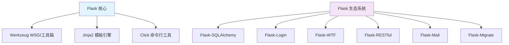
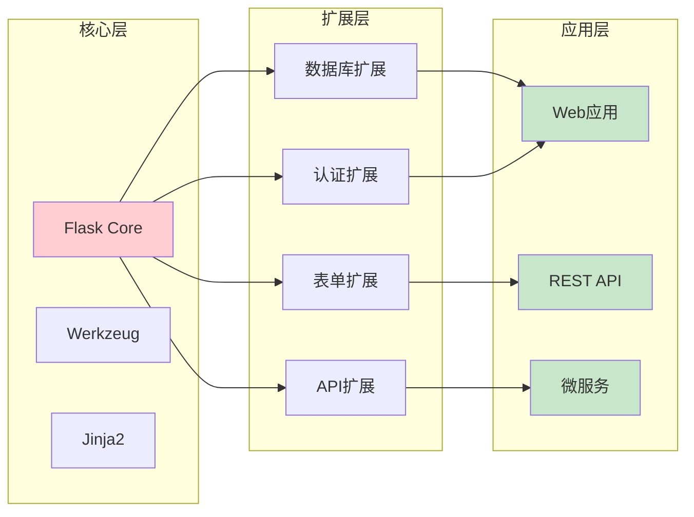
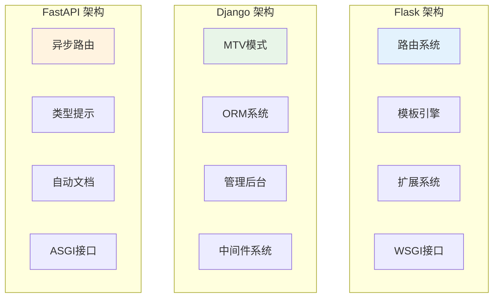
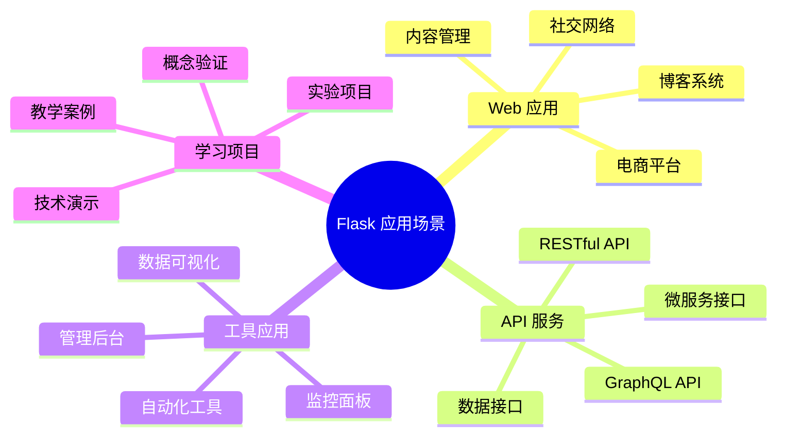
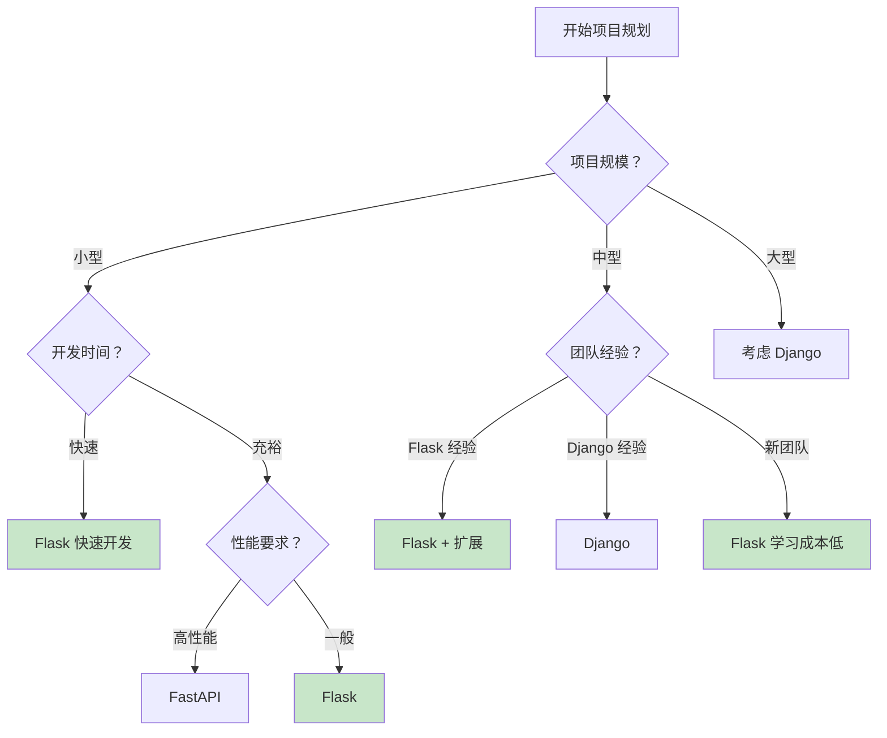
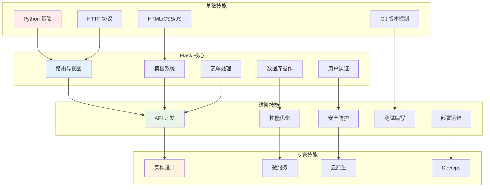
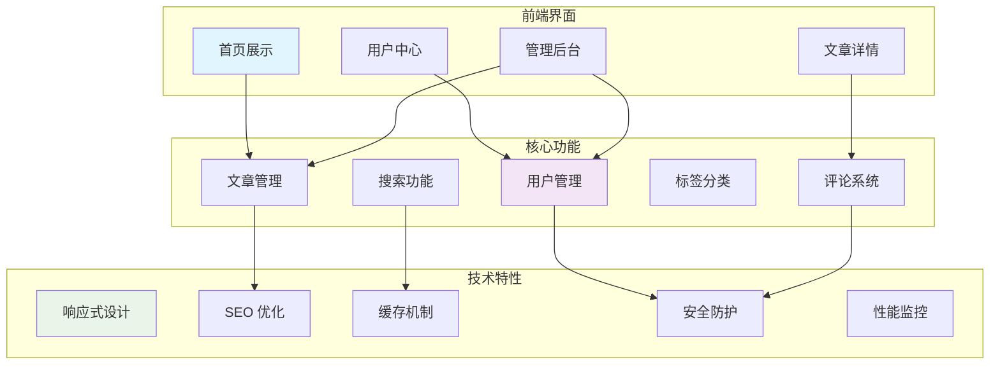
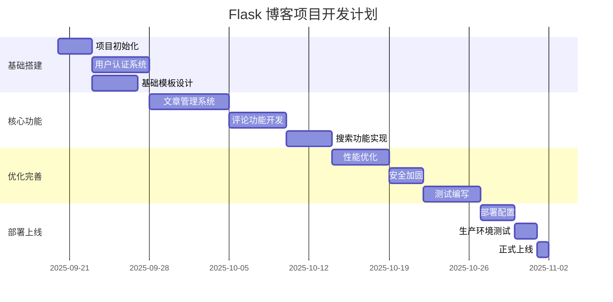

# 📝 1. 引言与概述

## 🌐 1.1 Flask 框架介绍与生态系统

### 什么是 Flask？

Flask 是一个使用 Python 编写的轻量级 Web 应用框架，由 Armin Ronacher 于 2010 年创建。它被称为"微框架"（microframework），这并不意味着功能简陋，而是指其核心保持简洁，同时具备强大的扩展能力。

### Flask 的设计哲学

Flask 遵循以下核心设计原则：

- **显式优于隐式**：代码行为清晰明确，避免"魔法"操作
- **简单优于复杂**：提供简洁的 API，降低学习成本
- **可扩展性**：通过扩展系统按需添加功能
- **灵活性**：不强制特定的项目结构或组件选择

### Flask 生态系统架构

## ⚖️ 1.2 Flask vs Django vs FastAPI 对比分析

### 框架特性对比

| 特性 | Flask | Django | FastAPI |
|------|-------|--------|----------|
| 学习曲线 | 平缓 | 陡峭 | 中等 |
| 项目规模 | 小到中型 | 大型 | 小到大型 |
| 性能 | 中等 | 中等 | 高 |
| 异步支持 | 有限 | 有限 | 原生 |
| 生态系统 | 丰富 | 非常丰富 | 快速增长 |
| 开发速度 | 快 | 中等 | 快 |

### 技术架构对比

### 选择建议

**选择 Flask 的场景：**
- 🎯 快速原型开发
- 🔧 需要高度定制化
- 📚 学习 Web 开发概念
- 🏗️ 构建微服务
- 🎨 偏好简洁的代码风格

**选择 Django 的场景：**
- 🏢 大型企业应用
- ⚡ 需要快速开发完整功能
- 👥 团队协作开发
- 🛡️ 需要完善的安全机制

**选择 FastAPI 的场景：**
- 🚀 高性能 API 服务
- 🔄 异步处理需求
- 📖 自动 API 文档
- 🎯 现代 Python 特性

## 🎯 1.3 适用场景与技术选型指南

### Flask 的典型应用场景

### 技术选型决策树

### 项目复杂度评估

| 项目特征 | 简单 | 中等 | 复杂 | 推荐框架 |
|----------|------|------|------|----------|
| 页面数量 | < 10 | 10-50 | > 50 | Flask/Django/FastAPI |
| 用户规模 | < 1K | 1K-10K | > 10K | Flask/Django |
| 数据模型 | < 5 | 5-20 | > 20 | Flask+SQLAlchemy/Django |
| 团队规模 | 1-2人 | 3-5人 | > 5人 | Flask/Django |
| 开发周期 | < 1月 | 1-6月 | > 6月 | Flask/Django |

## 📚 1.4 学习路径与技能树

### Flask 开发者技能图谱

### 学习阶段规划

#### 🌱 初级阶段（1-2个月）
- **目标**：掌握 Flask 基础概念，能够构建简单的 Web 应用
- **技能点**：
  - Flask 应用结构
  - 路由和视图函数
  - 模板渲染
  - 静态文件处理
  - 基础表单处理

#### 🌿 中级阶段（2-4个月）
- **目标**：能够开发功能完整的 Web 应用
- **技能点**：
  - 数据库集成
  - 用户认证系统
  - 表单验证
  - 错误处理
  - 蓝图模块化

#### 🌳 高级阶段（4-6个月）
- **目标**：掌握企业级开发技能
- **技能点**：
  - RESTful API 设计
  - 测试驱动开发
  - 性能优化
  - 安全最佳实践
  - 部署和运维

#### 🏆 专家阶段（6个月以上）
- **目标**：具备架构设计和团队领导能力
- **技能点**：
  - 微服务架构
  - 云原生开发
  - DevOps 实践
  - 技术选型
  - 团队管理

## 🚀 1.5 博客项目预览

### 项目功能架构

### 技术栈选择

| 层级 | 技术选择 | 说明 |
|------|----------|------|
| **后端框架** | Flask 2.3+ | 核心 Web 框架 |
| **数据库** | SQLite/PostgreSQL | 开发/生产环境 |
| **ORM** | SQLAlchemy | 数据库抽象层 |
| **认证** | Flask-Login | 用户会话管理 |
| **表单** | Flask-WTF | 表单处理和验证 |
| **前端** | Bootstrap 5 | 响应式 UI 框架 |
| **模板** | Jinja2 | 模板引擎 |
| **部署** | Docker + Nginx | 容器化部署 |

### 开发里程碑

### 学习收获预期

通过完成这个综合项目，您将获得：

- 🎯 **实战经验**：从零到一构建完整 Web 应用
- 🔧 **技术栈掌握**：熟练使用 Flask 生态系统
- 🏗️ **架构思维**：理解 Web 应用架构设计
- 🛡️ **安全意识**：掌握 Web 安全最佳实践
- 🚀 **部署能力**：具备生产环境部署经验
- 📈 **优化技能**：学会性能监控和优化

---

**准备好开始您的 Flask 学习之旅了吗？** 让我们从环境搭建开始，逐步构建您的第一个 Flask 应用！
        