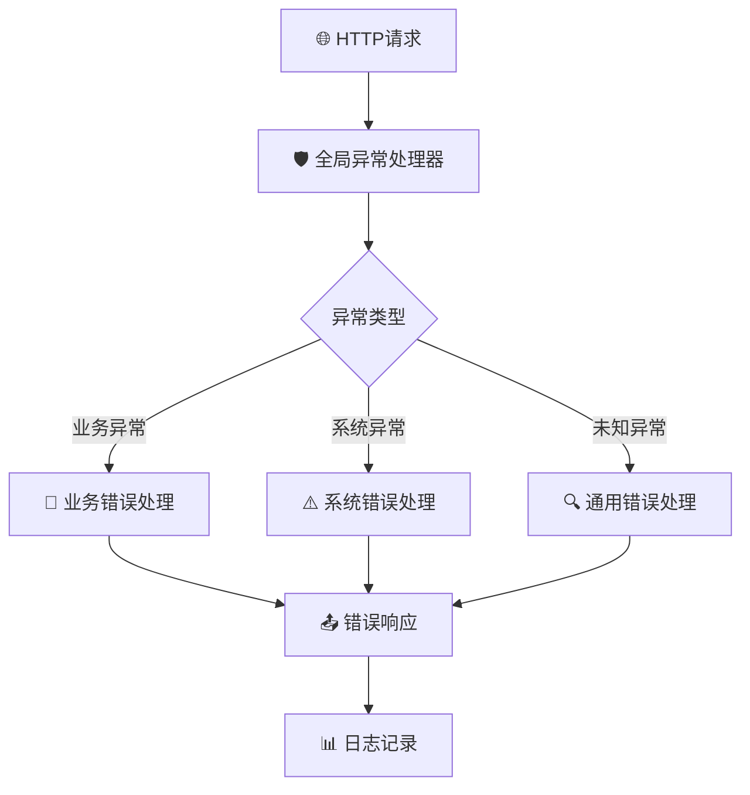
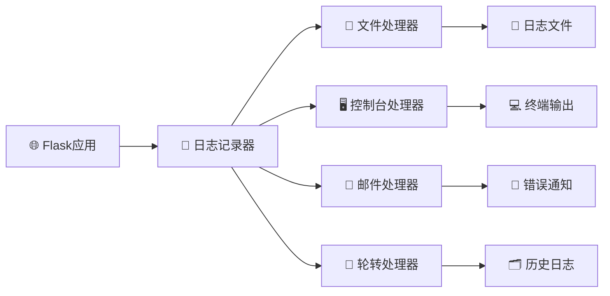
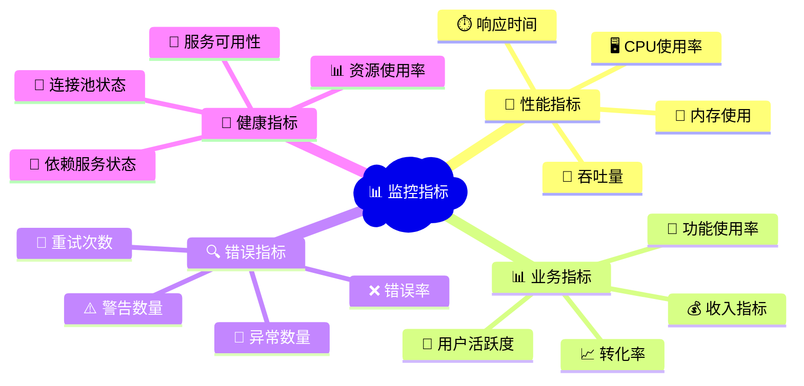

# 📊 10. 错误处理与监控

> 🎯 **本章目标**：构建健壮的Flask应用，实现全面的错误处理机制和监控体系，确保应用在生产环境中的稳定性和可观测性。

---

## 🚨 10.1 异常处理最佳实践

### 📋 异常处理层次结构



### 🔧 自定义异常类设计
app/exceptions.py
```python
class AppException(Exception):
    """应用基础异常类"""
    def __init__(self, message: str, code: int = 500, payload=None):
        super().__init__()
        self.message = message
        self.code = code
        self.payload = payload

class ValidationError(AppException):
    """数据验证异常"""
    def __init__(self, message: str, field: str = None):
        super().__init__(message, 400, {'field': field})

class AuthenticationError(AppException):
    """认证异常"""
    def __init__(self, message: str = "认证失败"):
        super().__init__(message, 401)

class AuthorizationError(AppException):
    """授权异常"""
    def __init__(self, message: str = "权限不足"):
        super().__init__(message, 403)
```

### 🛠️ 全局异常处理器
app/error_handlers.py
```python
from flask import Flask, jsonify, request
from werkzeug.exceptions import HTTPException
import logging

def register_error_handlers(app: Flask):
    """注册全局异常处理器"""
    
    @app.errorhandler(AppException)
    def handle_app_exception(error):
        """处理应用自定义异常"""
        response = {
            'error': {
                'message': error.message,
                'code': error.code
            }
        }
        if error.payload:
            response['error']['details'] = error.payload
        
        # 记录错误日志
        app.logger.error(f"应用异常: {error.message}", extra={
            'error_code': error.code,
            'payload': error.payload,
            'url': request.url,
            'method': request.method
        })
        
        return jsonify(response), error.code
    
    @app.errorhandler(HTTPException)
    def handle_http_exception(error):
        """处理HTTP异常"""
        return jsonify({
            'error': {
                'message': error.description,
                'code': error.code
            }
        }), error.code
    
    @app.errorhandler(Exception)
    def handle_unexpected_error(error):
        """处理未预期的异常"""
        app.logger.error(f"未处理异常: {str(error)}", exc_info=True)
        return jsonify({
            'error': {
                'message': '服务器内部错误',
                'code': 500
            }
        }), 500
```

---

## 🎨 10.2 自定义错误页面与API错误响应

### 🌐 Web页面错误处理
app/views/errors.py
```python
from flask import Blueprint, render_template, request

errors_bp = Blueprint('errors', __name__)

@errors_bp.app_errorhandler(404)
def not_found_error(error):
    """404错误页面"""
    if request.path.startswith('/api/'):
        return jsonify({'error': '资源未找到'}), 404
    return render_template('errors/404.html'), 404

@errors_bp.app_errorhandler(500)
def internal_error(error):
    """500错误页面"""
    if request.path.startswith('/api/'):
        return jsonify({'error': '服务器内部错误'}), 500
    return render_template('errors/500.html'), 500
```

### 📱 API统一错误响应格式
app/utils/response.py
```python
from flask import jsonify
from typing import Dict, Any, Optional
import time

class APIResponse:
    """API响应格式化工具"""
    
    @staticmethod
    def success(data: Any = None, message: str = "操作成功") -> Dict:
        """成功响应"""
        return {
            'success': True,
            'message': message,
            'data': data,
            'timestamp': int(time.time())
        }
    
    @staticmethod
    def error(message: str, code: int = 400, details: Optional[Dict] = None) -> Dict:
        """错误响应"""
        response = {
            'success': False,
            'error': {
                'message': message,
                'code': code
            },
            'timestamp': int(time.time())
        }
        if details:
            response['error']['details'] = details
        return response
```

---

## 📝 10.3 日志系统设计

### 🏗️ 日志架构设计



### ⚙️ 日志配置
app/config/logging.py
```python
import logging
import logging.handlers
from pathlib import Path

def setup_logging(app):
    """配置应用日志系统"""
    
    # 创建日志目录
    log_dir = Path('logs')
    log_dir.mkdir(exist_ok=True)
    
    # 设置日志格式
    formatter = logging.Formatter(
        '[%(asctime)s] %(levelname)s in %(module)s: %(message)s'
    )
    
    # 文件处理器 - 应用日志
    file_handler = logging.handlers.RotatingFileHandler(
        log_dir / 'app.log',
        maxBytes=10240000,  # 10MB
        backupCount=10
    )
    file_handler.setFormatter(formatter)
    file_handler.setLevel(logging.INFO)
    
    # 文件处理器 - 错误日志
    error_handler = logging.handlers.RotatingFileHandler(
        log_dir / 'error.log',
        maxBytes=10240000,
        backupCount=10
    )
    error_handler.setFormatter(formatter)
    error_handler.setLevel(logging.ERROR)
    
    # 控制台处理器
    console_handler = logging.StreamHandler()
    console_handler.setFormatter(formatter)
    console_handler.setLevel(logging.DEBUG if app.debug else logging.INFO)
    
    # 配置应用日志记录器
    app.logger.addHandler(file_handler)
    app.logger.addHandler(error_handler)
    app.logger.addHandler(console_handler)
    app.logger.setLevel(logging.INFO)
```

### 📊 结构化日志记录
app/utils/logger.py
```python
import json
import logging
from datetime import datetime
from flask import request, g

class StructuredLogger:
    """结构化日志记录器"""
    
    def __init__(self, logger: logging.Logger):
        self.logger = logger
    
    def log_request(self, response_status: int, response_time: float):
        """记录请求日志"""
        log_data = {
            'timestamp': datetime.utcnow().isoformat(),
            'request': {
                'method': request.method,
                'url': request.url,
                'remote_addr': request.remote_addr,
                'user_agent': request.headers.get('User-Agent', ''),
            },
            'response': {
                'status_code': response_status,
                'response_time_ms': round(response_time * 1000, 2)
            },
            'user_id': getattr(g, 'user_id', None)
        }
        
        self.logger.info(json.dumps(log_data, ensure_ascii=False))
    
    def log_business_event(self, event_type: str, **kwargs):
        """记录业务事件"""
        log_data = {
            'timestamp': datetime.utcnow().isoformat(),
            'event_type': event_type,
            'user_id': getattr(g, 'user_id', None),
            'data': kwargs
        }
        
        self.logger.info(json.dumps(log_data, ensure_ascii=False))
```

---

## 📈 10.4 应用监控与指标收集

### 🎯 监控指标体系



### 📊 Prometheus集成
app/monitoring/metrics.py
```python
from prometheus_client import Counter, Histogram, Gauge, generate_latest
from flask import Flask, Response
import time

# 定义指标
REQUEST_COUNT = Counter(
    'flask_requests_total',
    'Total Flask requests',
    ['method', 'endpoint', 'status']
)

REQUEST_DURATION = Histogram(
    'flask_request_duration_seconds',
    'Flask request duration',
    ['method', 'endpoint']
)

ACTIVE_USERS = Gauge(
    'flask_active_users',
    'Number of active users'
)

class MetricsCollector:
    """指标收集器"""
    
    def __init__(self, app: Flask = None):
        if app:
            self.init_app(app)
    
    def init_app(self, app: Flask):
        """初始化指标收集"""
        app.before_request(self.before_request)
        app.after_request(self.after_request)
        
        # 添加指标端点
        @app.route('/metrics')
        def metrics():
            return Response(generate_latest(), mimetype='text/plain')
    
    def before_request(self):
        """请求开始时记录"""
        g.start_time = time.time()
    
    def after_request(self, response):
        """请求结束时记录指标"""
        if hasattr(g, 'start_time'):
            duration = time.time() - g.start_time
            
            # 记录请求计数
            REQUEST_COUNT.labels(
                method=request.method,
                endpoint=request.endpoint or 'unknown',
                status=response.status_code
            ).inc()
            
            # 记录请求耗时
            REQUEST_DURATION.labels(
                method=request.method,
                endpoint=request.endpoint or 'unknown'
            ).observe(duration)
        
        return response
```

---

## ⚡ 10.5 性能分析与调优

### 🔍 性能分析工具集成
app/profiling/profiler.py
```python
from flask import Flask, request, g
from werkzeug.middleware.profiler import ProfilerMiddleware
import cProfile
import pstats
import io

class PerformanceProfiler:
    """性能分析器"""
    
    def __init__(self, app: Flask = None):
        if app:
            self.init_app(app)
    
    def init_app(self, app: Flask):
        """初始化性能分析"""
        if app.config.get('PROFILING_ENABLED', False):
            # 添加性能分析中间件
            app.wsgi_app = ProfilerMiddleware(
                app.wsgi_app,
                restrictions=[30],  # 显示前30个最慢的函数
                profile_dir='profiles'
            )
            
            app.before_request(self.start_profiling)
            app.after_request(self.end_profiling)
    
    def start_profiling(self):
        """开始性能分析"""
        if request.args.get('profile'):
            g.profiler = cProfile.Profile()
            g.profiler.enable()
    
    def end_profiling(self, response):
        """结束性能分析并输出结果"""
        if hasattr(g, 'profiler'):
            g.profiler.disable()
            
            # 生成分析报告
            s = io.StringIO()
            ps = pstats.Stats(g.profiler, stream=s)
            ps.sort_stats('cumulative').print_stats(20)
            
            # 添加到响应头
            response.headers['X-Profile-Stats'] = s.getvalue()
        
        return response
```

### 📊 数据库查询优化
app/monitoring/db_monitor.py
```python
from sqlalchemy import event
from sqlalchemy.engine import Engine
import time
import logging

class DatabaseMonitor:
    """数据库监控器"""
    
    def __init__(self):
        self.logger = logging.getLogger('db_monitor')
        self.slow_query_threshold = 1.0  # 1秒
    
    def setup_monitoring(self, engine: Engine):
        """设置数据库监控"""
        
        @event.listens_for(engine, "before_cursor_execute")
        def receive_before_cursor_execute(conn, cursor, statement, parameters, context, executemany):
            context._query_start_time = time.time()
        
        @event.listens_for(engine, "after_cursor_execute")
        def receive_after_cursor_execute(conn, cursor, statement, parameters, context, executemany):
            total = time.time() - context._query_start_time
            
            # 记录慢查询
            if total > self.slow_query_threshold:
                self.logger.warning(f"慢查询检测: {total:.2f}s - {statement[:100]}...")
            
            # 记录查询指标
            DB_QUERY_DURATION.observe(total)
            DB_QUERY_COUNT.labels(operation=self._get_operation(statement)).inc()
    
    def _get_operation(self, statement: str) -> str:
        """从SQL语句中提取操作类型"""
        statement = statement.strip().upper()
        if statement.startswith('SELECT'):
            return 'SELECT'
        elif statement.startswith('INSERT'):
            return 'INSERT'
        elif statement.startswith('UPDATE'):
            return 'UPDATE'
        elif statement.startswith('DELETE'):
            return 'DELETE'
        else:
            return 'OTHER'
```

---

## 🏥 10.6 健康检查与故障恢复

### 💓 健康检查端点
app/health/checks.py
```python
from flask import Blueprint, jsonify, current_app
from sqlalchemy import text
from redis import Redis
import time

health_bp = Blueprint('health', __name__)

class HealthChecker:
    """健康检查器"""
    
    def __init__(self):
        self.checks = {
            'database': self.check_database,
            'redis': self.check_redis,
            'disk_space': self.check_disk_space,
            'memory': self.check_memory
        }
    
    def check_database(self) -> dict:
        """检查数据库连接"""
        try:
            from app import db
            start_time = time.time()
            db.session.execute(text('SELECT 1'))
            response_time = (time.time() - start_time) * 1000
            
            return {
                'status': 'healthy',
                'response_time_ms': round(response_time, 2)
            }
        except Exception as e:
            return {
                'status': 'unhealthy',
                'error': str(e)
            }
    
    def check_redis(self) -> dict:
        """检查Redis连接"""
        try:
            redis_client = Redis.from_url(current_app.config['REDIS_URL'])
            start_time = time.time()
            redis_client.ping()
            response_time = (time.time() - start_time) * 1000
            
            return {
                'status': 'healthy',
                'response_time_ms': round(response_time, 2)
            }
        except Exception as e:
            return {
                'status': 'unhealthy',
                'error': str(e)
            }
    
    def run_all_checks(self) -> dict:
        """运行所有健康检查"""
        results = {}
        overall_status = 'healthy'
        
        for check_name, check_func in self.checks.items():
            try:
                result = check_func()
                results[check_name] = result
                
                if result['status'] != 'healthy':
                    overall_status = 'unhealthy'
            except Exception as e:
                results[check_name] = {
                    'status': 'error',
                    'error': str(e)
                }
                overall_status = 'unhealthy'
        
        return {
            'status': overall_status,
            'timestamp': int(time.time()),
            'checks': results
        }

@health_bp.route('/health')
def health_check():
    """健康检查端点"""
    checker = HealthChecker()
    result = checker.run_all_checks()
    
    status_code = 200 if result['status'] == 'healthy' else 503
    return jsonify(result), status_code

@health_bp.route('/health/ready')
def readiness_check():
    """就绪检查端点"""
    # 检查应用是否准备好接收流量
    return jsonify({'status': 'ready'}), 200

@health_bp.route('/health/live')
def liveness_check():
    """存活检查端点"""
    # 简单的存活检查
    return jsonify({'status': 'alive'}), 200
```

### 🔄 故障恢复机制
app/resilience/circuit_breaker.py
```python
import time
from enum import Enum
from functools import wraps

class CircuitState(Enum):
    CLOSED = "closed"
    OPEN = "open"
    HALF_OPEN = "half_open"

class CircuitBreaker:
    """熔断器实现"""
    
    def __init__(self, failure_threshold=5, timeout=60, expected_exception=Exception):
        self.failure_threshold = failure_threshold
        self.timeout = timeout
        self.expected_exception = expected_exception
        
        self.failure_count = 0
        self.last_failure_time = None
        self.state = CircuitState.CLOSED
    
    def __call__(self, func):
        @wraps(func)
        def wrapper(*args, **kwargs):
            if self.state == CircuitState.OPEN:
                if self._should_attempt_reset():
                    self.state = CircuitState.HALF_OPEN
                else:
                    raise Exception("熔断器开启，服务不可用")
            
            try:
                result = func(*args, **kwargs)
                self._on_success()
                return result
            except self.expected_exception as e:
                self._on_failure()
                raise e
        
        return wrapper
    
    def _should_attempt_reset(self):
        """判断是否应该尝试重置熔断器"""
        return (time.time() - self.last_failure_time) >= self.timeout
    
    def _on_success(self):
        """成功时的处理"""
        self.failure_count = 0
        self.state = CircuitState.CLOSED
    
    def _on_failure(self):
        """失败时的处理"""
        self.failure_count += 1
        self.last_failure_time = time.time()
        
        if self.failure_count >= self.failure_threshold:
            self.state = CircuitState.OPEN
```

---

## 🎯 本章小结

通过本章的学习，我们构建了一个完整的错误处理与监控体系：

### ✅ 核心收获

- **🛡️ 异常处理**：建立了分层的异常处理机制，确保错误能够被妥善处理
- **📝 日志系统**：实现了结构化日志记录，便于问题排查和分析
- **📊 监控指标**：集成了Prometheus监控，实现了全面的指标收集
- **⚡ 性能优化**：通过性能分析工具，识别和解决性能瓶颈
- **🏥 健康检查**：实现了完整的健康检查机制，支持故障自动恢复

### 🚀 最佳实践要点

1. **分层处理**：建立清晰的异常处理层次，避免异常泄露
2. **结构化日志**：使用结构化格式记录日志，便于自动化分析
3. **主动监控**：实现全面的指标监控，及时发现问题
4. **性能优化**：持续进行性能分析和优化
5. **故障恢复**：实现自动化的故障检测和恢复机制

### 📚 延伸阅读

- [Flask错误处理官方文档](https://flask.palletsprojects.com/en/2.3.x/errorhandling/)
- [Prometheus Python客户端](https://github.com/prometheus/client_python)
- [Python日志最佳实践](https://docs.python.org/3/howto/logging.html)

---

> 💡 **下一章预告**：我们将深入学习Flask应用的测试策略与实践，包括单元测试、集成测试和端到端测试的完整实现。
        