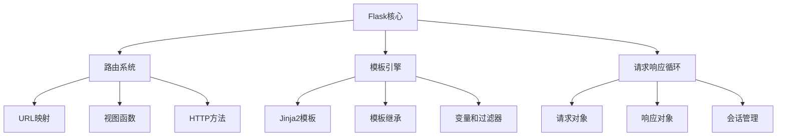

# 11. 最佳实践和总结
## 11.1 Flask 项目结构推荐
一个良好组织的项目结构是维护性和可扩展性的基础。以下是推荐的Flask项目结构：

```plain
myflaskapp/
├── app/
│   ├── __init__.py
│   ├── models/
│   │   ├── __init__.py
│   │   ├── user.py
│   │   └── post.py
│   ├── routes/
│   │   ├── __init__.py
│   │   ├── auth.py
│   │   ├── main.py
│   │   └── api.py
│   ├── templates/
│   │   ├── base.html
│   │   ├── auth/
│   │   │   ├── login.html
│   │   │   └── register.html
│   │   └── main/
│   │       ├── index.html
│   │       └── dashboard.html
│   ├── static/
│   │   ├── css/
│   │   ├── js/
│   │   ├── images/
│   │   └── uploads/
│   ├── utils/
│   │   ├── __init__.py
│   │   ├── helpers.py
│   │   └── validators.py
│   ├── errors/
│   │   ├── __init__.py
│   │   └── handlers.py
│   └── config.py
├── migrations/
├── tests/
│   ├── __init__.py
│   ├── test_models.py
│   ├── test_routes.py
│   └── test_api.py
├── venv/
├── instance/
│   └── config.py
├── requirements.txt
├── config.py
├── .env
├── .gitignore
├── Dockerfile
├── docker-compose.yml
└── README.md
```

**应用工厂模式**：

```python
# app/__init__.py
from flask import Flask
from flask_sqlalchemy import SQLAlchemy
from flask_login import LoginManager
from flask_migrate import Migrate

db = SQLAlchemy()
login_manager = LoginManager()
migrate = Migrate()

def create_app(config_class='config.Config'):
    app = Flask(__name__)
    app.config.from_object(config_class)
    
    # 初始化扩展
    db.init_app(app)
    login_manager.init_app(app)
    migrate.init_app(app, db)
    
    # 注册蓝图
    from app.routes.auth import auth_bp
    from app.routes.main import main_bp
    from app.routes.api import api_bp
    
    app.register_blueprint(auth_bp)
    app.register_blueprint(main_bp)
    app.register_blueprint(api_bp, url_prefix='/api')
    
    # 注册错误处理
    from app.errors.handlers import register_error_handlers
    register_error_handlers(app)
    
    # 上下文处理器
    @app.context_processor
    def inject_template_vars():
        return dict(
            site_name=app.config.get('SITE_NAME', 'Flask App')
        )
    
    return app
```

## 11.2 代码风格和文档
**代码规范遵循PEP 8**：

```python
# 好的代码风格示例
from datetime import datetime
from flask import render_template, request, jsonify

def create_user(username, email, password):
    """
    创建新用户
    
    Args:
        username (str): 用户名
        email (str): 邮箱地址
        password (str): 密码
        
    Returns:
        User: 新创建的用户对象
        
    Raises:
        ValueError: 当用户名或邮箱已存在时
    """
    # 检查用户是否存在
    if User.query.filter_by(username=username).first():
        raise ValueError('用户名已存在')
    
    if User.query.filter_by(email=email).first():
        raise ValueError('邮箱已存在')
    
    # 创建用户
    user = User(
        username=username,
        email=email,
        created_at=datetime.utcnow()
    )
    user.set_password(password)
    
    return user
```

**API文档生成**：

```python
from flask_restx import Api, Resource, fields
from flask_restx import Namespace

api = Namespace('users', description='用户管理操作')

# 定义数据模型
user_model = api.model('User', {
    'id': fields.Integer(readonly=True, description='用户ID'),
    'username': fields.String(required=True, description='用户名'),
    'email': fields.String(required=True, description='邮箱地址'),
    'created_at': fields.DateTime(description='创建时间')
})

@api.route('/')
class UserList(Resource):
    @api.doc('list_users')
    @api.marshal_list_with(user_model)
    def get(self):
        """获取所有用户列表"""
        return User.query.all()
    
    @api.doc('create_user')
    @api.expect(user_model)
    @api.marshal_with(user_model, code=201)
    def post(self):
        """创建新用户"""
        data = api.payload
        user = create_user(**data)
        db.session.add(user)
        db.session.commit()
        return user, 201
```

## 11.3 常见陷阱和避免方法
**数据库会话管理**：

```python
# 错误示例：在请求外使用数据库会话
def background_task():
    user = User.query.get(1)  # 这会在请求上下文外失败

# 正确做法：使用应用上下文
def background_task():
    with app.app_context():
        user = User.query.get(1)
```

**循环导入问题**：

```python
# 避免循环导入的策略
# 在 __init__.py 中延迟导入
def init_app(app):
    # 在函数内部导入，避免循环导入
    from .routes import auth_bp, main_bp
    app.register_blueprint(auth_bp)
    app.register_blueprint(main_bp)
```

**性能陷阱**：

```python
# N+1查询问题
# 错误做法
users = User.query.all()
for user in users:
    posts = user.posts.all()  # 每次循环都会执行一次查询

# 正确做法：使用急切加载
users = User.query.options(db.joinedload(User.posts)).all()
```

## 11.4 进一步学习资源
**官方文档和教程**：

+ [Flask官方文档](https://flask.palletsprojects.com/)
+ [Flask扩展仓库](https://github.com/mitsuhiko/flask)
+ [Awesome Flask](https://github.com/humiaozuzu/awesome-flask)

**推荐书籍**：

+ 《Flask Web开发：基于Python的Web应用开发实战》
+ 《深入理解Flask》
+ 《Flask框架开发指南》

**在线课程**：

+ Flask官方教程
+ Real Python的Flask课程
+ Udemy和Coursera上的Flask相关课程

**社区资源**：

+ Flask官方邮件列表
+ Stack Overflow的Flask标签
+ Reddit的r/flask社区
+ 中文Flask社区和论坛

## 11.5 总结和回顾
**Flask核心概念回顾**：



**学习路径总结**：


**Flask的优势总结**：

1. **轻量灵活**：微框架设计，不强制项目结构
2. **扩展性强**：丰富的扩展生态系统
3. **学习曲线平缓**：Pythonic的方式，易于上手
4. **社区活跃**：有大量的教程和社区支持
5. **适合快速开发**：原型开发和中小型项目的理想选择

**适用场景**：

+ RESTful API开发
+ 中小型Web应用程序
+ 微服务架构
+ 快速原型开发
+ 教育和学习项目

**未来学习方向**：

1. **异步编程**：学习使用Quart或Flask 2.0的异步支持
2. **微服务架构**：深入理解分布式系统设计
3. **性能优化**：学习高级缓存和数据库优化技术
4. **测试驱动开发**：掌握完整的测试策略
5. **DevOps集成**：学习容器化和自动化部署
