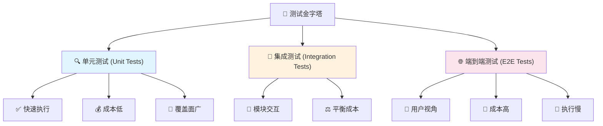
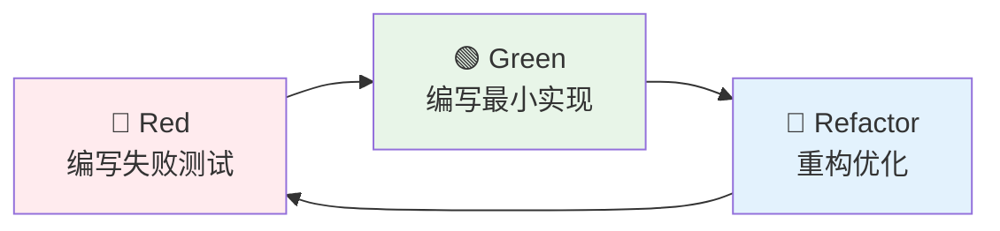
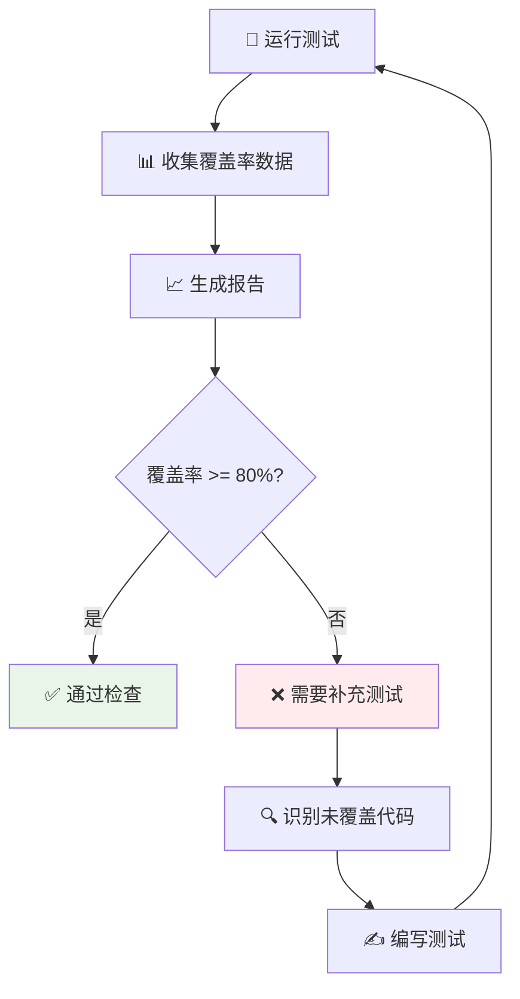
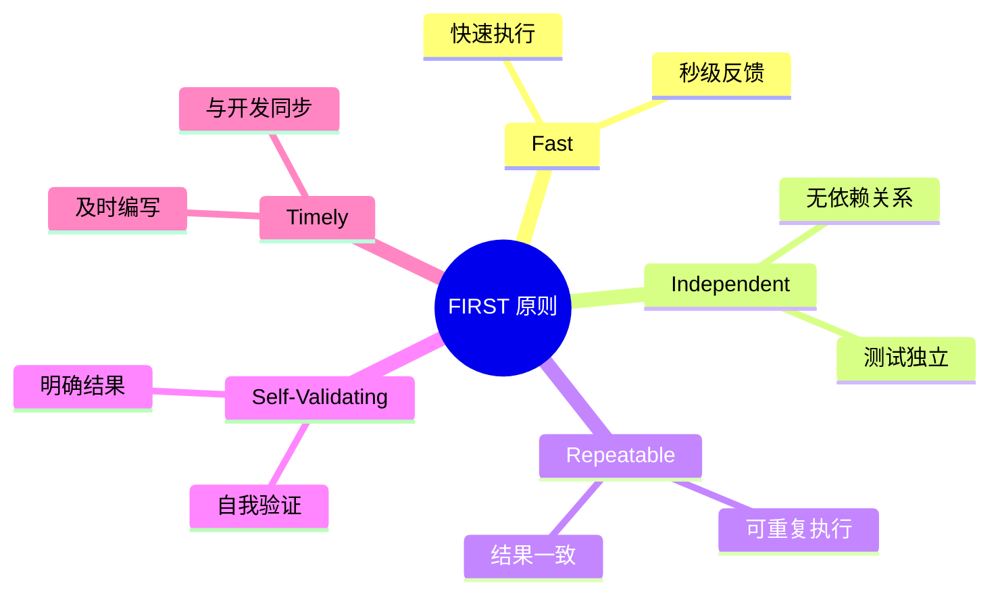

# 🧪 11. 测试策略与实践

> 💡 **核心理念**：测试不是开发完成后的附加工作，而是贯穿整个开发生命周期的质量保证手段。好的测试策略能够提高代码质量、降低维护成本、增强开发信心。

## 🔺 11.1 测试金字塔与测试策略

### 测试金字塔模型



### Flask 测试策略框架
tests/conftest.py
```python
import pytest
from app import create_app, db
from app.models import User, Post

@pytest.fixture
def app():
    """创建测试应用实例"""
    app = create_app('testing')
    
    with app.app_context():
        db.create_all()
        yield app
        db.drop_all()

@pytest.fixture
def client(app):
    """测试客户端"""
    return app.test_client()

@pytest.fixture
def runner(app):
    """CLI 测试运行器"""
    return app.test_cli_runner()
```

## 🔬 11.2 单元测试编写

### 测试驱动开发 (TDD) 流程



### 模型单元测试示例
tests/test_models.py
```python
import pytest
from app.models import User, Post
from werkzeug.security import check_password_hash

class TestUser:
    """用户模型测试类"""
    
    def test_password_hashing(self):
        """测试密码哈希功能"""
        user = User(username='testuser')
        user.set_password('secret')
        
        assert user.password_hash is not None
        assert user.password_hash != 'secret'
        assert user.check_password('secret')
        assert not user.check_password('wrong')
    
    def test_user_repr(self):
        """测试用户字符串表示"""
        user = User(username='john', email='john@example.com')
        assert repr(user) == '<User john>'
    
    @pytest.mark.parametrize('username,email,valid', [
        ('john', 'john@example.com', True),
        ('', 'john@example.com', False),  # 空用户名
        ('john', 'invalid-email', False),  # 无效邮箱
    ])
    def test_user_validation(self, username, email, valid):
        """参数化测试用户验证"""
        user = User(username=username, email=email)
        assert user.is_valid() == valid
```

### 视图函数单元测试
tests/test_views.py
```python
import pytest
from flask import url_for
from app.models import User

class TestAuthViews:
    """认证视图测试"""
    
    def test_register_get(self, client):
        """测试注册页面GET请求"""
        response = client.get('/auth/register')
        assert response.status_code == 200
        assert b'Register' in response.data
    
    def test_register_post_success(self, client, app):
        """测试成功注册"""
        response = client.post('/auth/register', data={
            'username': 'newuser',
            'email': 'new@example.com',
            'password': 'password123',
            'password2': 'password123'
        })
        
        assert response.status_code == 302  # 重定向
        
        with app.app_context():
            user = User.query.filter_by(username='newuser').first()
            assert user is not None
            assert user.email == 'new@example.com'
    
    def test_login_required_decorator(self, client):
        """测试登录装饰器"""
        response = client.get('/dashboard')
        assert response.status_code == 302
        assert '/auth/login' in response.location
```

## 🔗 11.3 集成测试与端到端测试

### 数据库集成测试
tests/test_integration.py
```python
import pytest
from app import db
from app.models import User, Post
from app.services import PostService

class TestPostService:
    """文章服务集成测试"""
    
    @pytest.fixture
    def user(self, app):
        """创建测试用户"""
        with app.app_context():
            user = User(username='author', email='author@example.com')
            user.set_password('password')
            db.session.add(user)
            db.session.commit()
            return user
    
    def test_create_post_with_tags(self, app, user):
        """测试创建带标签的文章"""
        with app.app_context():
            post_data = {
                'title': 'Test Post',
                'content': 'This is a test post',
                'tags': ['python', 'flask', 'testing']
            }
            
            post = PostService.create_post(user.id, post_data)
            
            assert post.title == 'Test Post'
            assert len(post.tags) == 3
            assert 'python' in [tag.name for tag in post.tags]
    
    def test_post_search_functionality(self, app, user):
        """测试文章搜索功能"""
        with app.app_context():
            # 创建测试数据
            posts = [
                Post(title='Python Tutorial', content='Learn Python', author=user),
                Post(title='Flask Guide', content='Learn Flask', author=user),
                Post(title='JavaScript Basics', content='Learn JS', author=user)
            ]
            
            for post in posts:
                db.session.add(post)
            db.session.commit()
            
            # 测试搜索
            results = PostService.search_posts('Python')
            assert len(results) == 1
            assert results[0].title == 'Python Tutorial'
```

### API 端到端测试
tests/test_api_e2e.py
```python
import pytest
import json
from app.models import User

class TestBlogAPI:
    """博客API端到端测试"""
    
    @pytest.fixture
    def auth_headers(self, client, app):
        """获取认证头"""
        with app.app_context():
            # 创建用户
            user = User(username='apiuser', email='api@example.com')
            user.set_password('password')
            db.session.add(user)
            db.session.commit()
            
            # 登录获取token
            response = client.post('/api/auth/login', json={
                'username': 'apiuser',
                'password': 'password'
            })
            
            token = response.json['access_token']
            return {'Authorization': f'Bearer {token}'}
    
    def test_complete_blog_workflow(self, client, auth_headers):
        """测试完整的博客工作流程"""
        # 1. 创建文章
        post_data = {
            'title': 'My First Post',
            'content': 'This is my first blog post',
            'tags': ['first', 'blog']
        }
        
        response = client.post('/api/posts', 
                             json=post_data, 
                             headers=auth_headers)
        assert response.status_code == 201
        post_id = response.json['id']
        
        # 2. 获取文章
        response = client.get(f'/api/posts/{post_id}')
        assert response.status_code == 200
        assert response.json['title'] == 'My First Post'
        
        # 3. 更新文章
        update_data = {'title': 'My Updated Post'}
        response = client.put(f'/api/posts/{post_id}', 
                            json=update_data, 
                            headers=auth_headers)
        assert response.status_code == 200
        
        # 4. 删除文章
        response = client.delete(f'/api/posts/{post_id}', 
                               headers=auth_headers)
        assert response.status_code == 204
        
        # 5. 验证删除
        response = client.get(f'/api/posts/{post_id}')
        assert response.status_code == 404
```

## 📋 11.4 测试数据管理

### Factory Boy 数据工厂
tests/factories.py
```python
import factory
from factory.alchemy import SQLAlchemyModelFactory
from app import db
from app.models import User, Post, Tag

class UserFactory(SQLAlchemyModelFactory):
    """用户数据工厂"""
    class Meta:
        model = User
        sqlalchemy_session = db.session
        sqlalchemy_session_persistence = 'commit'
    
    username = factory.Sequence(lambda n: f'user{n}')
    email = factory.LazyAttribute(lambda obj: f'{obj.username}@example.com')
    password_hash = factory.PostGenerationMethodCall('set_password', 'password123')
    is_active = True

class PostFactory(SQLAlchemyModelFactory):
    """文章数据工厂"""
    class Meta:
        model = Post
        sqlalchemy_session = db.session
        sqlalchemy_session_persistence = 'commit'
    
    title = factory.Faker('sentence', nb_words=4)
    content = factory.Faker('text', max_nb_chars=500)
    author = factory.SubFactory(UserFactory)
    
    @factory.post_generation
    def tags(self, create, extracted, **kwargs):
        if not create:
            return
        
        if extracted:
            for tag_name in extracted:
                tag = Tag.query.filter_by(name=tag_name).first()
                if not tag:
                    tag = Tag(name=tag_name)
                    db.session.add(tag)
                self.tags.append(tag)
```

### 使用数据工厂的测试
tests/test_with_factories.py
```python
import pytest
from tests.factories import UserFactory, PostFactory

class TestWithFactories:
    """使用数据工厂的测试"""
    
    def test_user_creation(self, app):
        """测试用户创建"""
        with app.app_context():
            user = UserFactory()
            assert user.username.startswith('user')
            assert '@example.com' in user.email
    
    def test_post_with_tags(self, app):
        """测试带标签的文章"""
        with app.app_context():
            post = PostFactory(tags=['python', 'flask'])
            assert len(post.tags) == 2
            tag_names = [tag.name for tag in post.tags]
            assert 'python' in tag_names
            assert 'flask' in tag_names
    
    def test_batch_creation(self, app):
        """测试批量创建"""
        with app.app_context():
            users = UserFactory.create_batch(5)
            posts = PostFactory.create_batch(10, author=users[0])
            
            assert len(users) == 5
            assert len(posts) == 10
            assert all(post.author == users[0] for post in posts)
```

## 🎭 11.5 Mock 与 Fixture 使用

### Mock 外部服务
tests/test_mocking.py
```python
import pytest
from unittest.mock import Mock, patch, MagicMock
from app.services import EmailService, PaymentService

class TestEmailService:
    """邮件服务测试"""
    
    @patch('app.services.email.send_mail')
    def test_send_welcome_email(self, mock_send_mail, app):
        """测试发送欢迎邮件"""
        with app.app_context():
            user = UserFactory()
            
            EmailService.send_welcome_email(user)
            
            mock_send_mail.assert_called_once()
            args, kwargs = mock_send_mail.call_args
            assert user.email in args
            assert 'Welcome' in kwargs.get('subject', '')
    
    @patch('requests.post')
    def test_payment_processing(self, mock_post, app):
        """测试支付处理"""
        # 模拟成功响应
        mock_response = Mock()
        mock_response.status_code = 200
        mock_response.json.return_value = {
            'status': 'success',
            'transaction_id': 'txn_123456'
        }
        mock_post.return_value = mock_response
        
        with app.app_context():
            result = PaymentService.process_payment({
                'amount': 100.00,
                'currency': 'USD',
                'card_token': 'tok_visa'
            })
            
            assert result['status'] == 'success'
            assert 'transaction_id' in result
            mock_post.assert_called_once()
```

### 高级 Fixture 使用
tests/conftest.py
```python
import pytest
from unittest.mock import patch
from app.services import CacheService

@pytest.fixture(scope='session')
def redis_mock():
    """会话级别的Redis模拟"""
    with patch('app.extensions.redis_client') as mock_redis:
        # 模拟Redis行为
        cache = {}
        
        def mock_get(key):
            return cache.get(key)
        
        def mock_set(key, value, ex=None):
            cache[key] = value
            return True
        
        def mock_delete(key):
            return cache.pop(key, None) is not None
        
        mock_redis.get.side_effect = mock_get
        mock_redis.set.side_effect = mock_set
        mock_redis.delete.side_effect = mock_delete
        
        yield mock_redis

@pytest.fixture
def authenticated_user(client, app):
    """已认证用户fixture"""
    with app.app_context():
        user = UserFactory()
        
        with client.session_transaction() as sess:
            sess['user_id'] = user.id
            sess['_fresh'] = True
        
        return user
```

## 📈 11.6 测试覆盖率分析

### 配置测试覆盖率
.coveragerc
```python
[run]
source = app
omit = 
    app/__init__.py
    app/config.py
    */venv/*
    */migrations/*
    */tests/*

[report]
exclude_lines =
    pragma: no cover
    def __repr__
    raise AssertionError
    raise NotImplementedError

[html]
directory = htmlcov
```

### 覆盖率测试命令

```bash
# 运行测试并生成覆盖率报告
pytest --cov=app --cov-report=html --cov-report=term-missing

# 查看详细覆盖率
coverage report -m

# 生成HTML报告
coverage html
```

### 覆盖率分析流程



## ⚡ 11.7 性能测试与压力测试

### 使用 pytest-benchmark
tests/test_performance.py
```python
import pytest
from app.services import SearchService
from tests.factories import PostFactory

class TestPerformance:
    """性能测试"""
    
    @pytest.fixture(scope='class')
    def large_dataset(self, app):
        """创建大数据集"""
        with app.app_context():
            posts = PostFactory.create_batch(1000)
            return posts
    
    def test_search_performance(self, benchmark, app, large_dataset):
        """测试搜索性能"""
        with app.app_context():
            result = benchmark(SearchService.search_posts, 'python')
            assert len(result) > 0
    
    def test_pagination_performance(self, benchmark, app, large_dataset):
        """测试分页性能"""
        with app.app_context():
            result = benchmark(
                SearchService.get_posts_paginated, 
                page=1, 
                per_page=20
            )
            assert result.total > 0
```

### 使用 Locust 进行压力测试
locustfile.py
```python
from locust import HttpUser, task, between
import random

class BlogUser(HttpUser):
    """博客用户行为模拟"""
    wait_time = between(1, 3)
    
    def on_start(self):
        """用户开始时的行为"""
        # 登录
        response = self.client.post('/auth/login', {
            'username': 'testuser',
            'password': 'password'
        })
        
    @task(3)
    def view_posts(self):
        """浏览文章 - 高频操作"""
        self.client.get('/posts')
        
        # 随机查看具体文章
        post_id = random.randint(1, 100)
        self.client.get(f'/posts/{post_id}')
    
    @task(1)
    def create_post(self):
        """创建文章 - 低频操作"""
        self.client.post('/posts', {
            'title': f'Test Post {random.randint(1, 1000)}',
            'content': 'This is a test post content'
        })
    
    @task(2)
    def search_posts(self):
        """搜索文章 - 中频操作"""
        keywords = ['python', 'flask', 'web', 'api', 'database']
        keyword = random.choice(keywords)
        self.client.get(f'/search?q={keyword}')
```

### 性能监控与分析
tests/test_monitoring.py
```python
import time
import psutil
import pytest
from app import create_app

class TestResourceUsage:
    """资源使用测试"""
    
    def test_memory_usage(self, app):
        """测试内存使用"""
        process = psutil.Process()
        initial_memory = process.memory_info().rss
        
        # 执行大量操作
        with app.app_context():
            posts = PostFactory.create_batch(100)
            
        final_memory = process.memory_info().rss
        memory_increase = final_memory - initial_memory
        
        # 内存增长不应超过50MB
        assert memory_increase < 50 * 1024 * 1024
    
    def test_response_time(self, client):
        """测试响应时间"""
        start_time = time.time()
        response = client.get('/posts')
        end_time = time.time()
        
        response_time = end_time - start_time
        
        assert response.status_code == 200
        assert response_time < 1.0  # 响应时间应小于1秒
```

## 🎯 测试最佳实践总结

### 测试原则 FIRST



### 测试命名约定

```python
# ✅ 好的测试命名
def test_user_login_with_valid_credentials_should_return_success():
    pass

def test_user_login_with_invalid_password_should_return_error():
    pass

def test_post_creation_without_title_should_raise_validation_error():
    pass

# ❌ 不好的测试命名
def test_login():
    pass

def test_user():
    pass
```

### 持续集成配置
.github/workflows/test.yml
```yaml
name: Tests

on: [push, pull_request]

jobs:
  test:
    runs-on: ubuntu-latest
    
    services:
      postgres:
        image: postgres:13
        env:
          POSTGRES_PASSWORD: postgres
        options: >-
          --health-cmd pg_isready
          --health-interval 10s
          --health-timeout 5s
          --health-retries 5
    
    steps:
    - uses: actions/checkout@v2
    
    - name: Set up Python
      uses: actions/setup-python@v2
      with:
        python-version: 3.9
    
    - name: Install dependencies
      run: |
        pip install -r requirements.txt
        pip install pytest pytest-cov
    
    - name: Run tests
      run: |
        pytest --cov=app --cov-report=xml
    
    - name: Upload coverage
      uses: codecov/codecov-action@v1
```

通过系统性的测试策略，我们能够构建高质量、可维护的Flask应用。测试不仅是质量保证的手段，更是设计良好代码架构的驱动力。在下一章中，我们将探讨代码质量与规范，进一步提升开发效率和代码可维护性。
        