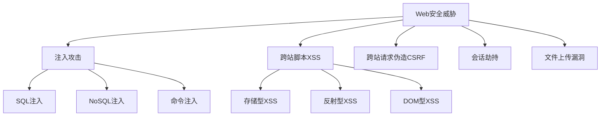
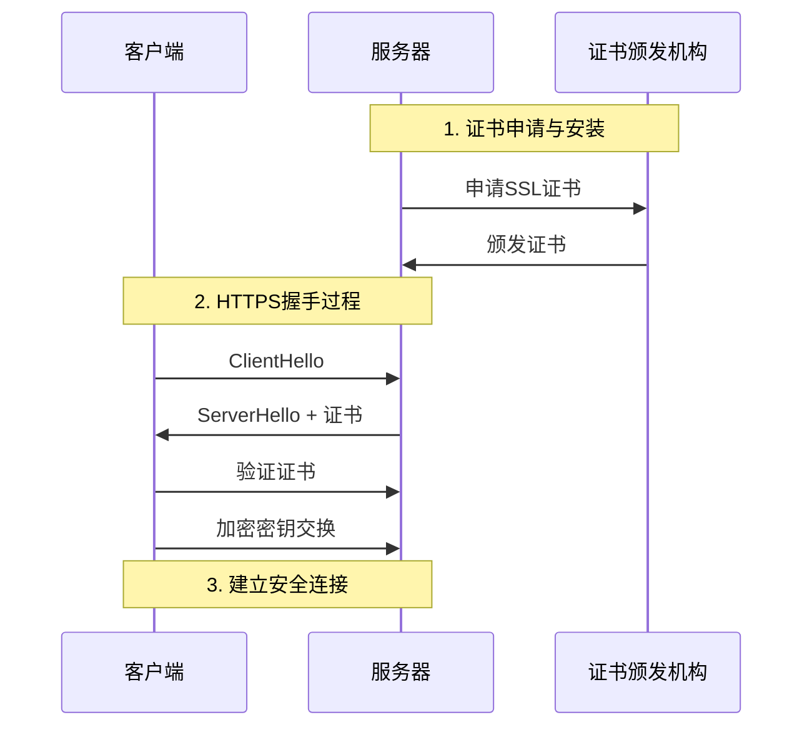
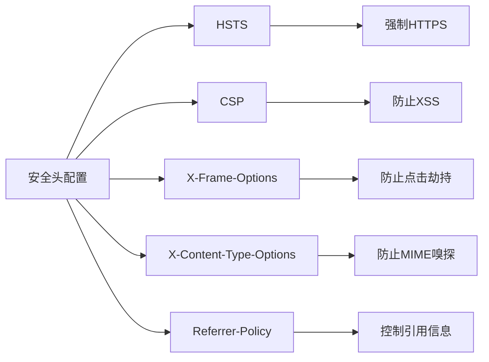
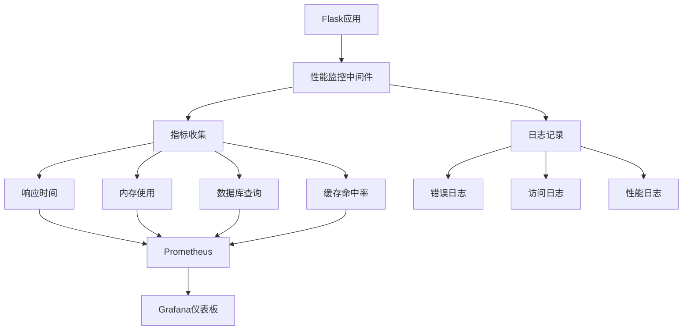
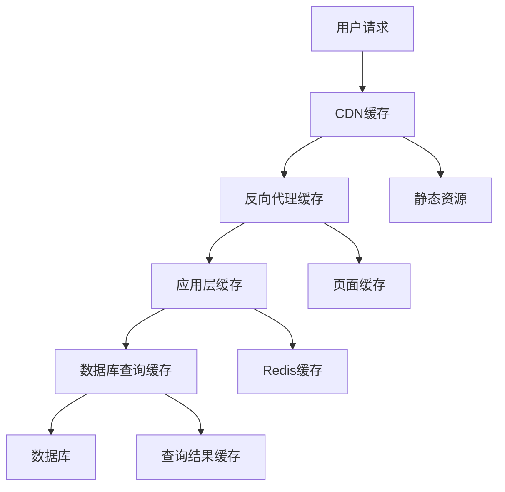
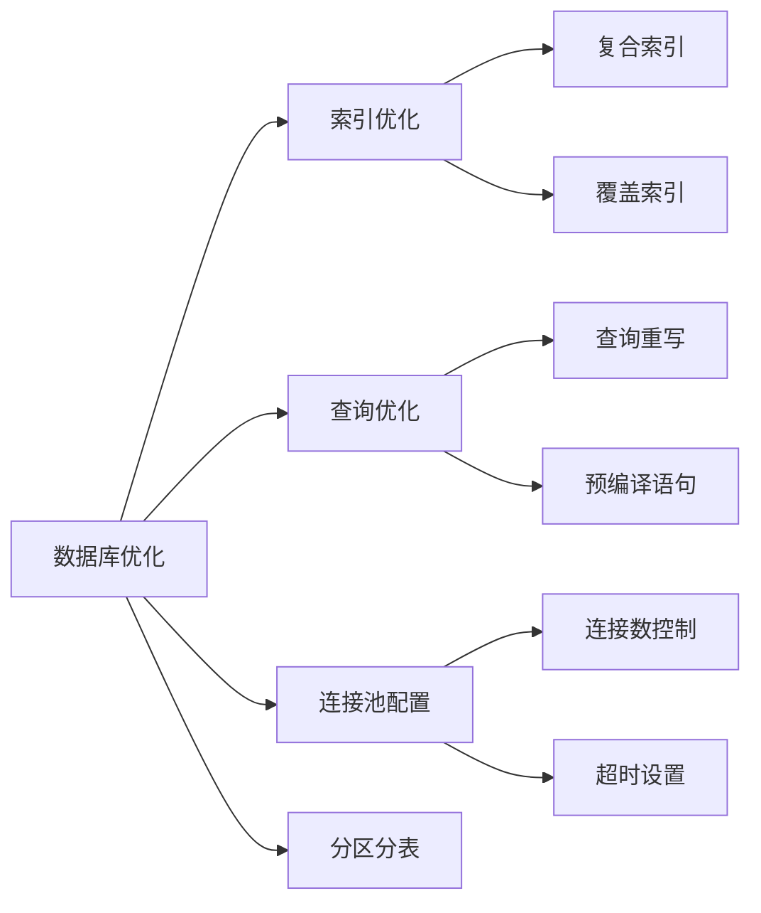

# 🔒⚡ 15. 安全与性能优化

在现代Web应用开发中，安全性和性能是两个不可忽视的关键要素。本章将深入探讨Flask应用的安全防护策略和性能优化技术，帮助你构建既安全又高效的Web应用。

## 🛡️ 15.1 Web 安全最佳实践

### 15.1.1 常见Web安全威胁



### 15.1.2 输入验证与数据清理

**核心原则**：永远不要信任用户输入
app/security/validators.py
```python
from flask import request
from werkzeug.utils import secure_filename
import re
import bleach

class SecurityValidator:
    @staticmethod
    def sanitize_html(content):
        """清理HTML内容，防止XSS攻击"""
        allowed_tags = ['p', 'br', 'strong', 'em', 'ul', 'ol', 'li']
        return bleach.clean(content, tags=allowed_tags, strip=True)
    
    @staticmethod
    def validate_filename(filename):
        """验证文件名安全性"""
        if not filename or '..' in filename:
            return False
        return secure_filename(filename) == filename
    
    @staticmethod
    def validate_sql_input(input_str):
        """基础SQL注入检测"""
        dangerous_patterns = [
            r'(union|select|insert|update|delete|drop|create|alter)',
            r'(script|javascript|vbscript)',
            r'(\<|\>|\&|\"|\'|\;|\(|\))'
        ]
        
        for pattern in dangerous_patterns:
            if re.search(pattern, input_str, re.IGNORECASE):
                return False
        return True
```

### 15.1.3 SQL注入防护

**使用参数化查询**：
app/models/user.py
```python
from sqlalchemy import text
from app import db

class User(db.Model):
    # ... 模型定义 ...
    
    @classmethod
    def find_by_email_safe(cls, email):
        """安全的用户查询方法"""
        # ✅ 正确：使用参数化查询
        return cls.query.filter(cls.email == email).first()
    
    @classmethod
    def search_users_safe(cls, keyword):
        """安全的用户搜索"""
        # ✅ 正确：使用SQLAlchemy的text()和参数绑定
        query = text(
            "SELECT * FROM users WHERE username LIKE :keyword OR email LIKE :keyword"
        )
        return db.session.execute(query, {'keyword': f'%{keyword}%'}).fetchall()
```

**❌ 危险示例（永远不要这样做）**：
```python
# 危险：直接字符串拼接
def unsafe_query(user_input):
    query = f"SELECT * FROM users WHERE name = '{user_input}'"
    # 攻击者可以输入: ' OR '1'='1' --
    return db.session.execute(query)
```

### 15.1.4 XSS防护策略
app/utils/security.py
```python
from markupsafe import Markup, escape
from flask import current_app

class XSSProtection:
    @staticmethod
    def safe_render(content, allow_html=False):
        """安全渲染用户内容"""
        if not allow_html:
            return escape(content)
        
        # 使用白名单方式清理HTML
        return Markup(bleach.clean(
            content,
            tags=['p', 'br', 'strong', 'em', 'a'],
            attributes={'a': ['href', 'title']},
            protocols=['http', 'https', 'mailto']
        ))
    
    @staticmethod
    def create_csp_header():
        """创建内容安全策略头"""
        return {
            'Content-Security-Policy': (
                "default-src 'self'; "
                "script-src 'self' 'unsafe-inline' https://cdn.jsdelivr.net; "
                "style-src 'self' 'unsafe-inline' https://fonts.googleapis.com; "
                "img-src 'self' data: https:; "
                "font-src 'self' https://fonts.gstatic.com;"
            )
        }
```

**模板中的安全实践**：
templates/base.html
```html
<!-- ✅ 正确：自动转义 -->
<p>用户名：{{ user.username }}</p>

<!-- ✅ 正确：明确标记为安全内容 -->
<div>{{ content | safe }}</div>

<!-- ❌ 危险：直接输出原始HTML -->
<div>{{ user_input | safe }}</div>
```

## 🔐 15.2 HTTPS 配置与证书管理

### 15.2.1 HTTPS配置流程



### 15.2.2 Flask HTTPS配置
app/config.py
```python
import os
from datetime import timedelta

class ProductionConfig:
    # HTTPS强制配置
    PREFERRED_URL_SCHEME = 'https'
    SESSION_COOKIE_SECURE = True
    SESSION_COOKIE_HTTPONLY = True
    SESSION_COOKIE_SAMESITE = 'Lax'
    
    # HSTS配置
    PERMANENT_SESSION_LIFETIME = timedelta(hours=1)
    
    # SSL证书路径
    SSL_CERT_PATH = os.environ.get('SSL_CERT_PATH', '/etc/ssl/certs/app.crt')
    SSL_KEY_PATH = os.environ.get('SSL_KEY_PATH', '/etc/ssl/private/app.key')
```

app/__init__.py
```python
from flask_talisman import Talisman

def create_app(config_name):
    app = Flask(__name__)
    app.config.from_object(config[config_name])
    
    # 配置HTTPS安全头
    if config_name == 'production':
        Talisman(app, 
            force_https=True,
            strict_transport_security=True,
            strict_transport_security_max_age=31536000,  # 1年
            content_security_policy={
                'default-src': "'self'",
                'script-src': "'self' 'unsafe-inline'",
                'style-src': "'self' 'unsafe-inline'"
            }
        )
    
    return app
```

### 15.2.3 Let's Encrypt自动化证书管理

```bash
# 安装Certbot
sudo apt-get install certbot python3-certbot-nginx

# 获取证书
sudo certbot --nginx -d yourdomain.com -d www.yourdomain.com

# 设置自动续期
sudo crontab -e
# 添加：0 12 * * * /usr/bin/certbot renew --quiet
```

## 🛡️ 15.3 安全头配置

### 15.3.1 关键安全头说明



### 15.3.2 安全头中间件实现
app/middleware/security.py
```python
from flask import g, request, current_app

class SecurityHeaders:
    def __init__(self, app=None):
        if app:
            self.init_app(app)
    
    def init_app(self, app):
        app.after_request(self.add_security_headers)
    
    def add_security_headers(self, response):
        """添加安全响应头"""
        security_headers = {
            # 防止点击劫持
            'X-Frame-Options': 'DENY',
            
            # 防止MIME类型嗅探
            'X-Content-Type-Options': 'nosniff',
            
            # XSS保护
            'X-XSS-Protection': '1; mode=block',
            
            # 引用策略
            'Referrer-Policy': 'strict-origin-when-cross-origin',
            
            # 权限策略
            'Permissions-Policy': (
                'geolocation=(), microphone=(), camera=()'
            )
        }
        
        # 仅在HTTPS下添加HSTS
        if request.is_secure:
            security_headers['Strict-Transport-Security'] = (
                'max-age=31536000; includeSubDomains; preload'
            )
        
        for header, value in security_headers.items():
            response.headers[header] = value
        
        return response
```

## 📊 15.4 性能监控与优化

### 15.4.1 性能监控架构



### 15.4.2 性能监控中间件
app/middleware/performance.py
```python
import time
import psutil
from flask import g, request, current_app
from functools import wraps

class PerformanceMonitor:
    def __init__(self, app=None):
        if app:
            self.init_app(app)
    
    def init_app(self, app):
        app.before_request(self.before_request)
        app.after_request(self.after_request)
    
    def before_request(self):
        """请求开始时记录"""
        g.start_time = time.time()
        g.start_memory = psutil.Process().memory_info().rss
    
    def after_request(self, response):
        """请求结束时计算性能指标"""
        if hasattr(g, 'start_time'):
            duration = time.time() - g.start_time
            memory_used = psutil.Process().memory_info().rss - g.start_memory
            
            # 记录性能指标
            current_app.logger.info(
                f"Performance: {request.endpoint} - "
                f"Duration: {duration:.3f}s, "
                f"Memory: {memory_used/1024/1024:.2f}MB, "
                f"Status: {response.status_code}"
            )
            
            # 慢查询警告
            if duration > 1.0:  # 超过1秒
                current_app.logger.warning(
                    f"Slow request detected: {request.url} took {duration:.3f}s"
                )
        
        return response

def monitor_function_performance(func):
    """函数性能监控装饰器"""
    @wraps(func)
    def wrapper(*args, **kwargs):
        start_time = time.time()
        try:
            result = func(*args, **kwargs)
            return result
        finally:
            duration = time.time() - start_time
            current_app.logger.debug(
                f"Function {func.__name__} took {duration:.3f}s"
            )
    return wrapper
```

### 15.4.3 数据库查询优化
app/models/optimized.py
```python
from sqlalchemy import event
from sqlalchemy.engine import Engine
import time
import logging

# 数据库查询性能监控
logging.basicConfig()
logger = logging.getLogger("sqlalchemy.engine")
logger.setLevel(logging.INFO)

@event.listens_for(Engine, "before_cursor_execute")
def before_cursor_execute(conn, cursor, statement, parameters, context, executemany):
    conn.info.setdefault('query_start_time', []).append(time.time())

@event.listens_for(Engine, "after_cursor_execute")
def after_cursor_execute(conn, cursor, statement, parameters, context, executemany):
    total = time.time() - conn.info['query_start_time'].pop(-1)
    if total > 0.1:  # 慢查询阈值100ms
        logger.warning(f"Slow query: {total:.3f}s - {statement[:100]}...")

class OptimizedUser(db.Model):
    # ... 基础模型定义 ...
    
    @classmethod
    def get_users_with_posts(cls, limit=10):
        """优化的用户和文章联合查询"""
        return cls.query.options(
            db.joinedload(cls.posts)  # 预加载关联数据
        ).limit(limit).all()
    
    @classmethod
    def search_users_optimized(cls, keyword, page=1, per_page=20):
        """优化的用户搜索"""
        return cls.query.filter(
            db.or_(
                cls.username.ilike(f'%{keyword}%'),
                cls.email.ilike(f'%{keyword}%')
            )
        ).paginate(
            page=page, per_page=per_page, error_out=False
        )
```

## 🚀 15.5 缓存策略实施

### 15.5.1 多层缓存架构



### 15.5.2 Flask缓存实现
app/cache/manager.py
```python
from flask_caching import Cache
from functools import wraps
import hashlib
import json

cache = Cache()

class CacheManager:
    def __init__(self, app=None):
        if app:
            self.init_app(app)
    
    def init_app(self, app):
        cache.init_app(app, config={
            'CACHE_TYPE': 'redis',
            'CACHE_REDIS_URL': app.config.get('REDIS_URL', 'redis://localhost:6379/0'),
            'CACHE_DEFAULT_TIMEOUT': 300
        })
    
    @staticmethod
    def cache_key(*args, **kwargs):
        """生成缓存键"""
        key_data = {'args': args, 'kwargs': kwargs}
        key_string = json.dumps(key_data, sort_keys=True)
        return hashlib.md5(key_string.encode()).hexdigest()
    
    @staticmethod
    def cached_view(timeout=300, key_prefix='view'):
        """视图缓存装饰器"""
        def decorator(f):
            @wraps(f)
            def wrapper(*args, **kwargs):
                cache_key = f"{key_prefix}:{CacheManager.cache_key(*args, **kwargs)}"
                
                # 尝试从缓存获取
                cached_result = cache.get(cache_key)
                if cached_result is not None:
                    return cached_result
                
                # 执行函数并缓存结果
                result = f(*args, **kwargs)
                cache.set(cache_key, result, timeout=timeout)
                return result
            return wrapper
        return decorator
```

### 15.5.3 智能缓存策略
app/services/cache_service.py
```python
from app.cache.manager import cache, CacheManager
from flask import current_app
import time

class SmartCacheService:
    @staticmethod
    def get_or_set(key, callback, timeout=300, refresh_threshold=0.8):
        """智能缓存：在过期前主动刷新"""
        cache_data = cache.get(key)
        
        if cache_data is None:
            # 缓存未命中，执行回调
            data = callback()
            cache.set(key, {
                'data': data,
                'timestamp': time.time()
            }, timeout=timeout)
            return data
        
        # 检查是否需要刷新
        age = time.time() - cache_data['timestamp']
        if age > (timeout * refresh_threshold):
            # 异步刷新缓存
            try:
                fresh_data = callback()
                cache.set(key, {
                    'data': fresh_data,
                    'timestamp': time.time()
                }, timeout=timeout)
                return fresh_data
            except Exception as e:
                current_app.logger.error(f"Cache refresh failed: {e}")
                return cache_data['data']  # 返回旧数据
        
        return cache_data['data']
    
    @staticmethod
    def invalidate_pattern(pattern):
        """按模式清除缓存"""
        # 注意：这需要Redis支持
        keys = cache.cache._read_clients.keys(pattern)
        if keys:
            cache.delete_many(*keys)
```

## 🗄️ 15.6 数据库性能调优

### 15.6.1 数据库性能优化策略



### 15.6.2 数据库连接优化
app/config.py
```python
class DatabaseConfig:
    # 数据库连接池配置
    SQLALCHEMY_ENGINE_OPTIONS = {
        'pool_size': 10,          # 连接池大小
        'pool_timeout': 20,       # 获取连接超时时间
        'pool_recycle': 3600,     # 连接回收时间（1小时）
        'pool_pre_ping': True,    # 连接前检查
        'max_overflow': 20,       # 最大溢出连接数
        'echo': False,            # 生产环境关闭SQL日志
    }
    
    # 查询优化配置
    SQLALCHEMY_RECORD_QUERIES = True
    DATABASE_QUERY_TIMEOUT = 0.5  # 慢查询阈值
```

### 15.6.3 查询性能分析工具
app/utils/db_profiler.py
```python
from flask_sqlalchemy import get_debug_queries
from flask import current_app, g

class DatabaseProfiler:
    @staticmethod
    def analyze_queries():
        """分析数据库查询性能"""
        queries = get_debug_queries()
        
        if not queries:
            return
        
        slow_queries = []
        total_time = 0
        
        for query in queries:
            total_time += query.duration
            
            if query.duration > current_app.config.get('DATABASE_QUERY_TIMEOUT', 0.5):
                slow_queries.append({
                    'statement': query.statement,
                    'parameters': query.parameters,
                    'duration': query.duration,
                    'context': query.context
                })
        
        # 记录性能统计
        current_app.logger.info(
            f"Database Performance: {len(queries)} queries, "
            f"Total time: {total_time:.3f}s"
        )
        
        # 记录慢查询
        for slow_query in slow_queries:
            current_app.logger.warning(
                f"Slow Query ({slow_query['duration']:.3f}s): "
                f"{slow_query['statement'][:200]}..."
            )
        
        return {
            'total_queries': len(queries),
            'total_time': total_time,
            'slow_queries': len(slow_queries)
        }
```

## 📋 安全与性能检查清单

### 🔒 安全检查清单
- [ ] 所有用户输入都经过验证和清理
- [ ] 使用参数化查询防止SQL注入
- [ ] 实施XSS防护措施
- [ ] 配置CSRF保护
- [ ] 启用HTTPS和安全头
- [ ] 实施适当的会话管理
- [ ] 定期更新依赖包
- [ ] 配置适当的错误处理

### ⚡ 性能检查清单
- [ ] 实施多层缓存策略
- [ ] 优化数据库查询和索引
- [ ] 配置连接池
- [ ] 启用Gzip压缩
- [ ] 优化静态资源加载
- [ ] 实施性能监控
- [ ] 设置适当的超时配置
- [ ] 使用CDN加速静态资源

---

通过本章的学习，你已经掌握了Flask应用安全防护和性能优化的核心技术。记住，安全和性能优化是一个持续的过程，需要在开发的每个阶段都保持警惕和关注。在下一章中，我们将探讨综合项目实战，将所学知识应用到实际项目中。