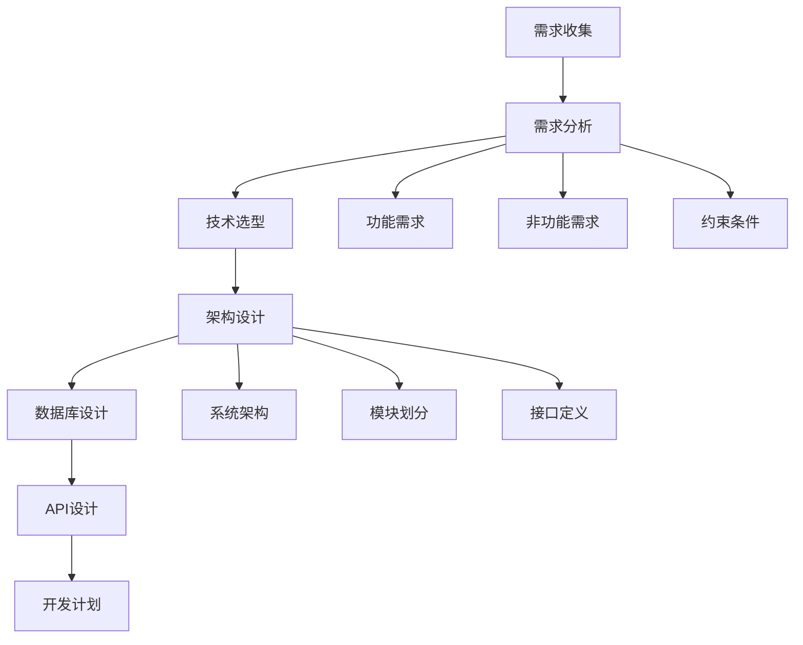
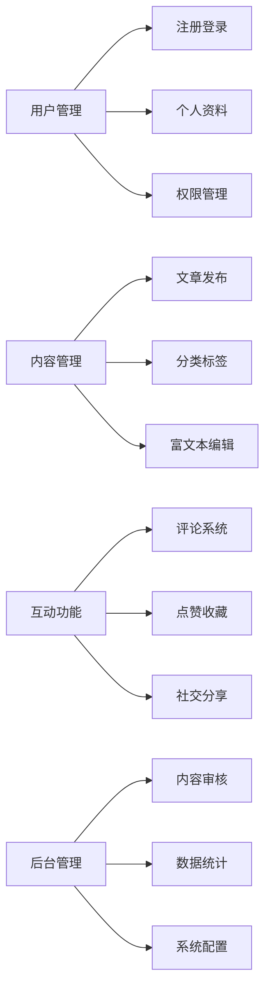
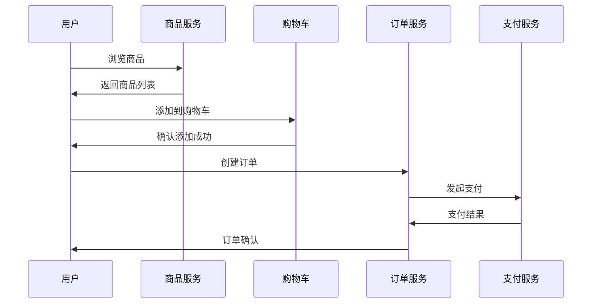
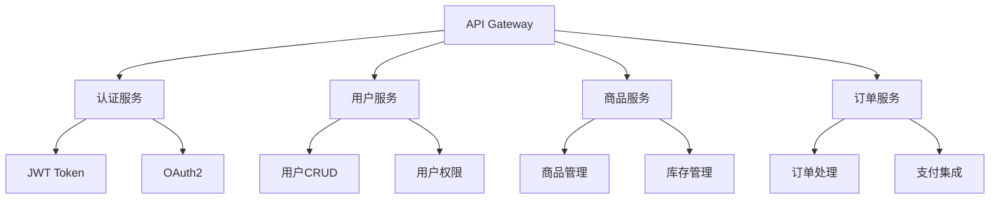
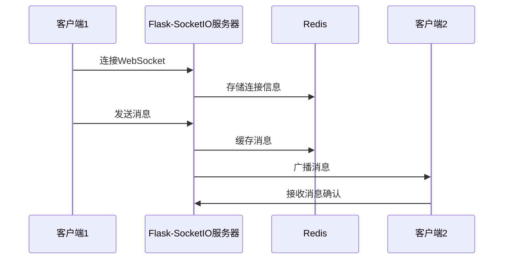
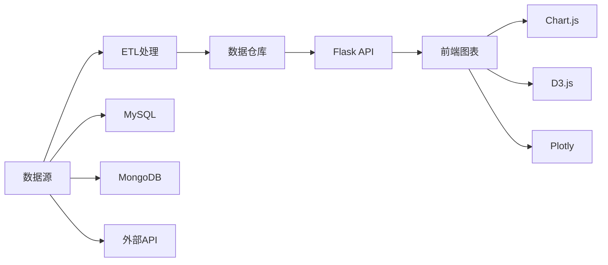

# 🚀 16. 综合项目实战

本章将通过六个完整的实战项目，帮助你将前面学到的Flask知识融会贯通，从项目规划到上线部署，体验完整的开发流程。

## 📋 16.1 项目需求分析与架构设计

### 🎯 需求分析方法论

在开始任何项目之前，我们需要系统地分析需求并设计合理的架构。



### 📐 架构设计原则

**SOLID原则在Flask中的应用：**

- **单一职责原则**：每个蓝图负责单一业务领域
- **开闭原则**：通过插件系统支持扩展
- **里氏替换原则**：数据库抽象层支持多种数据库
- **接口隔离原则**：API版本化管理
- **依赖倒置原则**：依赖注入和配置管理

### 🏗️ 通用项目架构模板

```python
# app/__init__.py - 应用工厂模式
from flask import Flask
from flask_sqlalchemy import SQLAlchemy
from flask_migrate import Migrate
from flask_login import LoginManager
from config import Config

db = SQLAlchemy()
migrate = Migrate()
login = LoginManager()

def create_app(config_class=Config):
    """应用工厂函数"""
    app = Flask(__name__)
    app.config.from_object(config_class)
    
    # 初始化扩展
    db.init_app(app)
    migrate.init_app(app, db)
    login.init_app(app)
    
    # 注册蓝图
    from app.main import bp as main_bp
    app.register_blueprint(main_bp)
    
    from app.auth import bp as auth_bp
    app.register_blueprint(auth_bp, url_prefix='/auth')
    
    from app.api import bp as api_bp
    app.register_blueprint(api_bp, url_prefix='/api')
    
    return app
```

## 📝 16.2 博客系统完整开发

### 🎨 系统功能架构



### 📊 数据库设计

```python
# app/models.py
from datetime import datetime
from app import db, login
from flask_user import UserMixin
from werkzeug.security import generate_password_hash, check_password_hash

class User(UserMixin, db.Model):
    """用户模型"""
    id = db.Column(db.Integer, primary_key=True)
    username = db.Column(db.String(64), index=True, unique=True)
    email = db.Column(db.String(120), index=True, unique=True)
    password_hash = db.Column(db.String(128))
    posts = db.relationship('Post', backref='author', lazy='dynamic')
    created_at = db.Column(db.DateTime, default=datetime.utcnow)
    
    def set_password(self, password):
        self.password_hash = generate_password_hash(password)
    
    def check_password(self, password):
        return check_password_hash(self.password_hash, password)

class Post(db.Model):
    """文章模型"""
    id = db.Column(db.Integer, primary_key=True)
    title = db.Column(db.String(140))
    body = db.Column(db.Text)
    timestamp = db.Column(db.DateTime, index=True, default=datetime.utcnow)
    user_id = db.Column(db.Integer, db.ForeignKey('user.id'))
    category_id = db.Column(db.Integer, db.ForeignKey('category.id'))
    
class Category(db.Model):
    """分类模型"""
    id = db.Column(db.Integer, primary_key=True)
    name = db.Column(db.String(64), unique=True)
    posts = db.relationship('Post', backref='category', lazy='dynamic')
```

### 🔧 核心功能实现

**文章发布功能：**

```python
# app/main/routes.py
from flask import render_template, flash, redirect, url_for, request
from flask_login import current_user, login_required
from app import db
from app.main import bp
from app.main.forms import PostForm
from app.models import Post

@bp.route('/create_post', methods=['GET', 'POST'])
@login_required
def create_post():
    """创建文章"""
    form = PostForm()
    if form.validate_on_submit():
        post = Post(
            title=form.title.data,
            body=form.body.data,
            author=current_user
        )
        db.session.add(post)
        db.session.commit()
        flash('文章发布成功！', 'success')
        return redirect(url_for('main.index'))
    
    return render_template('create_post.html', form=form)
```

## 🛒 16.3 电商平台核心功能

### 💼 业务流程设计



### 🛍️ 商品管理系统

```python
# app/shop/models.py
class Product(db.Model):
    """商品模型"""
    id = db.Column(db.Integer, primary_key=True)
    name = db.Column(db.String(100), nullable=False)
    description = db.Column(db.Text)
    price = db.Column(db.Numeric(10, 2), nullable=False)
    stock = db.Column(db.Integer, default=0)
    category_id = db.Column(db.Integer, db.ForeignKey('category.id'))
    images = db.relationship('ProductImage', backref='product')
    
    @property
    def is_available(self):
        return self.stock > 0
    
    def reduce_stock(self, quantity):
        """减少库存"""
        if self.stock >= quantity:
            self.stock -= quantity
            return True
        return False

class ShoppingCart(db.Model):
    """购物车模型"""
    id = db.Column(db.Integer, primary_key=True)
    user_id = db.Column(db.Integer, db.ForeignKey('user.id'))
    product_id = db.Column(db.Integer, db.ForeignKey('product.id'))
    quantity = db.Column(db.Integer, default=1)
    created_at = db.Column(db.DateTime, default=datetime.utcnow)
```

### 💳 订单处理流程

```python
# app/shop/services.py
from app import db
from app.models import Order, OrderItem, Product

class OrderService:
    """订单服务类"""
    
    @staticmethod
    def create_order(user_id, cart_items):
        """创建订单"""
        try:
            order = Order(user_id=user_id)
            total_amount = 0
            
            for item in cart_items:
                product = Product.query.get(item.product_id)
                if not product.reduce_stock(item.quantity):
                    raise ValueError(f'商品 {product.name} 库存不足')
                
                order_item = OrderItem(
                    product_id=product.id,
                    quantity=item.quantity,
                    price=product.price
                )
                order.items.append(order_item)
                total_amount += product.price * item.quantity
            
            order.total_amount = total_amount
            db.session.add(order)
            db.session.commit()
            
            return order
        except Exception as e:
            db.session.rollback()
            raise e
```

## 🔌 16.4 API 服务开发

### 🌐 RESTful API 设计



### 🔐 API 认证与授权

```python
# app/api/auth.py
from functools import wraps
from flask import request, jsonify, current_app
from flask_jwt_extended import verify_jwt_in_request, get_jwt_identity
import jwt

def token_required(f):
    """API认证装饰器"""
    @wraps(f)
    def decorated(*args, **kwargs):
        token = request.headers.get('Authorization')
        
        if not token:
            return jsonify({'message': '缺少认证令牌'}), 401
        
        try:
            # 移除 'Bearer ' 前缀
            token = token.split(' ')[1]
            data = jwt.decode(
                token, 
                current_app.config['SECRET_KEY'], 
                algorithms=['HS256']
            )
            current_user_id = data['user_id']
        except jwt.ExpiredSignatureError:
            return jsonify({'message': '令牌已过期'}), 401
        except jwt.InvalidTokenError:
            return jsonify({'message': '无效令牌'}), 401
        
        return f(current_user_id, *args, **kwargs)
    
    return decorated
```

### 📡 API 响应格式标准化

```python
# app/api/utils.py
from flask import jsonify

class APIResponse:
    """标准化API响应"""
    
    @staticmethod
    def success(data=None, message='操作成功', code=200):
        """成功响应"""
        response = {
            'success': True,
            'code': code,
            'message': message,
            'data': data
        }
        return jsonify(response), code
    
    @staticmethod
    def error(message='操作失败', code=400, errors=None):
        """错误响应"""
        response = {
            'success': False,
            'code': code,
            'message': message,
            'errors': errors
        }
        return jsonify(response), code

# 使用示例
@bp.route('/api/users', methods=['GET'])
@token_required
def get_users(current_user_id):
    """获取用户列表"""
    try:
        users = User.query.all()
        users_data = [{
            'id': user.id,
            'username': user.username,
            'email': user.email
        } for user in users]
        
        return APIResponse.success(users_data)
    except Exception as e:
        return APIResponse.error(str(e), 500)
```

## 💬 16.5 实时聊天应用

### 🔄 WebSocket 架构设计



### 💡 实时通信实现

```python
# app/chat/__init__.py
from flask import Flask
from flask_socketio import SocketIO, emit, join_room, leave_room
from flask_login import current_user

socketio = SocketIO(cors_allowed_origins="*")

@socketio.on('connect')
def on_connect():
    """用户连接"""
    if current_user.is_authenticated:
        join_room(f'user_{current_user.id}')
        emit('status', {'msg': f'{current_user.username} 已连接'})

@socketio.on('disconnect')
def on_disconnect():
    """用户断开连接"""
    if current_user.is_authenticated:
        leave_room(f'user_{current_user.id}')
        emit('status', {'msg': f'{current_user.username} 已断开连接'})

@socketio.on('send_message')
def handle_message(data):
    """处理消息发送"""
    if current_user.is_authenticated:
        message = {
            'username': current_user.username,
            'message': data['message'],
            'timestamp': datetime.now().strftime('%Y-%m-%d %H:%M:%S')
        }
        
        # 保存消息到数据库
        chat_message = ChatMessage(
            user_id=current_user.id,
            content=data['message'],
            room_id=data.get('room_id', 'general')
        )
        db.session.add(chat_message)
        db.session.commit()
        
        # 广播消息
        emit('receive_message', message, broadcast=True)
```

## 📊 16.6 数据分析仪表板

### 📈 数据可视化架构



### 📊 数据处理与分析

```python
# app/analytics/services.py
import pandas as pd
from sqlalchemy import text
from app import db

class AnalyticsService:
    """数据分析服务"""
    
    @staticmethod
    def get_user_growth_data():
        """获取用户增长数据"""
        query = text("""
            SELECT 
                DATE(created_at) as date,
                COUNT(*) as new_users,
                SUM(COUNT(*)) OVER (ORDER BY DATE(created_at)) as total_users
            FROM users 
            WHERE created_at >= DATE_SUB(NOW(), INTERVAL 30 DAY)
            GROUP BY DATE(created_at)
            ORDER BY date
        """)
        
        result = db.session.execute(query)
        data = [{
            'date': row.date.strftime('%Y-%m-%d'),
            'new_users': row.new_users,
            'total_users': row.total_users
        } for row in result]
        
        return data
    
    @staticmethod
    def get_sales_analytics():
        """获取销售分析数据"""
        # 使用pandas进行数据分析
        df = pd.read_sql_query(
            "SELECT * FROM orders WHERE created_at >= DATE_SUB(NOW(), INTERVAL 90 DAY)",
            db.engine
        )
        
        # 计算各种指标
        analytics = {
            'total_revenue': df['total_amount'].sum(),
            'avg_order_value': df['total_amount'].mean(),
            'order_count': len(df),
            'daily_sales': df.groupby(df['created_at'].dt.date)['total_amount'].sum().to_dict()
        }
        
        return analytics
```

### 🎨 前端图表集成

```html
<!-- templates/dashboard.html -->
<div class="dashboard-container">
    <div class="chart-grid">
        <div class="chart-card">
            <h3>📈 用户增长趋势</h3>
            <canvas id="userGrowthChart"></canvas>
        </div>
        
        <div class="chart-card">
            <h3>💰 销售数据分析</h3>
            <canvas id="salesChart"></canvas>
        </div>
    </div>
</div>

<script>
// 用户增长图表
fetch('/api/analytics/user-growth')
    .then(response => response.json())
    .then(data => {
        const ctx = document.getElementById('userGrowthChart').getContext('2d');
        new Chart(ctx, {
            type: 'line',
            data: {
                labels: data.map(item => item.date),
                datasets: [{
                    label: '新增用户',
                    data: data.map(item => item.new_users),
                    borderColor: 'rgb(75, 192, 192)',
                    tension: 0.1
                }]
            },
            options: {
                responsive: true,
                plugins: {
                    title: {
                        display: true,
                        text: '用户增长趋势'
                    }
                }
            }
        });
    });
</script>
```

## 🎯 项目实战总结

通过这六个综合项目，我们涵盖了Flask开发的各个方面：

- **🏗️ 架构设计**：从需求分析到系统设计的完整流程
- **💾 数据管理**：复杂的数据模型设计和关系处理
- **🔐 安全认证**：多种认证方式和权限控制
- **🌐 API开发**：RESTful API设计和文档化
- **⚡ 实时通信**：WebSocket和实时数据推送
- **📊 数据分析**：数据处理和可视化展示

### 💡 最佳实践要点

1. **模块化设计**：使用蓝图组织代码结构
2. **配置管理**：环境变量和配置文件分离
3. **错误处理**：统一的异常处理和日志记录
4. **测试覆盖**：单元测试和集成测试
5. **性能优化**：数据库查询优化和缓存策略
6. **安全防护**：输入验证和SQL注入防护

这些项目不仅帮助你掌握Flask的技术细节，更重要的是培养了系统性的项目开发思维和工程实践能力。在实际开发中，可以根据具体需求选择合适的技术栈和架构模式。