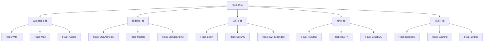
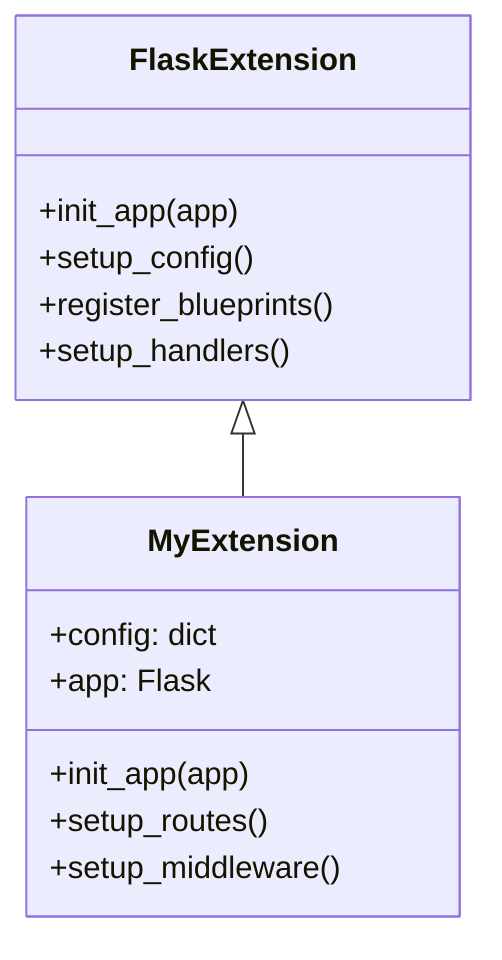
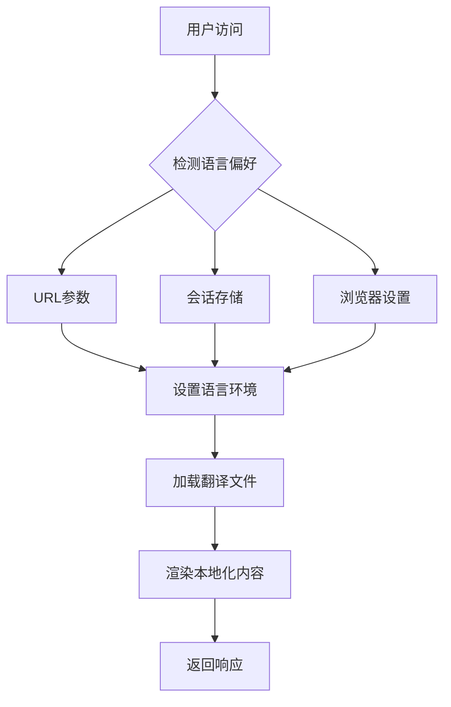
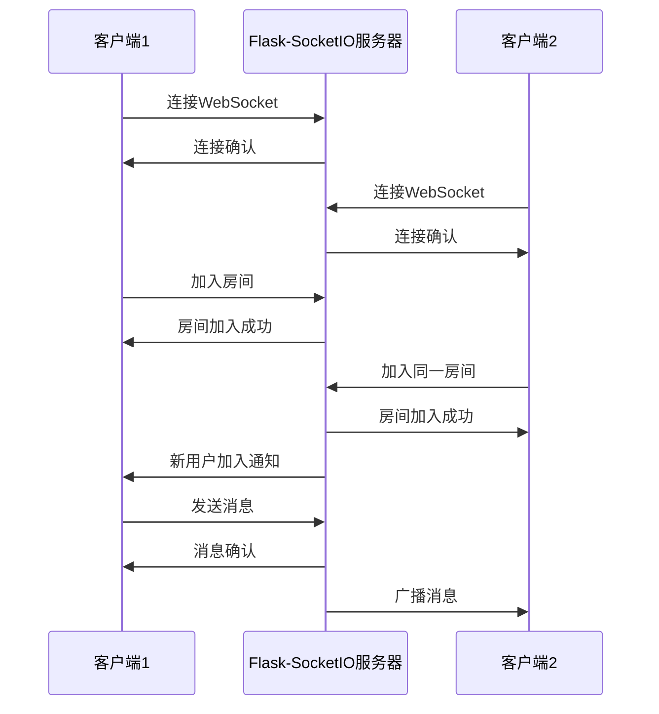
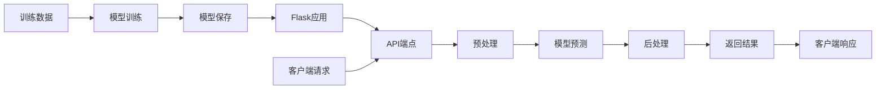

# 🌟 17. 生态系统与扩展

Flask 的强大之处不仅在于其简洁的核心，更在于其丰富的生态系统。本章将深入探讨 Flask 扩展的使用、开发以及与其他技术的集成。

## 📦 17.1 常用 Flask 扩展详解

### Flask 扩展生态系统概览



### 🔧 核心扩展详解

#### Flask-SQLAlchemy：数据库 ORM

```python
from flask import Flask
from flask_sqlalchemy import SQLAlchemy

app = Flask(__name__)
app.config['SQLALCHEMY_DATABASE_URI'] = 'sqlite:///example.db'
db = SQLAlchemy(app)

class User(db.Model):
    id = db.Column(db.Integer, primary_key=True)
    username = db.Column(db.String(80), unique=True, nullable=False)
    email = db.Column(db.String(120), unique=True, nullable=False)
    
    def __repr__(self):
        return f'<User {self.username}>'

# 创建表
with app.app_context():
    db.create_all()
```

#### Flask-Login：用户会话管理

```python
from flask_login import LoginManager, UserMixin, login_required

login_manager = LoginManager()
login_manager.init_app(app)
login_manager.login_view = 'login'

class User(UserMixin, db.Model):
    # ... 模型定义
    pass

@login_manager.user_loader
def load_user(user_id):
    return User.query.get(int(user_id))

@app.route('/dashboard')
@login_required
def dashboard():
    return render_template('dashboard.html')
```

#### Flask-WTF：表单处理

```python
from flask_wtf import FlaskForm
from wtforms import StringField, PasswordField, SubmitField
from wtforms.validators import DataRequired, Email

class LoginForm(FlaskForm):
    email = StringField('邮箱', validators=[DataRequired(), Email()])
    password = PasswordField('密码', validators=[DataRequired()])
    submit = SubmitField('登录')

@app.route('/login', methods=['GET', 'POST'])
def login():
    form = LoginForm()
    if form.validate_on_submit():
        # 处理登录逻辑
        return redirect(url_for('dashboard'))
    return render_template('login.html', form=form)
```

### 📊 扩展选择指南

| 功能需求 | 推荐扩展 | 特点 | 适用场景 |
|---------|---------|------|----------|
| 🗄️ 关系数据库 | Flask-SQLAlchemy | 功能全面，文档完善 | 大多数Web应用 |
| 🔐 用户认证 | Flask-Login | 轻量级，易集成 | 简单认证需求 |
| 🛡️ 安全认证 | Flask-Security | 功能丰富，开箱即用 | 企业级应用 |
| 📝 表单处理 | Flask-WTF | CSRF保护，验证器丰富 | 表单密集型应用 |
| 🚀 API开发 | Flask-RESTX | 自动文档生成 | RESTful API |
| 📧 邮件发送 | Flask-Mail | 简单易用 | 需要邮件功能的应用 |

## 🛠️ 17.2 自定义扩展开发

### 扩展开发架构



### 创建自定义扩展

```python
# my_extension.py
class MyExtension:
    def __init__(self, app=None):
        self.app = app
        if app is not None:
            self.init_app(app)
    
    def init_app(self, app):
        """初始化扩展"""
        app.config.setdefault('MY_EXTENSION_CONFIG', 'default_value')
        
        # 注册蓝图
        from .views import bp
        app.register_blueprint(bp)
        
        # 添加模板过滤器
        app.jinja_env.filters['my_filter'] = self.my_filter
        
        # 保存扩展实例
        if not hasattr(app, 'extensions'):
            app.extensions = {}
        app.extensions['my_extension'] = self
    
    def my_filter(self, value):
        """自定义模板过滤器"""
        return value.upper()

# 使用扩展
from my_extension import MyExtension

app = Flask(__name__)
my_ext = MyExtension(app)
```

### 扩展最佳实践 ✨

```python
# 完整的扩展示例
class AdvancedExtension:
    def __init__(self, app=None, **kwargs):
        self.config = kwargs
        if app:
            self.init_app(app)
    
    def init_app(self, app):
        # 1. 配置验证
        self._validate_config(app)
        
        # 2. 注册钩子函数
        app.before_request(self._before_request)
        app.after_request(self._after_request)
        
        # 3. 注册CLI命令
        app.cli.add_command(self._cli_command)
        
        # 4. 注册错误处理器
        app.errorhandler(500)(self._handle_error)
    
    def _validate_config(self, app):
        """配置验证"""
        required_configs = ['SECRET_KEY']
        for config in required_configs:
            if not app.config.get(config):
                raise ValueError(f"Missing required config: {config}")
    
    def _before_request(self):
        """请求前处理"""
        g.start_time = time.time()
    
    def _after_request(self, response):
        """请求后处理"""
        duration = time.time() - g.start_time
        response.headers['X-Response-Time'] = str(duration)
        return response
    
    @click.command()
    def _cli_command():
        """CLI命令"""
        click.echo('Extension CLI command executed!')
```

## 🔗 17.3 与其他 Python 库集成

### 数据科学库集成

```python
# 与 Pandas 集成
import pandas as pd
from flask import jsonify

@app.route('/api/data-analysis')
def data_analysis():
    # 读取数据
    df = pd.read_csv('data.csv')
    
    # 数据分析
    summary = {
        'total_records': len(df),
        'columns': list(df.columns),
        'statistics': df.describe().to_dict()
    }
    
    return jsonify(summary)

# 与 NumPy 集成
import numpy as np

@app.route('/api/calculate')
def calculate():
    data = request.json.get('data', [])
    arr = np.array(data)
    
    result = {
        'mean': np.mean(arr),
        'std': np.std(arr),
        'max': np.max(arr),
        'min': np.min(arr)
    }
    
    return jsonify(result)
```

### 异步任务集成

```python
# 与 Celery 集成
from celery import Celery

def make_celery(app):
    celery = Celery(
        app.import_name,
        backend=app.config['CELERY_RESULT_BACKEND'],
        broker=app.config['CELERY_BROKER_URL']
    )
    
    class ContextTask(celery.Task):
        def __call__(self, *args, **kwargs):
            with app.app_context():
                return self.run(*args, **kwargs)
    
    celery.Task = ContextTask
    return celery

app.config.update(
    CELERY_BROKER_URL='redis://localhost:6379',
    CELERY_RESULT_BACKEND='redis://localhost:6379'
)

celery = make_celery(app)

@celery.task
def send_email_task(email, subject, body):
    """异步发送邮件任务"""
    # 邮件发送逻辑
    return f"Email sent to {email}"

@app.route('/send-email', methods=['POST'])
def send_email():
    data = request.json
    task = send_email_task.delay(
        data['email'], 
        data['subject'], 
        data['body']
    )
    return jsonify({'task_id': task.id})
```

## 🌍 17.4 国际化与本地化

### Flask-Babel 配置

```python
from flask_babel import Babel, gettext, ngettext

babel = Babel(app)

@babel.localeselector
def get_locale():
    # 1. URL参数
    if request.args.get('lang'):
        session['language'] = request.args.get('lang')
    
    # 2. 用户设置
    if 'language' in session:
        return session['language']
    
    # 3. 浏览器偏好
    return request.accept_languages.best_match(['zh', 'en']) or 'en'

# 使用翻译
@app.route('/')
def index():
    title = gettext('欢迎使用我们的应用')
    return render_template('index.html', title=title)
```

### 多语言支持流程



### 翻译文件管理

```bash
# 提取翻译字符串
pybabel extract -F babel.cfg -k _l -o messages.pot .

# 初始化语言
pybabel init -i messages.pot -d translations -l zh

# 更新翻译
pybabel update -i messages.pot -d translations

# 编译翻译
pybabel compile -d translations
```

## ⚡ 17.5 WebSocket 实时通信

### Flask-SocketIO 集成

```python
from flask_socketio import SocketIO, emit, join_room, leave_room

socketio = SocketIO(app, cors_allowed_origins="*")

@socketio.on('connect')
def handle_connect():
    print(f'用户 {request.sid} 已连接')
    emit('status', {'msg': '连接成功'})

@socketio.on('disconnect')
def handle_disconnect():
    print(f'用户 {request.sid} 已断开连接')

@socketio.on('join_room')
def handle_join_room(data):
    room = data['room']
    join_room(room)
    emit('status', {'msg': f'已加入房间 {room}'}, room=room)

@socketio.on('message')
def handle_message(data):
    room = data.get('room')
    message = {
        'user': data['user'],
        'message': data['message'],
        'timestamp': datetime.now().isoformat()
    }
    emit('message', message, room=room)

if __name__ == '__main__':
    socketio.run(app, debug=True)
```

### 实时通信架构



### 前端 JavaScript 集成

```javascript
// 客户端代码
const socket = io();

// 连接事件
socket.on('connect', function() {
    console.log('已连接到服务器');
    
    // 加入房间
    socket.emit('join_room', {room: 'general'});
});

// 接收消息
socket.on('message', function(data) {
    const messageDiv = document.createElement('div');
    messageDiv.innerHTML = `
        <strong>${data.user}:</strong> ${data.message}
        <small>(${data.timestamp})</small>
    `;
    document.getElementById('messages').appendChild(messageDiv);
});

// 发送消息
function sendMessage() {
    const messageInput = document.getElementById('messageInput');
    const message = messageInput.value;
    
    if (message.trim()) {
        socket.emit('message', {
            user: 'current_user',
            message: message,
            room: 'general'
        });
        messageInput.value = '';
    }
}
```

## 🤖 17.6 机器学习模型部署

### 模型集成架构



### 模型部署示例

```python
import joblib
import numpy as np
from sklearn.preprocessing import StandardScaler
from flask import Flask, request, jsonify

app = Flask(__name__)

# 加载预训练模型
model = joblib.load('model.pkl')
scaler = joblib.load('scaler.pkl')

class ModelPredictor:
    def __init__(self, model, scaler):
        self.model = model
        self.scaler = scaler
    
    def predict(self, features):
        """模型预测"""
        # 数据预处理
        features_scaled = self.scaler.transform([features])
        
        # 预测
        prediction = self.model.predict(features_scaled)[0]
        probability = self.model.predict_proba(features_scaled)[0]
        
        return {
            'prediction': int(prediction),
            'probability': probability.tolist(),
            'confidence': float(max(probability))
        }

predictor = ModelPredictor(model, scaler)

@app.route('/api/predict', methods=['POST'])
def predict():
    try:
        data = request.json
        features = data.get('features')
        
        if not features:
            return jsonify({'error': '缺少特征数据'}), 400
        
        result = predictor.predict(features)
        
        return jsonify({
            'success': True,
            'result': result
        })
    
    except Exception as e:
        return jsonify({
            'success': False,
            'error': str(e)
        }), 500

@app.route('/api/model/info')
def model_info():
    """模型信息"""
    return jsonify({
        'model_type': type(model).__name__,
        'feature_count': model.n_features_in_,
        'classes': model.classes_.tolist() if hasattr(model, 'classes_') else None
    })
```

### 批量预测支持

```python
@app.route('/api/predict/batch', methods=['POST'])
def predict_batch():
    """批量预测"""
    try:
        data = request.json
        features_list = data.get('features_list')
        
        if not features_list:
            return jsonify({'error': '缺少特征数据列表'}), 400
        
        results = []
        for features in features_list:
            result = predictor.predict(features)
            results.append(result)
        
        return jsonify({
            'success': True,
            'results': results,
            'count': len(results)
        })
    
    except Exception as e:
        return jsonify({
            'success': False,
            'error': str(e)
        }), 500
```

### 模型监控与日志

```python
import logging
from datetime import datetime

# 配置日志
logging.basicConfig(level=logging.INFO)
logger = logging.getLogger(__name__)

class ModelMonitor:
    def __init__(self):
        self.prediction_count = 0
        self.error_count = 0
        self.start_time = datetime.now()
    
    def log_prediction(self, features, result, duration):
        """记录预测日志"""
        self.prediction_count += 1
        
        logger.info(f"预测完成 - 耗时: {duration:.3f}s, 置信度: {result['confidence']:.3f}")
    
    def log_error(self, error):
        """记录错误日志"""
        self.error_count += 1
        logger.error(f"预测错误: {error}")
    
    def get_stats(self):
        """获取统计信息"""
        uptime = datetime.now() - self.start_time
        return {
            'prediction_count': self.prediction_count,
            'error_count': self.error_count,
            'error_rate': self.error_count / max(self.prediction_count, 1),
            'uptime_seconds': uptime.total_seconds()
        }

monitor = ModelMonitor()

@app.route('/api/model/stats')
def model_stats():
    """模型统计信息"""
    return jsonify(monitor.get_stats())
```

## 🎯 本章小结

通过本章的学习，你已经掌握了：

- **扩展生态系统**：了解了 Flask 丰富的扩展库及其选择标准
- **自定义扩展**：学会了如何开发符合 Flask 规范的扩展
- **库集成技巧**：掌握了与数据科学、异步任务等库的集成方法
- **国际化支持**：实现了多语言应用的开发
- **实时通信**：使用 WebSocket 构建实时应用
- **AI模型部署**：将机器学习模型集成到 Web 应用中

这些技能将帮助你构建更加强大和完整的 Flask 应用，充分利用 Python 生态系统的优势。

---

💡 **下一章预告**：我们将探讨 Flask 开发者的职业发展路径，包括技能提升、面试准备和持续学习策略。