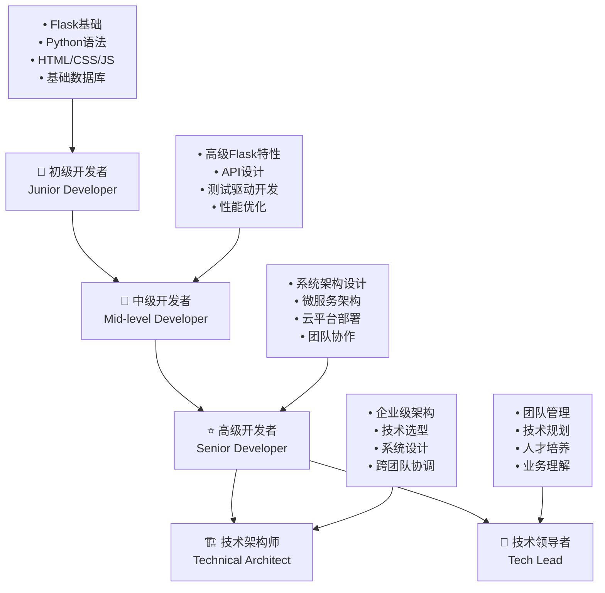
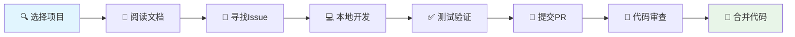
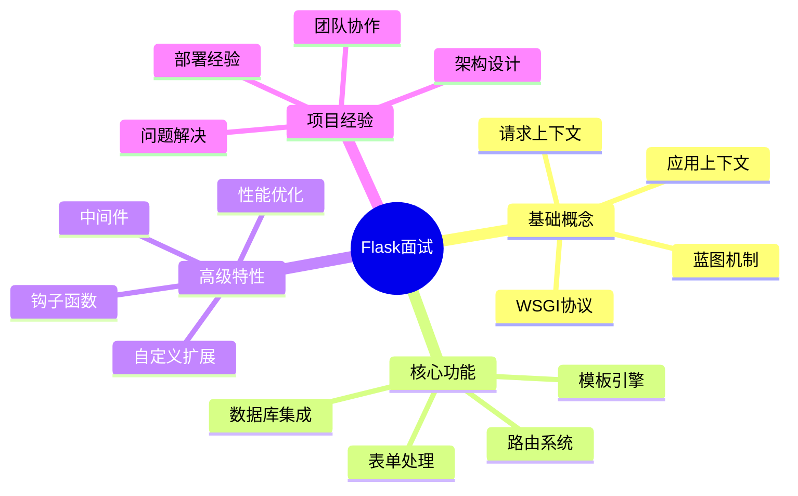
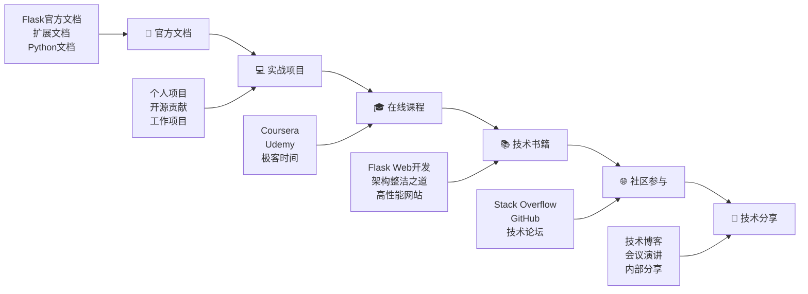
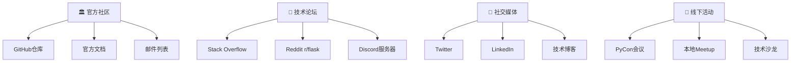
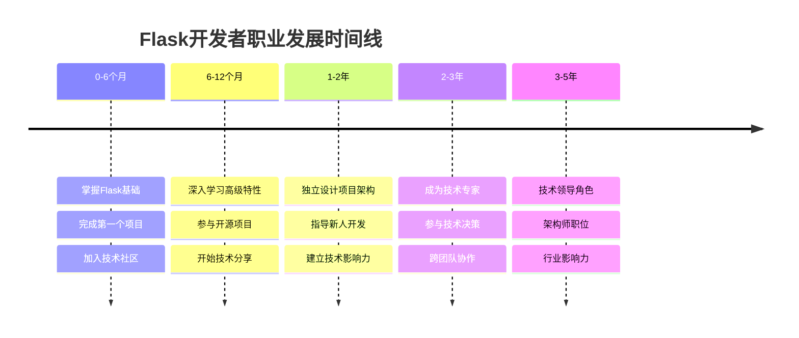

# 🚀 18. 职业发展与最佳实践

> 💡 **本章导读**：从技术专家到架构师，从个人贡献者到技术领导者，本章将为你规划完整的Flask开发者职业发展路径，并分享行业最佳实践。

---

## 📊 18.1 Flask 开发者技能图谱

### 🎯 技能发展路径



### 📊 核心技能矩阵

| 技能领域 | 初级 (0-2年) | 中级 (2-5年) | 高级 (5+年) |
|---------|-------------|-------------|------------|
| **🐍 Python & Flask** | 基础语法、路由、模板 | 高级特性、扩展开发 | 架构设计、性能调优 |
| **🗄️ 数据库** | SQL基础、ORM使用 | 查询优化、事务管理 | 分布式数据库、数据架构 |
| **🌐 前端技术** | HTML/CSS/JS基础 | 前端框架集成 | 全栈架构、微前端 |
| **☁️ 云服务** | 基础部署 | 容器化、CI/CD | 云原生架构、DevOps |
| **🔧 工具链** | Git、IDE使用 | 自动化工具、监控 | 工具链设计、效率优化 |

### 💼 职业发展建议

```python
# 技能提升策略示例
class DeveloperGrowth:
    def __init__(self, current_level):
        self.current_level = current_level
        self.skills = []
        self.projects = []
    
    def plan_next_quarter(self):
        """制定下季度学习计划"""
        if self.current_level == "junior":
            return {
                "technical": ["深入学习SQLAlchemy", "掌握Flask-RESTful"],
                "soft_skills": ["代码审查参与", "技术文档编写"],
                "projects": ["个人博客系统", "简单API服务"]
            }
        elif self.current_level == "mid":
            return {
                "technical": ["微服务架构", "性能监控", "安全最佳实践"],
                "soft_skills": ["技术分享", "新人指导"],
                "projects": ["电商后端系统", "开源贡献"]
            }
        # ... 更多级别
```

---

## 🌟 18.2 开源项目贡献指南

### 🌟 为什么要参与开源？

- **📈 技能提升**：接触高质量代码，学习最佳实践
- **🤝 建立网络**：与全球开发者协作，扩展人脉
- **💼 职业发展**：提升个人品牌，增加就业机会
- **🎯 回馈社区**：帮助他人，推动技术发展

### 🚀 开源贡献流程



### 📋 Flask生态系统贡献机会

```python
# 推荐的Flask相关开源项目
FLASK_ECOSYSTEM = {
    "core": {
        "Flask": "https://github.com/pallets/flask",
        "Werkzeug": "https://github.com/pallets/werkzeug",
        "Jinja2": "https://github.com/pallets/jinja"
    },
    "extensions": {
        "Flask-SQLAlchemy": "数据库ORM扩展",
        "Flask-Login": "用户认证扩展",
        "Flask-RESTful": "REST API扩展",
        "Flask-Mail": "邮件发送扩展"
    },
    "tools": {
        "Flask-CLI": "命令行工具",
        "Flask-Testing": "测试工具",
        "Flask-Migrate": "数据库迁移工具"
    }
}

# 贡献类型建议
CONTRIBUTION_TYPES = {
    "beginner": ["文档改进", "bug修复", "测试用例"],
    "intermediate": ["新功能开发", "性能优化", "代码重构"],
    "advanced": ["架构设计", "安全审计", "向后兼容性"]
}
```

### 🏆 开源贡献最佳实践

1. **📚 从文档开始**：修复拼写错误、改进示例代码
2. **🐛 解决简单Bug**：从标记为"good first issue"的问题开始
3. **✅ 编写测试**：为现有功能补充测试用例
4. **📖 改进文档**：添加使用示例、API说明
5. **🔧 开发工具**：创建有用的开发工具或脚本

---

## 💼 18.3 技术面试准备

### 🎯 Flask面试知识点



### 💡 常见面试题目

#### 基础概念题

```python
# Q: 解释Flask的应用上下文和请求上下文
from flask import Flask, g, request, current_app

app = Flask(__name__)

@app.route('/demo')
def context_demo():
    # 请求上下文：每个请求独有
    user_agent = request.headers.get('User-Agent')
    
    # 应用上下文：应用级别的全局变量
    app_name = current_app.name
    
    # g对象：请求期间的临时存储
    g.user_id = 123
    
    return f"App: {app_name}, UA: {user_agent}, User: {g.user_id}"

# 关键点：
# 1. 请求上下文在每个请求开始时创建，结束时销毁
# 2. 应用上下文在应用启动时创建，可以被多个请求共享
# 3. g对象用于在请求处理过程中存储临时数据
```

#### 架构设计题

```python
# Q: 设计一个可扩展的Flask应用架构
from flask import Flask
from flask_sqlalchemy import SQLAlchemy
from flask_login import LoginManager

def create_app(config_name='development'):
    """应用工厂模式"""
    app = Flask(__name__)
    
    # 配置加载
    app.config.from_object(config[config_name])
    
    # 扩展初始化
    db.init_app(app)
    login_manager.init_app(app)
    
    # 蓝图注册
    from .auth import auth_bp
    from .api import api_bp
    from .main import main_bp
    
    app.register_blueprint(auth_bp, url_prefix='/auth')
    app.register_blueprint(api_bp, url_prefix='/api/v1')
    app.register_blueprint(main_bp)
    
    return app

# 设计要点：
# 1. 使用应用工厂模式支持多环境
# 2. 通过蓝图实现模块化
# 3. 延迟初始化扩展
# 4. 清晰的项目结构
```

### 📝 面试准备清单

- [ ] **基础知识**：Flask核心概念、WSGI、HTTP协议
- [ ] **实战经验**：准备2-3个项目案例，能详细讲解架构和技术选型
- [ ] **问题解决**：准备遇到的技术难题和解决方案
- [ ] **代码质量**：了解测试、代码规范、性能优化
- [ ] **系统设计**：能设计中等复杂度的Web应用架构

---

## 📚 18.4 持续学习路径

### 📚 学习资源地图



### 🎯 年度学习计划模板

```python
class LearningPlan:
    def __init__(self, year):
        self.year = year
        self.quarters = {
            "Q1": self._plan_q1(),
            "Q2": self._plan_q2(),
            "Q3": self._plan_q3(),
            "Q4": self._plan_q4()
        }
    
    def _plan_q1(self):
        return {
            "focus": "深入Flask核心",
            "goals": [
                "掌握Flask高级特性",
                "完成一个中型项目",
                "贡献开源项目"
            ],
            "resources": [
                "Flask官方文档深度阅读",
                "《Flask Web开发》第二版",
                "参与Flask相关开源项目"
            ]
        }
    
    def track_progress(self, quarter, completed_goals):
        """跟踪学习进度"""
        total_goals = len(self.quarters[quarter]["goals"])
        progress = len(completed_goals) / total_goals * 100
        return f"{quarter} 完成度: {progress:.1f}%"
```

### 🔄 技术趋势跟踪

保持对以下技术趋势的关注：

- **🚀 异步编程**：AsyncIO、FastAPI对比学习
- **☁️ 云原生**：Kubernetes、Docker、微服务
- **🤖 AI集成**：机器学习模型部署、AI API开发
- **🔒 安全性**：零信任架构、API安全
- **📊 可观测性**：监控、日志、链路追踪

---

## 18.5 社区参与与网络建设

### 🌐 Flask社区生态



### 🤝 建立技术影响力

#### 1. 内容创作策略

```python
# 技术博客内容规划
BLOG_CONTENT_STRATEGY = {
    "beginner_friendly": [
        "Flask入门系列教程",
        "常见问题解决方案",
        "最佳实践分享"
    ],
    "advanced_topics": [
        "性能优化实战",
        "架构设计思考",
        "源码分析系列"
    ],
    "project_showcase": [
        "项目复盘总结",
        "技术选型分析",
        "踩坑经验分享"
    ]
}

class TechInfluence:
    def __init__(self):
        self.platforms = ["博客", "GitHub", "技术社区"]
        self.content_calendar = {}
    
    def create_content_plan(self, month):
        """制定内容创作计划"""
        return {
            "week1": "技术教程文章",
            "week2": "开源项目更新",
            "week3": "社区问题回答",
            "week4": "技术趋势分析"
        }
```

#### 2. 网络建设技巧

- **🎯 专业定位**：在Flask/Python领域建立专业形象
- **💡 价值输出**：持续分享有价值的技术内容
- **🤝 互动参与**：积极参与社区讨论，帮助他人
- **🌟 个人品牌**：保持一致的技术观点和风格

### 📈 职业发展里程碑



---

## 🎯 本章总结

通过本章的学习，你应该能够：

✅ **明确职业发展路径**：了解从初级到高级开发者的技能要求  
✅ **参与开源贡献**：掌握开源项目参与的方法和最佳实践  
✅ **准备技术面试**：具备Flask相关的面试知识和经验分享能力  
✅ **制定学习计划**：建立持续学习的习惯和方法  
✅ **建设技术网络**：在Flask社区中建立影响力和人脉关系  

> 💡 **关键提醒**：技术成长是一个持续的过程，保持学习热情，积极参与社区，用技术创造价值，这样才能在Flask开发者的道路上走得更远。

---

**下一步行动建议**：
1. 评估当前技能水平，制定个人发展计划
2. 选择一个开源项目开始贡献
3. 建立技术博客，开始内容创作
4. 加入Flask相关的技术社区
5. 准备一份技术简历，突出Flask项目经验