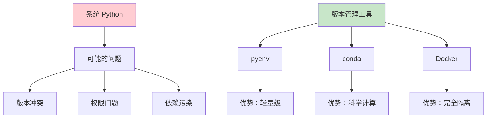
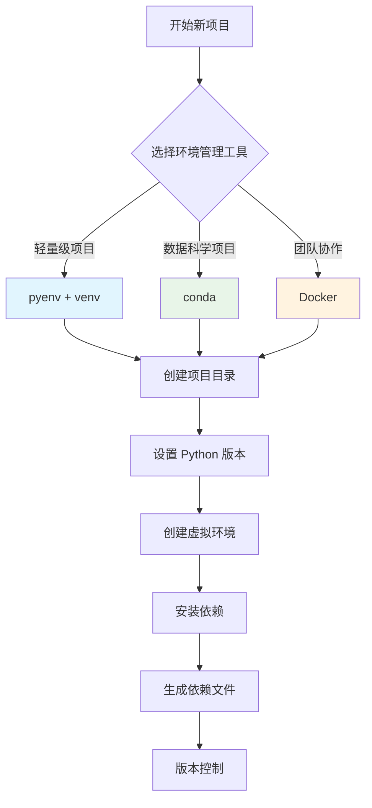
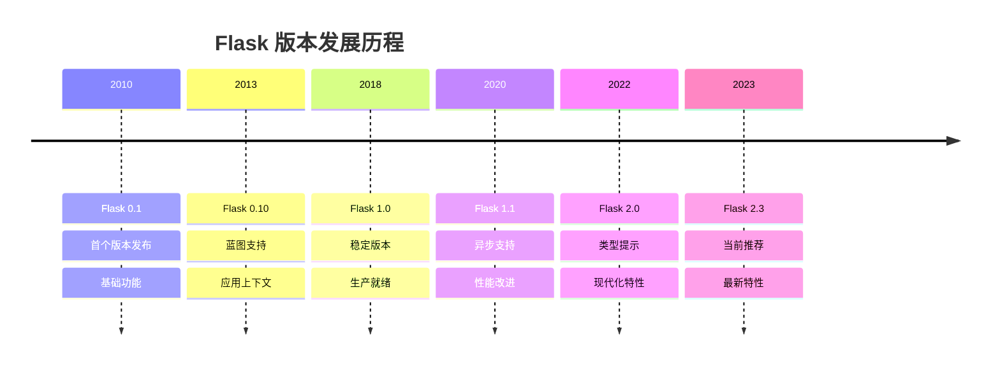
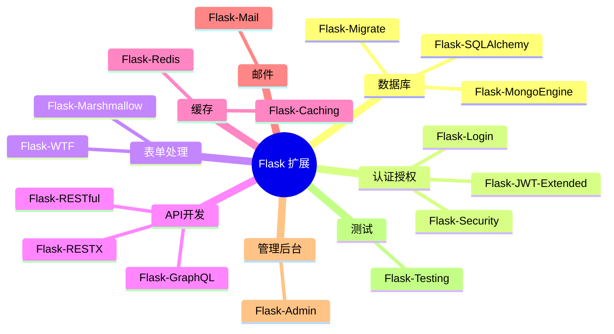
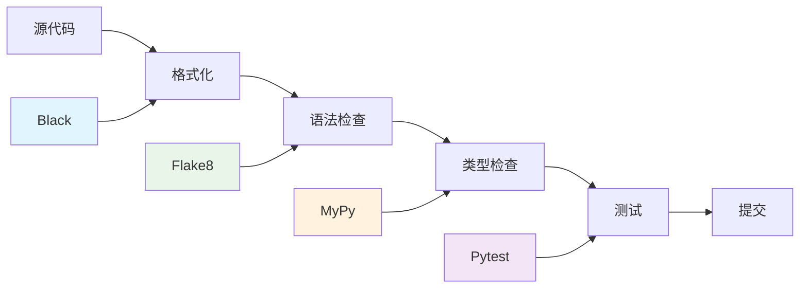
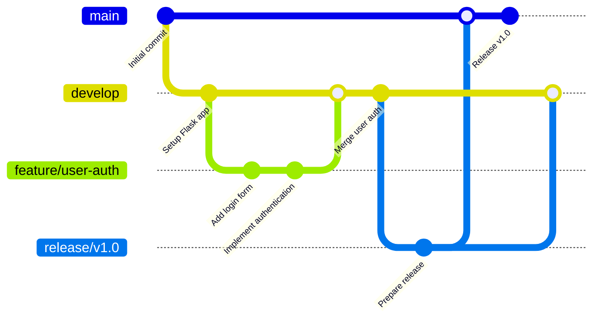
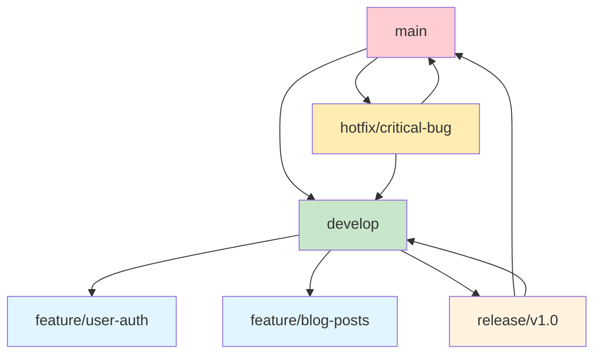

# 🛠️ 2. 开发环境与工具链

## 🐍 2.1 Python 环境管理（pyenv、conda）

### Python 版本管理的重要性

在 Flask 开发中，Python 版本管理至关重要。不同项目可能需要不同的 Python 版本，而系统级的 Python 版本变更可能影响其他应用。因此，我们需要专业的 Python 版本管理工具。



### pyenv 安装与使用

#### Linux/macOS 安装

```bash
# 使用官方安装脚本
curl https://pyenv.run | bash

# 或者使用 Homebrew (macOS)
brew install pyenv

# 添加到 shell 配置文件
echo 'export PYENV_ROOT="$HOME/.pyenv"' >> ~/.bashrc
echo 'command -v pyenv >/dev/null || export PATH="$PYENV_ROOT/bin:$PATH"' >> ~/.bashrc
echo 'eval "$(pyenv init -)"' >> ~/.bashrc
```

#### 基本使用命令

```bash
# 查看可安装的 Python 版本
pyenv install --list

# 安装特定版本
pyenv install 3.11.5
pyenv install 3.10.12

# 查看已安装版本
pyenv versions

# 设置全局默认版本
pyenv global 3.11.5

# 设置项目本地版本
cd /path/to/your/project
pyenv local 3.10.12

# 查看当前使用版本
pyenv version
```

### Conda 环境管理

#### Miniconda 安装

```bash
# 下载 Miniconda
wget https://repo.anaconda.com/miniconda/Miniconda3-latest-Linux-x86_64.sh

# 安装
bash Miniconda3-latest-Linux-x86_64.sh

# 初始化
conda init bash
```

#### Conda 环境操作

```bash
# 创建新环境
conda create -n flask-dev python=3.11

# 激活环境
conda activate flask-dev

# 安装包
conda install flask sqlalchemy

# 导出环境配置
conda env export > environment.yml

# 从配置文件创建环境
conda env create -f environment.yml

# 删除环境
conda env remove -n flask-dev
```

### 环境管理最佳实践



## 📦 2.2 虚拟环境最佳实践（venv、pipenv、poetry）

### 虚拟环境对比分析

| 工具 | 优势 | 劣势 | 适用场景 |
|------|------|------|----------|
| **venv** | 内置、轻量、稳定 | 功能简单 | 简单项目、学习 |
| **pipenv** | 依赖锁定、易用 | 性能较慢 | 中小型项目 |
| **poetry** | 现代化、功能全面 | 学习成本 | 专业项目、包开发 |
| **conda** | 科学计算友好 | 体积大 | 数据科学项目 |

### venv 标准用法

```bash
# 创建虚拟环境
python -m venv flask-env

# 激活环境 (Linux/macOS)
source flask-env/bin/activate

# 激活环境 (Windows)
flask-env\Scripts\activate

# 安装依赖
pip install flask flask-sqlalchemy flask-login

# 生成依赖文件
pip freeze > requirements.txt

# 安装依赖（新环境）
pip install -r requirements.txt

# 退出环境
deactivate
```

### Pipenv 现代化管理

```bash
# 安装 pipenv
pip install pipenv

# 创建项目和虚拟环境
mkdir my-flask-app && cd my-flask-app
pipenv install flask

# 安装开发依赖
pipenv install pytest --dev

# 激活环境
pipenv shell

# 查看依赖图
pipenv graph

# 检查安全漏洞
pipenv check

# 生成 requirements.txt
pipenv requirements > requirements.txt
```

#### Pipfile 示例

```toml
[[source]]
url = "https://pypi.org/simple"
verify_ssl = true
name = "pypi"

[packages]
flask = "*"
flask-sqlalchemy = "*"
flask-login = "*"
flask-wtf = "*"

[dev-packages]
pytest = "*"
flake8 = "*"
black = "*"

[requires]
python_version = "3.11"
```

### Poetry 专业级管理

```bash
# 安装 Poetry
curl -sSL https://install.python-poetry.org | python3 -

# 创建新项目
poetry new my-flask-app
cd my-flask-app

# 添加依赖
poetry add flask flask-sqlalchemy

# 添加开发依赖
poetry add --group dev pytest black flake8

# 安装依赖
poetry install

# 激活环境
poetry shell

# 运行命令
poetry run python app.py

# 构建包
poetry build

# 发布包
poetry publish
```

#### pyproject.toml 示例

```toml
[tool.poetry]
name = "my-flask-app"
version = "0.1.0"
description = "A Flask web application"
authors = ["Your Name <your.email@example.com>"]
readme = "README.md"

[tool.poetry.dependencies]
python = "^3.11"
flask = "^2.3.0"
flask-sqlalchemy = "^3.0.0"
flask-login = "^0.6.0"
flask-wtf = "^1.1.0"

[tool.poetry.group.dev.dependencies]
pytest = "^7.4.0"
black = "^23.7.0"
flake8 = "^6.0.0"
mypy = "^1.5.0"

[build-system]
requires = ["poetry-core"]
build-backend = "poetry.core.masonry.api"

[tool.black]
line-length = 88
target-version = ['py311']

[tool.mypy]
python_version = "3.11"
warn_return_any = true
warn_unused_configs = true
```

## ⚡ 2.3 Flask 安装与版本管理

### Flask 版本选择指南



### 安装方式对比

| 安装方式 | 命令 | 优势 | 适用场景 |
|----------|------|------|----------|
| **pip** | `pip install flask` | 简单直接 | 快速开始 |
| **pipenv** | `pipenv install flask` | 依赖锁定 | 项目开发 |
| **poetry** | `poetry add flask` | 现代化管理 | 专业开发 |
| **conda** | `conda install flask` | 科学计算 | 数据项目 |

### 版本固定策略

```bash
# 精确版本（生产环境推荐）
pip install flask==2.3.3

# 兼容版本（开发环境）
pip install "flask>=2.3.0,<3.0.0"

# 最新稳定版
pip install flask

# 预发布版本（测试新特性）
pip install --pre flask
```

### Flask 扩展生态系统



## 💻 2.4 开发工具配置（VS Code、PyCharm、调试器）

### VS Code 配置

#### 推荐扩展

```json
{
    "recommendations": [
        "ms-python.python",
        "ms-python.flake8",
        "ms-python.black-formatter",
        "ms-python.mypy-type-checker",
        "bradlc.vscode-tailwindcss",
        "formulahendry.auto-rename-tag",
        "ms-vscode.vscode-json",
        "redhat.vscode-yaml",
        "ms-python.debugpy"
    ]
}
```

#### 工作区配置 (.vscode/settings.json)

```json
{
    "python.defaultInterpreterPath": "./venv/bin/python",
    "python.linting.enabled": true,
    "python.linting.flake8Enabled": true,
    "python.formatting.provider": "black",
    "python.formatting.blackArgs": ["--line-length=88"],
    "python.testing.pytestEnabled": true,
    "python.testing.pytestArgs": ["tests"],
    "files.associations": {
        "*.html": "jinja-html"
    },
    "emmet.includeLanguages": {
        "jinja-html": "html"
    }
}
```

#### 调试配置 (.vscode/launch.json)

```json
{
    "version": "0.2.0",
    "configurations": [
        {
            "name": "Flask Debug",
            "type": "python",
            "request": "launch",
            "program": "${workspaceFolder}/app.py",
            "env": {
                "FLASK_ENV": "development",
                "FLASK_DEBUG": "1"
            },
            "args": [],
            "jinja": true,
            "console": "integratedTerminal"
        },
        {
            "name": "Flask Test",
            "type": "python",
            "request": "launch",
            "module": "pytest",
            "args": ["tests/", "-v"],
            "console": "integratedTerminal"
        }
    ]
}
```

### PyCharm 配置

#### 项目设置

1. **Python 解释器配置**
   - File → Settings → Project → Python Interpreter
   - 选择虚拟环境中的 Python 解释器

2. **Flask 项目模板**
   - File → New Project → Flask
   - 自动配置 Flask 项目结构

3. **运行配置**
   ```python
   # 运行配置参数
   Script path: /path/to/your/app.py
   Environment variables: FLASK_ENV=development;FLASK_DEBUG=1
   Python interpreter: Project interpreter
   Working directory: /path/to/your/project
   ```

#### 代码模板

```python
# Flask 路由模板
@app.route('/${PATH}$', methods=['${METHODS}$'])
def ${FUNCTION_NAME}$():
    ${BODY}$
    return ${RETURN}$

# Flask 类视图模板
class ${CLASS_NAME}$(MethodView):
    def get(self):
        ${GET_BODY}$
    
    def post(self):
        ${POST_BODY}$
```

### 调试技巧与工具

#### Flask 内置调试器

```python
from flask import Flask

app = Flask(__name__)
app.config['DEBUG'] = True

@app.route('/debug')
def debug_route():
    # 触发断点
    import pdb; pdb.set_trace()
    
    # 或使用 breakpoint() (Python 3.7+)
    breakpoint()
    
    return "Debug point reached"

if __name__ == '__main__':
    app.run(debug=True, host='0.0.0.0', port=5000)
```

#### 高级调试配置

```python
# 开发环境配置
class DevelopmentConfig:
    DEBUG = True
    TESTING = False
    SECRET_KEY = 'dev-secret-key'
    SQLALCHEMY_DATABASE_URI = 'sqlite:///dev.db'
    SQLALCHEMY_TRACK_MODIFICATIONS = False
    SQLALCHEMY_ECHO = True  # 显示 SQL 查询
    
    # 调试工具栏
    DEBUG_TB_ENABLED = True
    DEBUG_TB_INTERCEPT_REDIRECTS = False
```

#### Flask-DebugToolbar 集成

```python
from flask import Flask
from flask_debugtoolbar import DebugToolbarExtension

app = Flask(__name__)
app.config['SECRET_KEY'] = 'secret'
app.config['DEBUG_TB_ENABLED'] = True

toolbar = DebugToolbarExtension(app)
```

## 🔍 2.5 代码质量工具（black、flake8、mypy）

### 代码质量工具链



### Black 代码格式化

#### 安装和基本使用

```bash
# 安装
pip install black

# 格式化单个文件
black app.py

# 格式化整个项目
black .

# 检查但不修改
black --check .

# 显示差异
black --diff .
```

#### 配置文件 (pyproject.toml)

```toml
[tool.black]
line-length = 88
target-version = ['py311']
include = '\.pyi?$'
extend-exclude = '''
# A regex preceded by ^/ will apply only to files and directories
# in the root of the project.
^/migrations/  # exclude migrations
'''
```

### Flake8 语法检查

#### 安装和使用

```bash
# 安装
pip install flake8

# 检查代码
flake8 .

# 指定配置文件
flake8 --config=.flake8

# 生成报告
flake8 --format=html --htmldir=flake8-report .
```

#### 配置文件 (.flake8)

```ini
[flake8]
max-line-length = 88
extend-ignore = 
    E203,  # whitespace before ':'
    E501,  # line too long
    W503,  # line break before binary operator
exclude = 
    .git,
    __pycache__,
    migrations,
    venv,
    .venv
max-complexity = 10
per-file-ignores =
    __init__.py:F401
    tests/*:S101
```

### MyPy 类型检查

#### 安装和使用

```bash
# 安装
pip install mypy

# 类型检查
mypy .

# 生成报告
mypy --html-report mypy-report .

# 检查特定文件
mypy app.py models.py
```

#### Flask 类型注解示例

```python
from typing import Dict, List, Optional, Union
from flask import Flask, request, jsonify, Response
from flask_sqlalchemy import SQLAlchemy

app: Flask = Flask(__name__)
db: SQLAlchemy = SQLAlchemy(app)

class User(db.Model):
    id: int = db.Column(db.Integer, primary_key=True)
    username: str = db.Column(db.String(80), unique=True, nullable=False)
    email: str = db.Column(db.String(120), unique=True, nullable=False)
    
    def to_dict(self) -> Dict[str, Union[int, str]]:
        return {
            'id': self.id,
            'username': self.username,
            'email': self.email
        }

@app.route('/users', methods=['GET'])
def get_users() -> Response:
    users: List[User] = User.query.all()
    return jsonify([user.to_dict() for user in users])

@app.route('/users/<int:user_id>', methods=['GET'])
def get_user(user_id: int) -> Response:
    user: Optional[User] = User.query.get(user_id)
    if user is None:
        return jsonify({'error': 'User not found'}), 404
    return jsonify(user.to_dict())
```

#### MyPy 配置 (mypy.ini)

```ini
[mypy]
python_version = 3.11
warn_return_any = True
warn_unused_configs = True
disallow_untyped_defs = True
disallow_incomplete_defs = True
check_untyped_defs = True
disallow_untyped_decorators = True
no_implicit_optional = True
warn_redundant_casts = True
warn_unused_ignores = True
warn_no_return = True
warn_unreachable = True
strict_equality = True

[mypy-flask_sqlalchemy.*]
ignore_missing_imports = True

[mypy-flask_login.*]
ignore_missing_imports = True
```

### 自动化工具集成

#### Pre-commit 钩子

```yaml
# .pre-commit-config.yaml
repos:
  - repo: https://github.com/psf/black
    rev: 23.7.0
    hooks:
      - id: black
        language_version: python3.11
        
  - repo: https://github.com/pycqa/flake8
    rev: 6.0.0
    hooks:
      - id: flake8
        
  - repo: https://github.com/pre-commit/mirrors-mypy
    rev: v1.5.1
    hooks:
      - id: mypy
        additional_dependencies: [types-all]
        
  - repo: https://github.com/pycqa/isort
    rev: 5.12.0
    hooks:
      - id: isort
        args: ["--profile", "black"]
```

#### Makefile 自动化

```makefile
.PHONY: format lint type-check test clean

# 代码格式化
format:
	black .
	isort . --profile black

# 代码检查
lint:
	flake8 .

# 类型检查
type-check:
	mypy .

# 运行测试
test:
	pytest tests/ -v --cov=app

# 完整检查
check: format lint type-check test

# 清理缓存
clean:
	find . -type d -name "__pycache__" -delete
	find . -type f -name "*.pyc" -delete
	find . -type d -name ".pytest_cache" -delete
	find . -type d -name ".mypy_cache" -delete
```

## 🌿 2.6 Git 工作流与版本控制

### Git 工作流模型



### Flask 项目 .gitignore

```plaintext
# Byte-compiled / optimized / DLL files
__pycache__/
*.py[cod]
*$py.class

# C extensions
*.so

# IDE
.vscode/

# ... other files
```

### 提交信息规范

```bash
# 提交类型
feat: 新功能
fix: 修复bug
docs: 文档更新
style: 代码格式调整
refactor: 代码重构
test: 测试相关
chore: 构建过程或辅助工具的变动

# 示例
git commit -m "feat: add user authentication system"
git commit -m "fix: resolve database connection issue"
git commit -m "docs: update API documentation"
git commit -m "refactor: optimize database queries"
```

### 分支管理策略



通过以上完整的开发环境与工具链配置，您将拥有一个专业、高效的 Flask 开发环境，为后续的学习和项目开发奠定坚实基础。
        