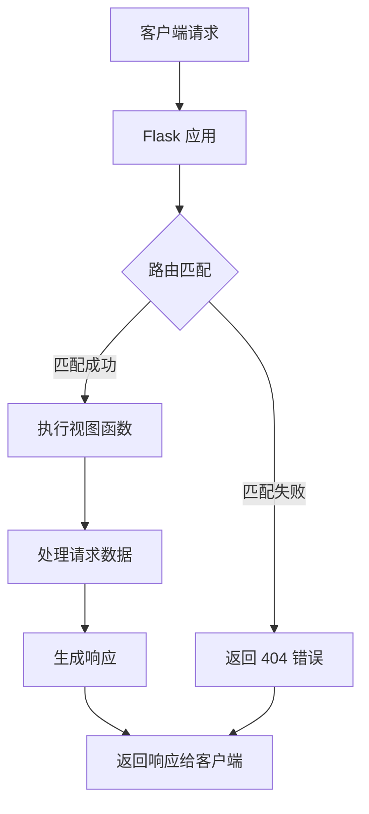

# 3. Flask 基础概念
## 3.1 Flask 应用结构
### 3.1.1 最小应用示例
Flask 应用的核心是创建 Flask 类的实例。以下是一个最简单的 Flask 应用：

```python
from flask import Flask

# 创建 Flask 应用实例
app = Flask(__name__)

@app.route('/')
def hello():
    return 'Hello, Flask!'

if __name__ == '__main__':
    app.run(debug=True)
```

这个简单应用包含了 Flask 开发的基本要素：

+ `Flask(__name__)`：创建应用实例，`__name__` 帮助 Flask 确定应用根目录
+ `@app.route('/')`：路由装饰器，定义 URL 路径与函数的映射关系
+ `app.run(debug=True)`：启动开发服务器，`debug=True` 启用调试模式

### 3.1.2 应用对象和配置
Flask 应用对象支持多种配置方式：

```python
app = Flask(__name__)

# 方式1：直接设置配置属性
app.config['SECRET_KEY'] = 'your-secret-key'
app.config['DEBUG'] = True

# 方式2：使用配置文件
app.config.from_pyfile('config.py')

# 方式3：使用环境变量
app.config.from_envvar('APP_SETTINGS')

# 常用配置项
app.config.update({
    'SECRET_KEY': 'dev-key-here',
    'DEBUG': True,
    'TESTING': False,
    'ENV': 'development'
})
```

## 3.2 路由和视图函数
### 3.2.1 定义路由和 URL 映射
路由是将 URL 映射到 Python 函数（视图函数）的机制：

```python
@app.route('/')
def index():
    return '首页'

@app.route('/about')
def about():
    return '关于我们'

@app.route('/contact')
def contact():
    return '联系我们'
```

### 3.2.2 请求方法和路由装饰器
Flask 支持定义不同的 HTTP 方法：

```python
from flask import request

@app.route('/login', methods=['GET', 'POST'])
def login():
    if request.method == 'POST':
        return '处理登录请求'
    else:
        return '显示登录表单'
```

使用 `methods` 参数指定允许的 HTTP 方法，常见的包括：

+ `GET`：获取资源
+ `POST`：创建资源
+ `PUT`：更新资源
+ `DELETE`：删除资源

### 3.2.3 动态路由和变量规则
Flask 支持在路由中包含变量部分：

```python
@app.route('/user/<username>')
def show_user(username):
    return f'用户: {username}'

@app.route('/post/<int:post_id>')
def show_post(post_id):
    return f'文章 ID: {post_id}'

@app.route('/path/<path:subpath>')
def show_subpath(subpath):
    return f'子路径: {subpath}'
```

支持的类型转换器：

+ `string`：（默认）接受任何不包含斜杠的文本
+ `int`：接受正整数
+ `float`：接受正浮点数
+ `path`：类似 string，但可以包含斜杠
+ `uuid`：接受 UUID 字符串

## 3.3 请求和响应处理
### 3.3.1 访问请求数据（GET、POST）
Flask 通过 `request` 对象提供请求数据访问：

```python
from flask import request

@app.route('/search')
def search():
    # 获取 GET 参数
    query = request.args.get('q', '')
    return f'搜索关键词: {query}'

@app.route('/submit', methods=['POST'])
def submit():
    # 获取 POST 数据
    username = request.form.get('username')
    email = request.form.get('email')
    return f'用户名: {username}, 邮箱: {email}'

@app.route('/api/data', methods=['POST'])
def api_data():
    # 获取 JSON 数据
    data = request.get_json()
    return f'接收到的数据: {data}'
```

### 3.3.2 构建响应对象
视图函数可以返回多种类型的响应：

```python
from flask import make_response, jsonify

@app.route('/plain')
def plain_text():
    return '纯文本响应'

@app.route('/html')
def html_response():
    return '<h1>HTML 响应</h1>'

@app.route('/json')
def json_response():
    return jsonify({'status': 'success', 'data': [1, 2, 3]})

@app.route('/custom')
def custom_response():
    response = make_response('自定义响应')
    response.headers['X-Custom-Header'] = 'Value'
    response.status_code = 201
    return response
```

### 3.3.3 重定向和错误处理
Flask 提供了重定向和错误处理功能：

```python
from flask import redirect, url_for, abort

@app.route('/old-page')
def old_page():
    # 重定向到新页面
    return redirect('/new-page')

@app.route('/new-page')
def new_page():
    return '这是新页面'

@app.route('/user/<username>')
def user_profile(username):
    if username == 'admin':
        return redirect(url_for('admin_dashboard'))
    return f'用户 {username} 的个人页面'

@app.route('/admin')
def admin_dashboard():
    return '管理员面板'

@app.route('/restricted')
def restricted():
    # 返回 403 错误
    abort(403)

# 自定义错误处理
@app.errorhandler(404)
def page_not_found(error):
    return '页面不存在', 404

@app.errorhandler(500)
def internal_error(error):
    return '服务器内部错误', 500
```

以下图表展示了 Flask 的请求-响应周期：



这个基础概念章节涵盖了 Flask 的核心机制，理解这些概念是进一步学习 Flask 开发的基础。每个概念都配有实际代码示例，建议读者动手实践以加深理解。

