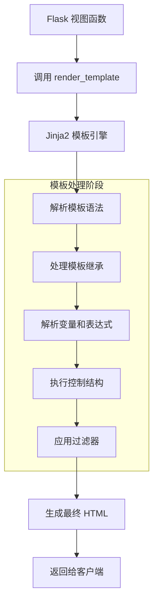

# 4. 模板引擎：Jinja2
## 4.1 Jinja2 简介和基本语法
Jinja2 是 Flask 默认的模板引擎，它允许将 Python 代码逻辑与 HTML 表现层分离。Jinja2 提供了强大的模板功能，包括变量替换、控制结构、模板继承等。

**基本语法元素**：

+ `{{ variable }}`：输出变量的值
+ ``：执行控制语句
+ `{# comment #}`：模板注释

```python
# 在 Flask 中使用模板
from flask import render_template

@app.route('/')
def index():
    return render_template('index.html', title='首页', user={'name': '张三'})
```

## 4.2 创建和渲染模板
**项目结构**：

```plain
myapp/
├── app.py
└── templates/
    ├── base.html
    ├── index.html
    └── user/
        └── profile.html
```

**基本模板示例** `templates/index.html`：

```html
<!DOCTYPE html>
<html>
<head>
    <title>{{ title }}</title>
</head>
<body>
    <h1>欢迎, {{ user.name }}!</h1>
    <p>当前时间: {{ current_time }}</p>
</body>
</html>

```

**渲染模板**：

```python
from datetime import datetime

@app.route('/')
def index():
    return render_template('index.html',
                         title='首页',
                         user={'name': '张三'},
                         current_time=datetime.now())
```

## 4.3 模板变量和控制结构
**变量和过滤器**：

```html
<p>用户名: {{ user.name | upper }}</p>
<p>简介: {{ user.bio | default('暂无简介') }}</p>
<p>文章数量: {{ posts | length }}</p>
<p>注册时间: {{ user.join_date | format_date }}</p>

```

**控制结构**：

```html
{# 条件判断 #}

    <p>管理员权限</p>

    <p>VIP用户</p>

    <p>普通用户</p>


{# 循环结构 #}
<ul>

    <li>{{ post.title }} - {{ post.date | date_format }}</li>

    <li>暂无文章</li>

</ul>
{# 宏定义 #}

    <input type="{{ type }}" name="{{ name }}" value="{{ value }}">


{{ input_field('username') }}
{{ input_field('email', type='email') }}
```

## 4.4 模板继承和包含
**基模板** `templates/base.html`：

```html
<!DOCTYPE html>
<html>
<head>
    <title>默认标题 - 我的网站</title>
    
    <link rel="stylesheet" href="{{ url_for('static', filename='css/style.css') }}">
    
</head>
<body>
    <header>
        
    </header>
    
    <main>
        
        
    </main>
    
    <footer>
        
    </footer>
    
    
    <script src="{{ url_for('static', filename='js/app.js') }}"></script>
    
</body>
</html>

```

**子模板** `templates/user/profile.html`：

```html


用户资料


{{ super() }}
<style>
    .profile { color: blue; }
</style>



<div class="profile">
    <h1>{{ user.name }}的资料</h1>
    <p>邮箱: {{ user.email }}</p>
    
</div>



{{ super() }}
<script>
    console.log('用户资料页面加载完成');
</script>

```

## 4.5 自定义过滤器和全局函数
**注册自定义过滤器**：

```python
from datetime import datetime

@app.template_filter('format_date')
def format_date(value, format='%Y-%m-%d %H:%M'):
    if isinstance(value, datetime):
        return value.strftime(format)
    return value

@app.template_filter('truncate')
def truncate_text(text, length=100, end='...'):
    if len(text) <= length:
        return text
    return text[:length] + end

# 注册全局函数
@app.context_processor
def utility_processor():
    def format_price(amount, currency='¥'):
        return f"{currency}{amount:,.2f}"
    
    return {
        'format_price': format_price,
        'now': datetime.now,
        'site_name': '我的Flask网站'
    }
```

**在模板中使用自定义功能**：

```html
<p>发布时间: {{ post.created_at | format_date('%Y年%m月%d日') }}</p>
<p>内容摘要: {{ post.content | truncate(200) }}</p>
<p>价格: {{ format_price(99.99) }}</p>
<p>当前时间: {{ now() | format_date }}</p>
<p>网站: {{ site_name }}</p>

```

## 4.6 模板渲染流程可视化
以下 Mermaid 图表展示了 Jinja2 模板的渲染流程：



**模板继承机制详解**：


## 4.7 高级模板特性
**自动转义和安全**：

```html
{# 自动转义 HTML 特殊字符 #}
<p>{{ user_input }}</p>
{# 标记安全 HTML #}
<p>{{ safe_html | safe }}</p>
{# 禁用自动转义区块 #}

    <p>{{ trusted_content }}</p>

```

**模板测试功能**：

```html

    <p>用户已定义</p>



    <p>能被3整除</p>



    <p>小写字符串</p>

```

**国际化和本地化**：

```python
from flask import request

@app.template_filter('format_number')
def format_number(value):
    locale = request.accept_languages.best_match(['zh', 'en'])
    if locale == 'zh':
        return f"{value:,}"
    else:
        return f"{value:,.2f}"
```

```html
<p>数字格式: {{ 1234567.89 | format_number }}</p>

```

本章详细介绍了 Jinja2 模板引擎的核心功能，从基础语法到高级特性，帮助开发者创建动态、可维护的 Web 页面。通过模板继承、包含机制和自定义功能，可以构建复杂而整洁的模板结构。

