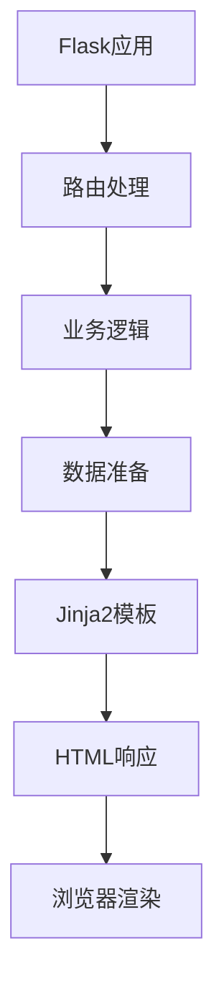
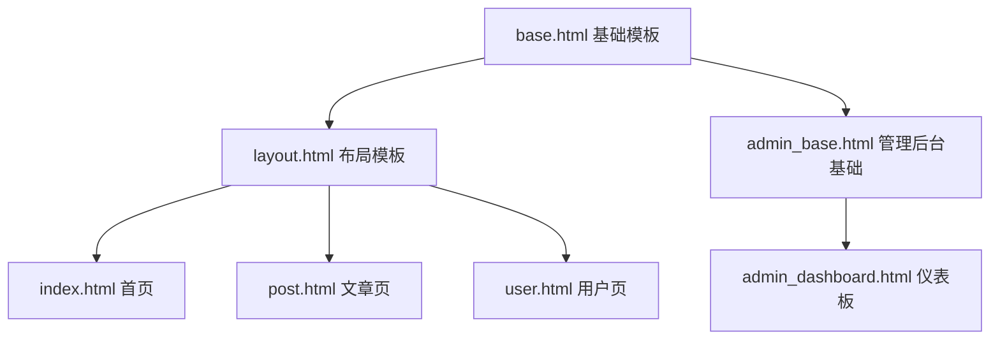
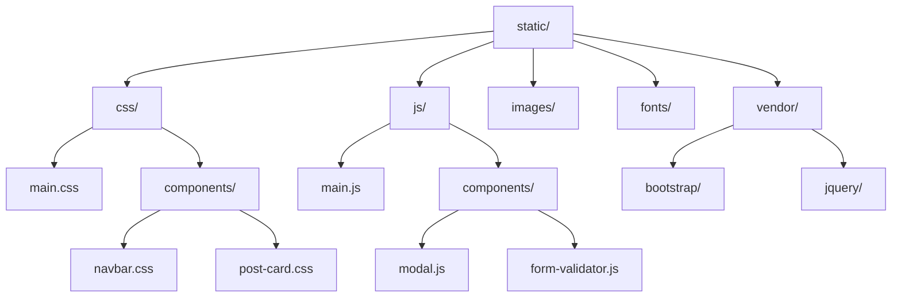
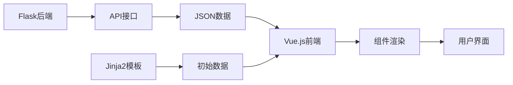

#  📄 4. 模板引擎与前端集成 

在现代Web开发中，前端展示层的设计与实现是用户体验的关键。Flask通过强大的Jinja2模板引擎，为开发者提供了灵活而高效的前端集成解决方案。本章将深入探讨如何构建优雅、可维护的前端架构。

## 📝 4.1 Jinja2 模板语法详解 

### 4.1.1 模板语法基础

Jinja2是Flask的默认模板引擎，它提供了强大的模板语法来动态生成HTML内容。



**核心语法元素：**
templates/base.html
```html
<!DOCTYPE html>
<html lang="zh-CN">
<head>
    <title>{{ title or '默认标题' }}</title>
    <meta charset="UTF-8">
</head>
<body>
    <!-- 变量输出 -->
    <h1>{{ user.name }}</h1>
    
    <!-- 条件判断 -->
    
        <p>欢迎回来，{{ user.name }}！</p>
    
        <p>请先登录</p>
    
    
    <!-- 循环遍历 -->
    <ul>
    
        <li>{{ post.title }} - {{ post.created_at|strftime('%Y-%m-%d') }}</li>
    
    </ul>
    
    <!-- 注释 -->
    {# 这是模板注释，不会出现在HTML中 #}
</body>
</html>
```

### 4.1.2 内置过滤器与函数

app.py
```python
from flask import Flask, render_template
from datetime import datetime

app = Flask(__name__)

@app.route('/')
def index():
    posts = [
        {'title': 'Flask入门', 'content': '学习Flask基础知识...', 'created_at': datetime.now()},
        {'title': 'Jinja2模板', 'content': '掌握模板语法...', 'created_at': datetime.now()}
    ]
    return render_template('posts.html', posts=posts)
```

templates/posts.html
```html
<!-- 常用过滤器示例 -->
<div class="posts">

    <article>
        <h2>{{ post.title|title }}</h2>  <!-- 首字母大写 -->
        <p>{{ post.content|truncate(50) }}</p>  <!-- 截断文本 -->
        <time>{{ post.created_at|strftime('%Y年%m月%d日') }}</time>
        <div>字数：{{ post.content|length }}</div>
    </article>

</div>
```

## 🏗️ 4.2 模板继承与组件化设计 
### 4.2.1 模板继承架构

模板继承是构建可维护前端的核心概念，它允许我们创建基础模板并在子模板中扩展。



**基础模板设计：**
templates/base.html
```html
<!DOCTYPE html>
<html lang="zh-CN">
<head>
    <meta charset="UTF-8">
    <meta name="viewport" content="width=device-width, initial-scale=1.0">
    <title>默认标题 - 我的博客</title>
    
    <!-- CSS块 -->
    
    <link rel="stylesheet" href="{{ url_for('static', filename='css/main.css') }}">
    
</head>
<body>
    <!-- 导航栏 -->
    <nav class="navbar">
        
        <div class="nav-brand">
            <a href="{{ url_for('index') }}">我的博客</a>
        </div>
        <ul class="nav-links">
            <li><a href="{{ url_for('index') }}">首页</a></li>
            <li><a href="{{ url_for('posts') }}">文章</a></li>
        </ul>
        
    </nav>
    
    <!-- 主要内容区域 -->
    <main class="container">
        
    </main>
    
    <!-- 页脚 -->
    <footer>
        
        <p>&copy; 2024 我的博客. All rights reserved.</p>
        
    </footer>
    
    <!-- JavaScript块 -->
    
    <script src="{{ url_for('static', filename='js/main.js') }}"></script>
    
</body>
</html>
```

**子模板实现：**
templates/posts/index.html
```html


文章列表


{{ super() }}  <!-- 继承父模板的样式 -->
<link rel="stylesheet" href="{{ url_for('static', filename='css/posts.css') }}">



<div class="posts-container">
    <h1>📚 最新文章</h1>
    
    
        
            
        
    
        <div class="empty-state">
            <p>暂无文章，<a href="{{ url_for('create_post') }}">创建第一篇文章</a></p>
        </div>
    
</div>

```

### 4.2.2 组件化设计模式
templates/components/post_card.html
```html
<!-- 可复用的文章卡片组件 -->
<article class="post-card">
    <header class="post-header">
        <h2><a href="{{ url_for('post_detail', id=post.id) }}">{{ post.title }}</a></h2>
        <div class="post-meta">
            <span class="author">👤 {{ post.author.name }}</span>
            <span class="date">📅 {{ post.created_at|strftime('%Y-%m-%d') }}</span>
            <span class="category">🏷️ {{ post.category.name }}</span>
        </div>
    </header>
    
    <div class="post-excerpt">
        {{ post.content|striptags|truncate(150) }}
    </div>
    
    <footer class="post-footer">
        <div class="post-stats">
            <span>👁️ {{ post.views }}</span>
            <span>💬 {{ post.comments|length }}</span>
            <span>❤️ {{ post.likes }}</span>
        </div>
        <a href="{{ url_for('post_detail', id=post.id) }}" class="read-more">阅读更多 →</a>
    </footer>
</article>
```

## ⚙️ 4.3 自定义过滤器与函数

### 4.3.1 自定义过滤器开发
filters.py
```python
from flask import current_app
from datetime import datetime
import re

def init_filters(app):
    """初始化自定义过滤器"""
    
    @app.template_filter('timeago')
    def timeago_filter(dt):
        """时间距离现在的描述"""
        if not isinstance(dt, datetime):
            return dt
            
        now = datetime.now()
        diff = now - dt
        
        if diff.days > 0:
            return f"{diff.days}天前"
        elif diff.seconds > 3600:
            return f"{diff.seconds // 3600}小时前"
        elif diff.seconds > 60:
            return f"{diff.seconds // 60}分钟前"
        else:
            return "刚刚"
    
    @app.template_filter('markdown')
    def markdown_filter(text):
        """简单的Markdown渲染"""
        # 简化的Markdown处理
        text = re.sub(r'\*\*(.*?)\*\*', r'<strong>\1</strong>', text)
        text = re.sub(r'\*(.*?)\*', r'<em>\1</em>', text)
        text = re.sub(r'`(.*?)`', r'<code>\1</code>', text)
        return text
    
    @app.template_filter('avatar')
    def avatar_filter(user, size=50):
        """生成用户头像URL"""
        if user.avatar:
            return user.avatar
        # 使用Gravatar作为默认头像
        import hashlib
        email_hash = hashlib.md5(user.email.lower().encode()).hexdigest()
        return f"https://www.gravatar.com/avatar/{email_hash}?s={size}&d=identicon"
```

### 4.3.2 全局模板函数
template_functions.py
```python
from flask import url_for, request

def init_template_functions(app):
    """初始化全局模板函数"""
    
    @app.template_global()
    def is_active_route(route_name):
        """检查当前路由是否激活"""
        return request.endpoint == route_name
    
    @app.template_global()
    def get_menu_items():
        """获取导航菜单项"""
        return [
            {'name': '首页', 'url': url_for('index'), 'icon': '🏠'},
            {'name': '文章', 'url': url_for('posts'), 'icon': '📝'},
            {'name': '分类', 'url': url_for('categories'), 'icon': '🏷️'},
            {'name': '关于', 'url': url_for('about'), 'icon': '👤'},
        ]
    
    @app.template_global()
    def pagination_info(pagination):
        """分页信息"""
        return {
            'current': pagination.page,
            'total': pagination.pages,
            'has_prev': pagination.has_prev,
            'has_next': pagination.has_next,
            'prev_num': pagination.prev_num,
            'next_num': pagination.next_num
        }
```

**使用示例：**
templates/components/navbar.html
```html
<nav class="navbar">
    <ul class="nav-menu">
    
        <li class="nav-item {{ 'active' if is_active_route(item.url) else '' }}">
            <a href="{{ item.url }}">{{ item.icon }} {{ item.name }}</a>
        </li>
    
    </ul>
</nav>
```

## 📦 4.4 静态资源管理与优化

### 4.4.1 静态资源组织结构



### 4.4.2 资源版本控制与缓存
utils/assets.py
```python
import hashlib
import os
from flask import current_app

class AssetManager:
    """静态资源管理器"""
    
    def __init__(self, app=None):
        self.app = app
        self._asset_hashes = {}
        if app:
            self.init_app(app)
    
    def init_app(self, app):
        """初始化资源管理器"""
        app.jinja_env.globals['asset_url'] = self.asset_url
        
        # 在开发模式下禁用缓存
        if app.debug:
            app.jinja_env.globals['asset_url'] = self._debug_asset_url
    
    def asset_url(self, filename):
        """生成带版本号的资源URL"""
        if filename not in self._asset_hashes:
            self._asset_hashes[filename] = self._get_file_hash(filename)
        
        hash_value = self._asset_hashes[filename]
        return f"/static/{filename}?v={hash_value[:8]}"
    
    def _debug_asset_url(self, filename):
        """开发模式下的资源URL（实时计算hash）"""
        hash_value = self._get_file_hash(filename)
        return f"/static/{filename}?v={hash_value[:8]}"
    
    def _get_file_hash(self, filename):
        """计算文件hash值"""
        filepath = os.path.join(current_app.static_folder, filename)
        if not os.path.exists(filepath):
            return 'missing'
        
        with open(filepath, 'rb') as f:
            return hashlib.md5(f.read()).hexdigest()
```

**模板中使用：**
templates/base.html
```html
<head>
    <!-- 使用版本化的资源URL -->
    <link rel="stylesheet" href="{{ asset_url('css/main.css') }}">
    <link rel="stylesheet" href="{{ asset_url('css/components/navbar.css') }}">
</head>
<body>
    <!-- 页面内容 -->
    
    <script src="{{ asset_url('js/main.js') }}"></script>
    <script src="{{ asset_url('js/components/modal.js') }}"></script>
</body>
```

## ⚛️ 4.5 前端框架集成（Vue.js、React）

### 4.5.1 Vue.js 集成方案



**混合渲染方案：**
templates/posts/vue_list.html
```html



<div id="posts-app">
    <posts-list :initial-posts='{{ posts|tojson }}'></posts-list>
</div>



{{ super() }}
<script src="https://unpkg.com/vue@3/dist/vue.global.js"></script>
<script>
const { createApp } = Vue;

// Posts列表组件
const PostsList = {
    props: ['initialPosts'],
    data() {
        return {
            posts: this.initialPosts || [],
            loading: false,
            searchQuery: ''
        }
    },
    computed: {
        filteredPosts() {
            if (!this.searchQuery) return this.posts;
            return this.posts.filter(post => 
                post.title.toLowerCase().includes(this.searchQuery.toLowerCase())
            );
        }
    },
    methods: {
        async loadMorePosts() {
            this.loading = true;
            try {
                const response = await fetch('/api/posts?page=' + (this.posts.length / 10 + 1));
                const data = await response.json();
                this.posts.push(...data.posts);
            } catch (error) {
                console.error('加载失败:', error);
            } finally {
                this.loading = false;
            }
        }
    },
    template: `
        <div class="posts-container">
            <div class="search-box">
                <input v-model="searchQuery" placeholder="搜索文章..." class="search-input">
            </div>
            
            <div class="posts-grid">
                <article v-for="post in filteredPosts" :key="post.id" class="post-card">
                    <h3>{{ post.title }}</h3>
                    <p>{{ post.excerpt }}</p>
                    <div class="post-meta">
                        <span>{{ formatDate(post.created_at) }}</span>
                        <span>{{ post.author }}</span>
                    </div>
                </article>
            </div>
            
            <button @click="loadMorePosts" :disabled="loading" class="load-more-btn">
                {{ loading ? '加载中...' : '加载更多' }}
            </button>
        </div>
    `
};

// 创建Vue应用
createApp({
    components: {
        PostsList
    }
}).mount('#posts-app');
</script>

```

### 4.5.2 API端点设计
api/posts.py
```python
from flask import Blueprint, jsonify, request
from models import Post

api_bp = Blueprint('api', __name__, url_prefix='/api')

@api_bp.route('/posts')
def get_posts():
    """获取文章列表API"""
    page = request.args.get('page', 1, type=int)
    per_page = request.args.get('per_page', 10, type=int)
    search = request.args.get('search', '')
    
    query = Post.query
    if search:
        query = query.filter(Post.title.contains(search))
    
    pagination = query.paginate(
        page=page, per_page=per_page, error_out=False
    )
    
    return jsonify({
        'posts': [{
            'id': post.id,
            'title': post.title,
            'excerpt': post.content[:150] + '...',
            'author': post.author.name,
            'created_at': post.created_at.isoformat(),
            'url': url_for('post_detail', id=post.id)
        } for post in pagination.items],
        'pagination': {
            'page': page,
            'pages': pagination.pages,
            'has_next': pagination.has_next,
            'has_prev': pagination.has_prev
        }
    })
```

## 🎨 4.6 CSS 框架集成（Bootstrap、Tailwind CSS）

### 4.6.1 Bootstrap 集成
templates/base_bootstrap.html
```html
<!DOCTYPE html>
<html lang="zh-CN">
<head>
    <meta charset="UTF-8">
    <meta name="viewport" content="width=device-width, initial-scale=1.0">
    <title> - Bootstrap Blog</title>
    
    <!-- Bootstrap CSS -->
    <link href="https://cdn.jsdelivr.net/npm/bootstrap@5.3.0/dist/css/bootstrap.min.css" rel="stylesheet">
    <!-- 自定义样式 -->
    <link href="{{ url_for('static', filename='css/custom.css') }}" rel="stylesheet">
    
    
</head>
<body>
    <!-- 导航栏 -->
    <nav class="navbar navbar-expand-lg navbar-dark bg-primary">
        <div class="container">
            <a class="navbar-brand" href="{{ url_for('index') }}">📝 我的博客</a>
            
            <button class="navbar-toggler" type="button" data-bs-toggle="collapse" data-bs-target="#navbarNav">
                <span class="navbar-toggler-icon"></span>
            </button>
            
            <div class="collapse navbar-collapse" id="navbarNav">
                <ul class="navbar-nav ms-auto">
                    <li class="nav-item">
                        <a class="nav-link {{ 'active' if request.endpoint == 'index' }}" href="{{ url_for('index') }}">首页</a>
                    </li>
                    <li class="nav-item">
                        <a class="nav-link {{ 'active' if request.endpoint == 'posts' }}" href="{{ url_for('posts') }}">文章</a>
                    </li>
                </ul>
            </div>
        </div>
    </nav>
    
    <!-- 主要内容 -->
    <main class="container my-5">
        
            
                
                    <div class="alert alert-{{ 'danger' if category == 'error' else category }} alert-dismissible fade show" role="alert">
                        {{ message }}
                        <button type="button" class="btn-close" data-bs-dismiss="alert"></button>
                    </div>
                
            
        
        
        
    </main>
    
    <!-- 页脚 -->
    <footer class="bg-light py-4 mt-5">
        <div class="container text-center">
            <p class="text-muted mb-0">&copy; 2024 我的博客. All rights reserved.</p>
        </div>
    </footer>
    
    <!-- Bootstrap JS -->
    <script src="https://cdn.jsdelivr.net/npm/bootstrap@5.3.0/dist/js/bootstrap.bundle.min.js"></script>
    
</body>
</html>
```

### 4.6.2 Tailwind CSS 集成
templates/base_tailwind.html
```html
<!DOCTYPE html>
<html lang="zh-CN">
<head>
    <meta charset="UTF-8">
    <meta name="viewport" content="width=device-width, initial-scale=1.0">
    <title> - Tailwind Blog</title>
    
    <!-- Tailwind CSS -->
    <script src="https://cdn.tailwindcss.com"></script>
    <script>
        tailwind.config = {
            theme: {
                extend: {
                    colors: {
                        primary: '#3B82F6',
                        secondary: '#64748B'
                    }
                }
            }
        }
    </script>
    
    
</head>
<body class="bg-gray-50 min-h-screen flex flex-col">
    <!-- 导航栏 -->
    <nav class="bg-white shadow-sm border-b">
        <div class="max-w-7xl mx-auto px-4 sm:px-6 lg:px-8">
            <div class="flex justify-between items-center h-16">
                <div class="flex items-center">
                    <a href="{{ url_for('index') }}" class="text-xl font-bold text-primary">
                        📝 我的博客
                    </a>
                </div>
                
                <div class="hidden md:block">
                    <div class="ml-10 flex items-baseline space-x-4">
                        <a href="{{ url_for('index') }}" 
                           class="{{ 'text-primary border-b-2 border-primary' if request.endpoint == 'index' else 'text-gray-600 hover:text-primary' }} px-3 py-2 text-sm font-medium transition-colors">
                            首页
                        </a>
                        <a href="{{ url_for('posts') }}" 
                           class="{{ 'text-primary border-b-2 border-primary' if request.endpoint == 'posts' else 'text-gray-600 hover:text-primary' }} px-3 py-2 text-sm font-medium transition-colors">
                            文章
                        </a>
                    </div>
                </div>
            </div>
        </div>
    </nav>
    
    <!-- 主要内容 -->
    <main class="flex-1 max-w-7xl mx-auto py-8 px-4 sm:px-6 lg:px-8 w-full">
        <!-- Flash消息 -->
        
            
                <div class="mb-6">
                    
                        <div class="{{ 'bg-red-50 border-red-200 text-red-800' if category == 'error' else 'bg-green-50 border-green-200 text-green-800' }} border rounded-lg p-4 mb-4">
                            <div class="flex">
                                <div class="flex-shrink-0">
                                    
                                        ❌
                                    
                                        ✅
                                    
                                </div>
                                <div class="ml-3">
                                    <p class="text-sm font-medium">{{ message }}</p>
                                </div>
                            </div>
                        </div>
                    
                </div>
            
        
        
        
    </main>
    
    <!-- 页脚 -->
    <footer class="bg-white border-t">
        <div class="max-w-7xl mx-auto py-6 px-4 sm:px-6 lg:px-8">
            <p class="text-center text-gray-500 text-sm">
                &copy; 2024 我的博客. All rights reserved.
            </p>
        </div>
    </footer>
    
    
</body>
</html>
```

### 4.6.3 响应式组件示例
templates/components/post_grid.html
```html
<!-- Bootstrap版本 -->
<div class="row g-4">

    <div class="col-md-6 col-lg-4">
        <div class="card h-100 shadow-sm">
            
            
            
            
            <div class="card-body d-flex flex-column">
                <h5 class="card-title">{{ post.title }}</h5>
                <p class="card-text text-muted flex-grow-1">{{ post.excerpt }}</p>
                
                <div class="d-flex justify-content-between align-items-center mt-auto">
                    <small class="text-muted">{{ post.created_at|timeago }}</small>
                    <a href="{{ url_for('post_detail', id=post.id) }}" class="btn btn-primary btn-sm">阅读更多</a>
                </div>
            </div>
        </div>
    </div>

</div>

<!-- Tailwind版本 -->
<div class="grid grid-cols-1 md:grid-cols-2 lg:grid-cols-3 gap-6">

    <article class="bg-white rounded-lg shadow-sm hover:shadow-md transition-shadow duration-200 overflow-hidden">
        
        
        
        
        <div class="p-6">
            <h3 class="text-xl font-semibold text-gray-900 mb-2 line-clamp-2">
                <a href="{{ url_for('post_detail', id=post.id) }}" class="hover:text-primary transition-colors">
                    {{ post.title }}
                </a>
            </h3>
            
            <p class="text-gray-600 text-sm mb-4 line-clamp-3">{{ post.excerpt }}</p>
            
            <div class="flex items-center justify-between">
                <span class="text-xs text-gray-500">{{ post.created_at|timeago }}</span>
                <a href="{{ url_for('post_detail', id=post.id) }}" 
                   class="inline-flex items-center text-primary hover:text-primary-dark text-sm font-medium">
                    阅读更多 
                    <svg class="ml-1 w-4 h-4" fill="none" stroke="currentColor" viewBox="0 0 24 24">
                        <path stroke-linecap="round" stroke-linejoin="round" stroke-width="2" d="M9 5l7 7-7 7"></path>
                    </svg>
                </a>
            </div>
        </div>
    </article>

</div>
```

## 📋 小结

通过本章的学习，我们深入了解了Flask模板引擎与前端集成的核心概念：

- **🎯 Jinja2语法**：掌握了变量输出、控制结构、过滤器等核心语法
- **🏗️ 模板继承**：学会了构建可维护的模板架构和组件化设计
- **⚙️ 自定义扩展**：了解了如何创建自定义过滤器和全局函数
- **📦 资源管理**：掌握了静态资源的组织、版本控制和优化策略
- **⚛️ 框架集成**：学习了与现代前端框架（Vue.js、React）的集成方案
- **🎨 CSS框架**：了解了Bootstrap和Tailwind CSS的集成与使用

这些技能将为构建现代化、可维护的Web应用奠定坚实的基础。在下一章中，我们将探讨表单处理与数据验证的最佳实践。