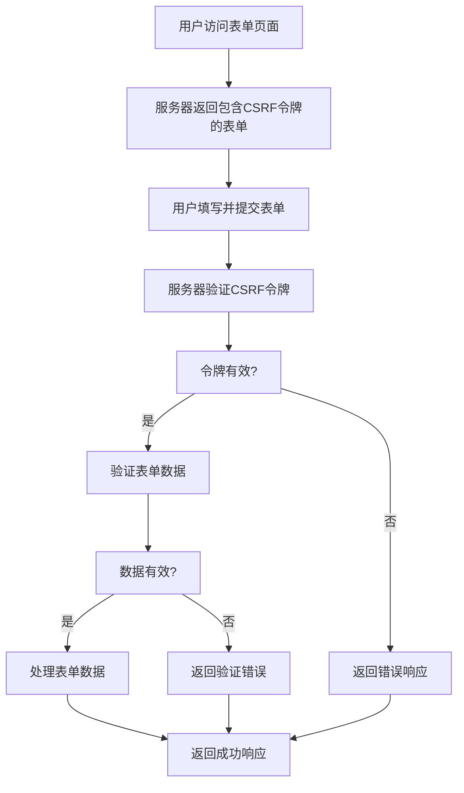

# 5. 表单处理
## 5.1 原生 HTML 表单处理
在 Flask 中可以直接使用原生 HTML 表单进行处理，这种方式简单直接，适合基础需求。

**基本表单示例**：

```html
<!-- templates/login.html -->
<form method="POST" action="{{ url_for('handle_login') }}">
    <div>
        <label for="username">用户名:</label>
        <input type="text" id="username" name="username" required>
    </div>
    <div>
        <label for="password">密码:</label>
        <input type="password" id="password" name="password" required>
    </div>
    <button type="submit">登录</button>
</form>

```

**处理表单的视图函数**：

```python
from flask import request, redirect, url_for

@app.route('/login', methods=['GET'])
def show_login_form():
    return render_template('login.html')

@app.route('/login', methods=['POST'])
def handle_login():
    username = request.form.get('username')
    password = request.form.get('password')
    
    # 简单的验证逻辑
    if not username or not password:
        return "请填写所有必填字段", 400
    
    # 处理登录逻辑
    # ...
    
    return redirect(url_for('dashboard'))
```

**表单验证和错误处理**：

```python
@app.route('/register', methods=['GET', 'POST'])
def register():
    if request.method == 'POST':
        username = request.form.get('username')
        email = request.form.get('email')
        password = request.form.get('password')
        confirm_password = request.form.get('confirm_password')
        
        errors = []
        
        # 验证逻辑
        if not username:
            errors.append('用户名不能为空')
        elif len(username) < 3:
            errors.append('用户名至少需要3个字符')
            
        if not email or '@' not in email:
            errors.append('请输入有效的邮箱地址')
            
        if not password:
            errors.append('密码不能为空')
        elif len(password) < 6:
            errors.append('密码至少需要6个字符')
            
        if password != confirm_password:
            errors.append('两次输入的密码不一致')
            
        if errors:
            return render_template('register.html', errors=errors,
                                 username=username, email=email)
        
        # 保存用户等逻辑
        # ...
        
        return redirect(url_for('login'))
    
    return render_template('register.html')
```

## 5.2 使用 Flask-WTF 扩展
Flask-WTF 提供了更强大、更安全的表单处理功能，包括CSRF保护、表单验证等。

### 5.2.1 安装和配置
**安装 Flask-WTF**：

```bash
pip install flask-wtf
```

**配置 Flask-WTF**：

```python
from flask_wtf import FlaskForm
from wtforms import StringField, PasswordField, SubmitField
from wtforms.validators import DataRequired, Email, Length, EqualTo

app.config['SECRET_KEY'] = 'your-secret-key-here'  # 必须设置，用于CSRF保护
```

### 5.2.2 定义表单类
**创建表单类**：

```python
from wtforms.validators import DataRequired, Email, Length, EqualTo, Optional

class LoginForm(FlaskForm):
    username = StringField('用户名', validators=[DataRequired(message='用户名不能为空')])
    password = PasswordField('密码', validators=[DataRequired(message='密码不能为空')])
    remember_me = BooleanField('记住我')
    submit = SubmitField('登录')

class RegistrationForm(FlaskForm):
    username = StringField('用户名', validators=[
        DataRequired(message='用户名不能为空'),
        Length(min=3, max=20, message='用户名长度必须在3-20个字符之间')
    ])
    email = StringField('邮箱', validators=[
        DataRequired(message='邮箱不能为空'),
        Email(message='请输入有效的邮箱地址')
    ])
    password = PasswordField('密码', validators=[
        DataRequired(message='密码不能为空'),
        Length(min=6, message='密码至少需要6个字符')
    ])
    confirm_password = PasswordField('确认密码', validators=[
        DataRequired(message='请确认密码'),
        EqualTo('password', message='两次输入的密码不一致')
    ])
    submit = SubmitField('注册')

class ProfileForm(FlaskForm):
    full_name = StringField('全名', validators=[Optional()])
    bio = TextAreaField('个人简介', validators=[Optional(), Length(max=500)])
    website = StringField('网站', validators=[Optional(), URL(message='请输入有效的URL')])
    submit = SubmitField('更新资料')
```

### 5.2.3 表单验证和渲染
**在视图函数中使用表单**：

```python
from flask import flash

@app.route('/wtf-login', methods=['GET', 'POST'])
def wtf_login():
    form = LoginForm()
    
    if form.validate_on_submit():
        # 表单验证通过，处理登录逻辑
        username = form.username.data
        password = form.password.data
        remember_me = form.remember_me.data
        
        # 验证用户凭据
        user = User.query.filter_by(username=username).first()
        if user and user.check_password(password):
            login_user(user, remember=remember_me)
            flash('登录成功!', 'success')
            return redirect(url_for('dashboard'))
        else:
            flash('用户名或密码错误', 'danger')
    
    return render_template('wtf_login.html', form=form)

@app.route('/wtf-register', methods=['GET', 'POST'])
def wtf_register():
    form = RegistrationForm()
    
    if form.validate_on_submit():
        # 创建新用户
        user = User(
            username=form.username.data,
            email=form.email.data
        )
        user.set_password(form.password.data)
        
        db.session.add(user)
        db.session.commit()
        
        flash('注册成功! 请登录。', 'success')
        return redirect(url_for('wtf_login'))
    
    return render_template('wtf_register.html', form=form)
```

**在模板中渲染表单**：

```html
<!-- templates/wtf_login.html -->
<form method="POST">
    {{ form.hidden_tag() }}  <!-- 包含CSRF令牌 -->
    
    <div class="form-group">
        {{ form.username.label }}
        {{ form.username(class="form-control") }}
        
            <span class="text-danger">{{ error }}</span>
        
    </div>
    
    <div class="form-group">
        {{ form.password.label }}
        {{ form.password(class="form-control") }}
        
            <span class="text-danger">{{ error }}</span>
        
    </div>
    
    <div class="form-check">
        {{ form.remember_me(class="form-check-input") }}
        {{ form.remember_me.label(class="form-check-label") }}
    </div>
    
    {{ form.submit(class="btn btn-primary") }}
</form>

```

## 5.3 文件上传处理
Flask 提供了处理文件上传的功能，可以结合 Flask-WTF 使用。

**文件上传表单**：

```python
from flask_wtf.file import FileField, FileAllowed, FileRequired
from werkzeug.utils import secure_filename
import os

class UploadForm(FlaskForm):
    photo = FileField('上传照片', validators=[
        FileRequired(message='请选择要上传的文件'),
        FileAllowed(['jpg', 'png', 'jpeg'], '只允许上传图片文件')
    ])
    submit = SubmitField('上传')
```

**处理文件上传的视图**：

```python
@app.route('/upload', methods=['GET', 'POST'])
def upload_file():
    form = UploadForm()
    
    if form.validate_on_submit():
        file = form.photo.data
        filename = secure_filename(file.filename)
        
        # 确保上传目录存在
        upload_dir = os.path.join(app.root_path, 'static', 'uploads')
        os.makedirs(upload_dir, exist_ok=True)
        
        # 保存文件
        file_path = os.path.join(upload_dir, filename)
        file.save(file_path)
        
        flash('文件上传成功!', 'success')
        return redirect(url_for('upload_file'))
    
    return render_template('upload.html', form=form)
```

**多文件上传**：

```python
from wtforms import MultipleFileField

class MultiUploadForm(FlaskForm):
    photos = MultipleFileField('选择多个文件', validators=[
        FileRequired(message='请至少选择一个文件'),
        FileAllowed(['jpg', 'png', 'jpeg'], '只允许上传图片文件')
    ])
    submit = SubmitField('上传')
```

## 5.4 CSRF 保护简介
CSRF（跨站请求伪造）是一种常见的网络攻击方式，Flask-WTF 默认提供 CSRF 保护。

**CSRF 保护机制**：

1. 为每个表单生成唯一的 CSRF 令牌
2. 验证每个 POST 请求中的令牌
3. 防止跨站请求伪造攻击

**启用和配置 CSRF**：

```python
# 默认已启用，无需额外配置
# 如果需要禁用某个视图的CSRF保护
@app.route('/api/endpoint', methods=['POST'])
@csrf.exempt  # 禁用CSRF保护
def api_endpoint():
    return jsonify({'status': 'success'})
```

**在 AJAX 请求中处理 CSRF**：

```javascript
// 获取CSRF令牌
var csrf_token = "{{ csrf_token() }}";

// 在AJAX请求中包含CSRF令牌
$.ajaxSetup({
    beforeSend: function(xhr, settings) {
        if (!/^(GET|HEAD|OPTIONS|TRACE)$/i.test(settings.type)) {
            xhr.setRequestHeader("X-CSRFToken", csrf_token);
        }
    }
});
```

**手动处理 CSRF 令牌**：

```python
from flask_wtf.csrf import generate_csrf, validate_csrf
from wtforms import ValidationError

@app.route('/manual-csrf')
def manual_csrf():
    token = generate_csrf()
    return render_template('manual_csrf.html', csrf_token=token)

@app.route('/process-form', methods=['POST'])
def process_form():
    try:
        validate_csrf(request.form.get('csrf_token'))
        # 处理表单数据
        return "表单处理成功"
    except ValidationError:
        return "CSRF令牌验证失败", 400
```

以下图表展示了表单处理的完整流程：



本章详细介绍了 Flask 中的表单处理，从原生 HTML 表单到使用 Flask-WTF 扩展的高级功能。通过合理使用这些技术，可以创建安全、用户友好的表单，有效处理用户输入和数据验证。

