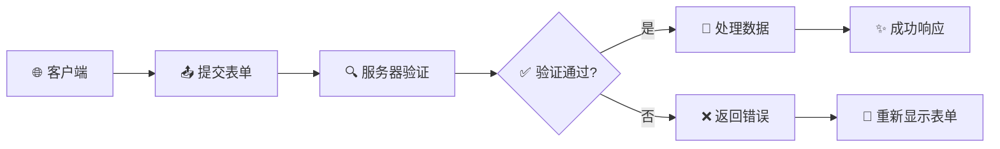
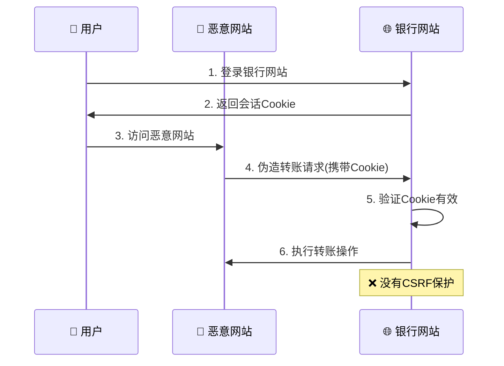
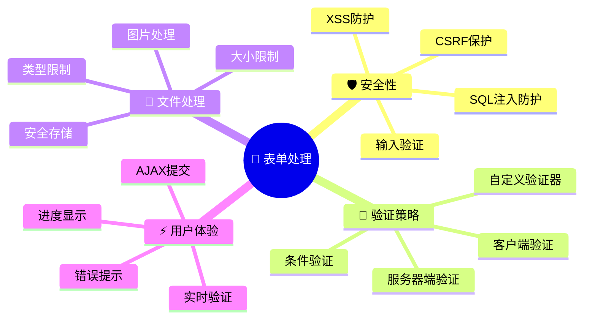

# 📝 5. 表单处理与数据验证

表单处理是Web应用开发中的核心功能之一。本章将深入探讨Flask中的表单处理技术，从基础的原生表单到高级的Flask-WTF用法，帮助你构建安全、高效的表单系统。

## 🔧 5.1 原生表单处理与安全性

### 基础表单处理流程



### 🛡️ 安全性考虑

**输入验证与清理**：

```python
from flask import request, escape
import re

@app.route('/secure-form', methods=['POST'])
def secure_form_handler():
    # 获取并清理用户输入
    username = escape(request.form.get('username', '').strip())
    email = escape(request.form.get('email', '').strip())
    
    # 服务器端验证
    errors = []
    
    # 用户名验证
    if not username:
        errors.append('用户名不能为空')
    elif not re.match(r'^[a-zA-Z0-9_]{3,20}$', username):
        errors.append('用户名只能包含字母、数字和下划线，长度3-20字符')
    
    # 邮箱验证
    email_pattern = r'^[a-zA-Z0-9._%+-]+@[a-zA-Z0-9.-]+\.[a-zA-Z]{2,}$'
    if not email:
        errors.append('邮箱不能为空')
    elif not re.match(email_pattern, email):
        errors.append('邮箱格式不正确')
    
    if errors:
        return render_template('form.html', errors=errors)
    
    # 处理有效数据
    return redirect(url_for('success'))
```

**防止SQL注入**：

```python
from sqlalchemy import text

# ❌ 错误做法 - 容易SQL注入
# query = f"SELECT * FROM users WHERE username = '{username}'"

# ✅ 正确做法 - 使用参数化查询
user = db.session.execute(
    text("SELECT * FROM users WHERE username = :username"),
    {'username': username}
).fetchone()
```

## 🚀 5.2 Flask-WTF 高级用法

### 动态表单生成

```python
from wtforms import Form, StringField, SelectField
from wtforms.validators import DataRequired

class DynamicForm(FlaskForm):
    def __init__(self, categories=None, *args, **kwargs):
        super().__init__(*args, **kwargs)
        
        # 动态添加分类选择字段
        if categories:
            choices = [(cat.id, cat.name) for cat in categories]
            self.category = SelectField('分类', choices=choices, validators=[DataRequired()])
        
        # 动态添加自定义字段
        for i in range(3):
            field_name = f'custom_field_{i}'
            setattr(self, field_name, StringField(f'自定义字段 {i+1}'))

@app.route('/dynamic-form')
def dynamic_form():
    categories = Category.query.all()
    form = DynamicForm(categories=categories)
    return render_template('dynamic_form.html', form=form)
```

### 🔄 表单继承与复用

```python
class BaseForm(FlaskForm):
    """基础表单类"""
    created_at = HiddenField()
    updated_at = HiddenField()
    
    def __init__(self, *args, **kwargs):
        super().__init__(*args, **kwargs)
        if not self.created_at.data:
            self.created_at.data = datetime.utcnow()
        self.updated_at.data = datetime.utcnow()

class UserForm(BaseForm):
    """用户表单 - 继承基础表单"""
    username = StringField('用户名', validators=[DataRequired(), Length(3, 20)])
    email = StringField('邮箱', validators=[DataRequired(), Email()])

class AdminUserForm(UserForm):
    """管理员用户表单 - 继承用户表单"""
    role = SelectField('角色', choices=[('admin', '管理员'), ('user', '普通用户')])
    is_active = BooleanField('激活状态', default=True)
```

### 📊 条件验证

```python
from wtforms.validators import ValidationError

class ConditionalForm(FlaskForm):
    user_type = SelectField('用户类型', choices=[
        ('individual', '个人用户'),
        ('company', '企业用户')
    ])
    
    # 个人用户字段
    first_name = StringField('名')
    last_name = StringField('姓')
    
    # 企业用户字段
    company_name = StringField('公司名称')
    tax_id = StringField('税号')
    
    def validate_first_name(self, field):
        if self.user_type.data == 'individual' and not field.data:
            raise ValidationError('个人用户必须填写姓名')
    
    def validate_company_name(self, field):
        if self.user_type.data == 'company' and not field.data:
            raise ValidationError('企业用户必须填写公司名称')
```

## 🎯 5.3 自定义验证器开发

### 函数式验证器

```python
def unique_username(form, field):
    """验证用户名唯一性"""
    if User.query.filter_by(username=field.data).first():
        raise ValidationError('该用户名已被使用')

def strong_password(form, field):
    """强密码验证"""
    password = field.data
    if len(password) < 8:
        raise ValidationError('密码至少需要8个字符')
    
    if not re.search(r'[A-Z]', password):
        raise ValidationError('密码必须包含至少一个大写字母')
    
    if not re.search(r'[a-z]', password):
        raise ValidationError('密码必须包含至少一个小写字母')
    
    if not re.search(r'\d', password):
        raise ValidationError('密码必须包含至少一个数字')
    
    if not re.search(r'[!@#$%^&*(),.?":{}|<>]', password):
        raise ValidationError('密码必须包含至少一个特殊字符')

class RegistrationForm(FlaskForm):
    username = StringField('用户名', validators=[
        DataRequired(), Length(3, 20), unique_username
    ])
    password = PasswordField('密码', validators=[
        DataRequired(), strong_password
    ])
```

### 🏗️ 类式验证器

```python
class UniqueField:
    """通用唯一性验证器"""
    def __init__(self, model, field, message=None):
        self.model = model
        self.field = field
        self.message = message or f'该{field}已存在'
    
    def __call__(self, form, field):
        query = self.model.query.filter(getattr(self.model, self.field) == field.data)
        
        # 如果是编辑模式，排除当前记录
        if hasattr(form, 'obj') and form.obj:
            query = query.filter(self.model.id != form.obj.id)
        
        if query.first():
            raise ValidationError(self.message)

class DateRangeValidator:
    """日期范围验证器"""
    def __init__(self, start_field, end_field, message=None):
        self.start_field = start_field
        self.end_field = end_field
        self.message = message or '结束日期必须晚于开始日期'
    
    def __call__(self, form, field):
        start_date = getattr(form, self.start_field).data
        end_date = getattr(form, self.end_field).data
        
        if start_date and end_date and start_date >= end_date:
            raise ValidationError(self.message)

# 使用自定义验证器
class EventForm(FlaskForm):
    title = StringField('活动标题', validators=[
        DataRequired(),
        UniqueField(Event, 'title', '活动标题已存在')
    ])
    start_date = DateField('开始日期', validators=[DataRequired()])
    end_date = DateField('结束日期', validators=[
        DataRequired(),
        DateRangeValidator('start_date', 'end_date')
    ])
```

## 📁 5.4 文件上传与处理

### 高级文件上传

```python
import os
from PIL import Image
from werkzeug.utils import secure_filename

class AdvancedUploadForm(FlaskForm):
    avatar = FileField('头像', validators=[
        FileRequired('请选择头像文件'),
        FileAllowed(['jpg', 'jpeg', 'png', 'gif'], '只支持图片格式')
    ])
    
    def validate_avatar(self, field):
        if field.data:
            # 检查文件大小 (2MB)
            field.data.seek(0, 2)  # 移动到文件末尾
            size = field.data.tell()
            field.data.seek(0)  # 重置到开头
            
            if size > 2 * 1024 * 1024:
                raise ValidationError('文件大小不能超过2MB')
            
            # 检查图片尺寸
            try:
                image = Image.open(field.data)
                width, height = image.size
                field.data.seek(0)  # 重置文件指针
                
                if width > 1920 or height > 1080:
                    raise ValidationError('图片尺寸不能超过1920x1080')
            except Exception:
                raise ValidationError('无效的图片文件')

@app.route('/upload-avatar', methods=['GET', 'POST'])
def upload_avatar():
    form = AdvancedUploadForm()
    
    if form.validate_on_submit():
        file = form.avatar.data
        
        # 生成唯一文件名
        filename = f"{uuid.uuid4().hex}_{secure_filename(file.filename)}"
        
        # 创建上传目录
        upload_dir = os.path.join(app.static_folder, 'uploads', 'avatars')
        os.makedirs(upload_dir, exist_ok=True)
        
        file_path = os.path.join(upload_dir, filename)
        
        # 处理图片（压缩、裁剪）
        image = Image.open(file)
        
        # 等比例缩放到最大200x200
        image.thumbnail((200, 200), Image.Resampling.LANCZOS)
        
        # 保存处理后的图片
        image.save(file_path, optimize=True, quality=85)
        
        # 更新用户头像
        current_user.avatar = f'uploads/avatars/{filename}'
        db.session.commit()
        
        flash('头像上传成功！', 'success')
        return redirect(url_for('profile'))
    
    return render_template('upload_avatar.html', form=form)
```

### 📤 多文件上传与进度显示

```python
class MultiFileUploadForm(FlaskForm):
    files = MultipleFileField('选择文件', validators=[
        FileRequired('请至少选择一个文件')
    ])
    description = TextAreaField('描述')
    
@app.route('/upload-multiple', methods=['GET', 'POST'])
def upload_multiple():
    form = MultiFileUploadForm()
    
    if form.validate_on_submit():
        uploaded_files = []
        
        for file in form.files.data:
            if file and file.filename:
                filename = secure_filename(file.filename)
                file_path = os.path.join(app.config['UPLOAD_FOLDER'], filename)
                file.save(file_path)
                uploaded_files.append(filename)
        
        flash(f'成功上传 {len(uploaded_files)} 个文件', 'success')
        return redirect(url_for('file_list'))
    
    return render_template('upload_multiple.html', form=form)
```

## ⚡ 5.5 AJAX 表单提交

### 异步表单处理

```python
@app.route('/api/quick-save', methods=['POST'])
def quick_save():
    """AJAX快速保存接口"""
    form = QuickSaveForm()
    
    if form.validate_on_submit():
        # 处理数据
        item = Item(
            title=form.title.data,
            content=form.content.data,
            user_id=current_user.id
        )
        db.session.add(item)
        db.session.commit()
        
        return jsonify({
            'success': True,
            'message': '保存成功',
            'item_id': item.id
        })
    
    # 返回验证错误
    return jsonify({
        'success': False,
        'errors': form.errors
    }), 400
```

**前端JavaScript实现**：

```javascript
// 🔄 AJAX表单提交
function submitFormAjax(formId) {
    const form = document.getElementById(formId);
    const formData = new FormData(form);
    
    // 显示加载状态
    const submitBtn = form.querySelector('button[type="submit"]');
    const originalText = submitBtn.textContent;
    submitBtn.textContent = '保存中...';
    submitBtn.disabled = true;
    
    fetch(form.action, {
        method: 'POST',
        body: formData,
        headers: {
            'X-CSRFToken': document.querySelector('meta[name=csrf-token]').content
        }
    })
    .then(response => response.json())
    .then(data => {
        if (data.success) {
            showNotification('✅ ' + data.message, 'success');
            form.reset();
        } else {
            showFormErrors(data.errors);
        }
    })
    .catch(error => {
        showNotification('❌ 网络错误，请重试', 'error');
    })
    .finally(() => {
        submitBtn.textContent = originalText;
        submitBtn.disabled = false;
    });
}

// 显示表单错误
function showFormErrors(errors) {
    // 清除之前的错误
    document.querySelectorAll('.field-error').forEach(el => el.remove());
    
    // 显示新错误
    Object.keys(errors).forEach(fieldName => {
        const field = document.querySelector(`[name="${fieldName}"]`);
        if (field) {
            const errorDiv = document.createElement('div');
            errorDiv.className = 'field-error text-danger';
            errorDiv.textContent = errors[fieldName][0];
            field.parentNode.appendChild(errorDiv);
        }
    });
}
```

## 🛡️ 5.6 CSRF 防护机制

### CSRF攻击原理与防护



### 🔐 Flask-WTF CSRF保护实现

```python
from flask_wtf.csrf import CSRFProtect, CSRFError

# 初始化CSRF保护
csrf = CSRFProtect(app)

# 自定义CSRF错误处理
@app.errorhandler(CSRFError)
def handle_csrf_error(e):
    return render_template('csrf_error.html', reason=e.description), 400

# API接口的CSRF处理
@app.route('/api/data', methods=['POST'])
@csrf.exempt  # 对API接口禁用CSRF（需要其他认证方式）
def api_data():
    # 使用API密钥或JWT token进行认证
    api_key = request.headers.get('X-API-Key')
    if not validate_api_key(api_key):
        return jsonify({'error': '无效的API密钥'}), 401
    
    return jsonify({'status': 'success'})

# 手动验证CSRF令牌
@app.route('/manual-csrf-check', methods=['POST'])
def manual_csrf_check():
    from flask_wtf.csrf import validate_csrf
    
    try:
        validate_csrf(request.form.get('csrf_token'))
        # CSRF验证通过，处理请求
        return jsonify({'status': 'success'})
    except ValidationError:
        return jsonify({'error': 'CSRF令牌无效'}), 400
```

### 🌐 前端CSRF令牌处理

```html
<!-- 在HTML头部添加CSRF令牌 -->
<meta name="csrf-token" content="{{ csrf_token() }}">

<script>
// 🔧 配置AJAX请求自动包含CSRF令牌
$.ajaxSetup({
    beforeSend: function(xhr, settings) {
        if (!/^(GET|HEAD|OPTIONS|TRACE)$/i.test(settings.type) && !this.crossDomain) {
            xhr.setRequestHeader("X-CSRFToken", $('meta[name=csrf-token]').attr('content'));
        }
    }
});

// 🔄 动态刷新CSRF令牌
function refreshCSRFToken() {
    fetch('/csrf-token')
        .then(response => response.json())
        .then(data => {
            document.querySelector('meta[name=csrf-token]').content = data.csrf_token;
            // 更新所有表单中的CSRF令牌
            document.querySelectorAll('input[name=csrf_token]').forEach(input => {
                input.value = data.csrf_token;
            });
        });
}
</script>
```

## 📊 表单处理最佳实践总结



### 🎯 核心要点

1. **🔒 安全第一**：始终进行服务器端验证，不要仅依赖客户端验证
2. **🎨 用户友好**：提供清晰的错误提示和实时反馈
3. **⚡ 性能优化**：合理使用AJAX，避免不必要的页面刷新
4. **🛡️ 防护机制**：启用CSRF保护，防范常见攻击
5. **📱 响应式设计**：确保表单在各种设备上都能正常工作

通过本章的学习，你已经掌握了Flask表单处理的核心技术和最佳实践。这些知识将帮助你构建安全、高效、用户友好的Web应用表单系统。
        