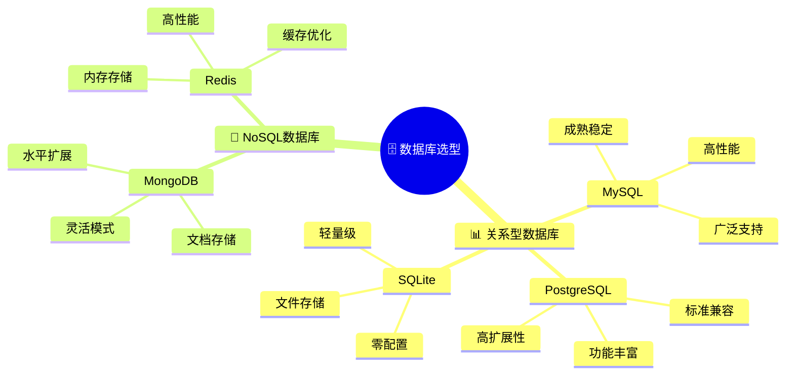
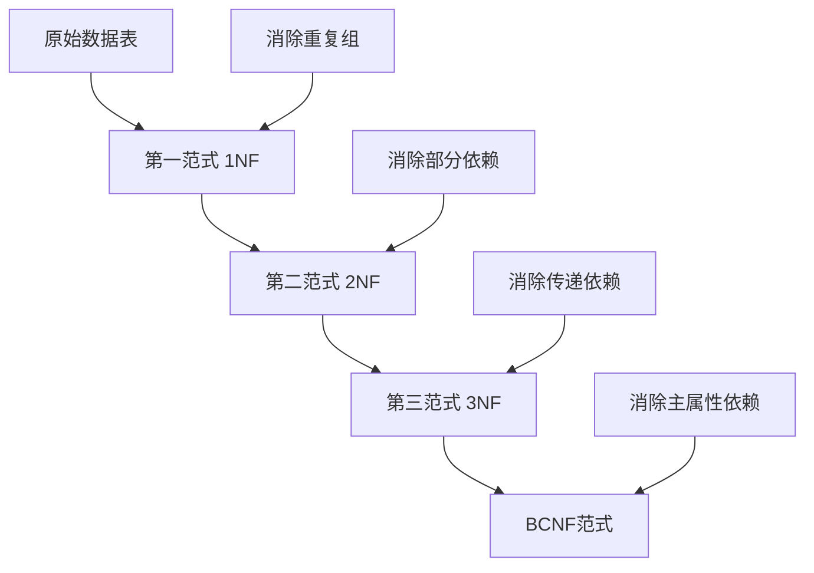
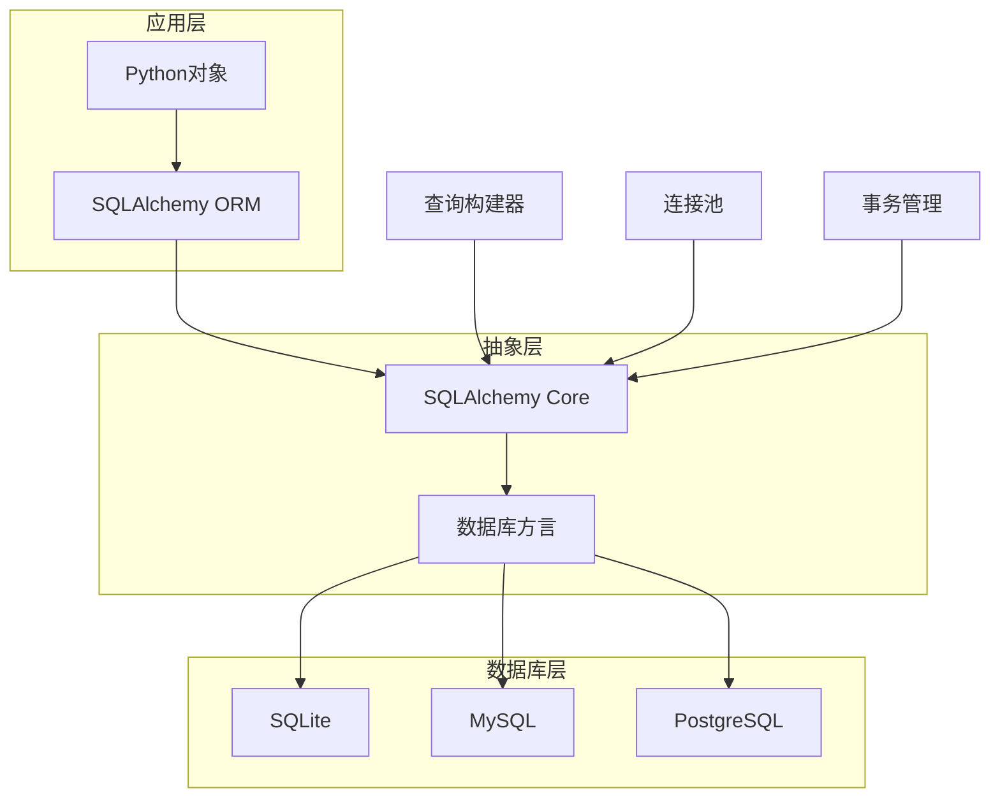
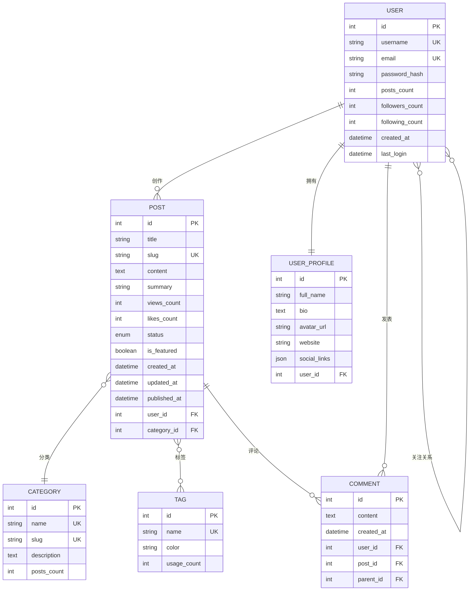
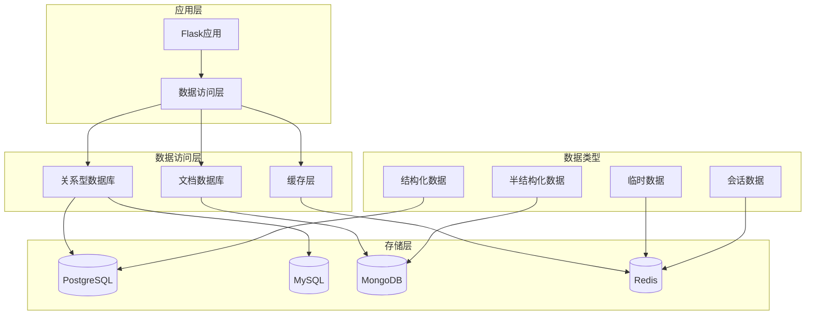
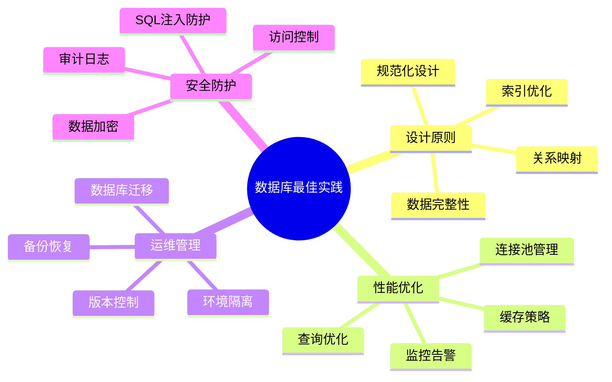

# 🗄️ 6. 数据库设计与 ORM

数据库是Web应用的核心组件，负责数据的持久化存储和管理。本章将深入探讨Flask中的数据库设计原则、ORM使用技巧以及性能优化策略，帮助你构建高效、可扩展的数据层架构。

## 🎯 6.1 数据库选择与设计原则

### 数据库技术选型



### 🏗️ 数据库设计原则

**1. 规范化设计**



**2. 性能优化设计**

```python
# 🎯 索引策略设计
class User(db.Model):
    __tablename__ = 'users'
    
    id = db.Column(db.Integer, primary_key=True)
    username = db.Column(db.String(80), unique=True, nullable=False, index=True)
    email = db.Column(db.String(120), unique=True, nullable=False, index=True)
    created_at = db.Column(db.DateTime, default=datetime.utcnow, index=True)
    
    # 复合索引优化查询
    __table_args__ = (
        db.Index('ix_user_status_created', 'is_active', 'created_at'),
        db.Index('ix_user_email_domain', 'email'),  # 支持邮箱域名查询
    )

# 🔍 分区表设计（大数据量场景）
class UserActivity(db.Model):
    __tablename__ = 'user_activities'
    
    id = db.Column(db.Integer, primary_key=True)
    user_id = db.Column(db.Integer, db.ForeignKey('users.id'), nullable=False)
    activity_type = db.Column(db.String(50), nullable=False)
    created_at = db.Column(db.DateTime, default=datetime.utcnow, nullable=False)
    
    # 按时间分区的索引策略
    __table_args__ = (
        db.Index('ix_activity_user_time', 'user_id', 'created_at'),
        db.Index('ix_activity_type_time', 'activity_type', 'created_at'),
    )
```

### 📋 数据库选择对比

| 特性 | SQLite | MySQL | PostgreSQL | MongoDB | Redis |
|------|--------|-------|------------|---------|-------|
| 🎯 **适用场景** | 原型开发 | Web应用 | 企业级应用 | 文档存储 | 缓存/会话 |
| ⚡ **性能** | 中等 | 高 | 高 | 高 | 极高 |
| 🔧 **配置复杂度** | 极低 | 中等 | 中高 | 中等 | 低 |
| 📈 **扩展性** | 低 | 中高 | 高 | 极高 | 中等 |
| 💰 **成本** | 免费 | 免费/付费 | 免费 | 免费/付费 | 免费/付费 |

## ⚙️ 6.2 SQLAlchemy 核心概念

### ORM架构原理



### 🏭 高级配置与优化

```python
from flask_sqlalchemy import SQLAlchemy
from sqlalchemy import create_engine
from sqlalchemy.pool import QueuePool

class DatabaseConfig:
    """数据库配置类"""
    
    @staticmethod
    def get_database_uri(env='development'):
        """根据环境获取数据库URI"""
        configs = {
            'development': 'sqlite:///dev.db',
            'testing': 'sqlite:///:memory:',
            'production': os.environ.get('DATABASE_URL')
        }
        return configs.get(env, configs['development'])
    
    @staticmethod
    def get_engine_options():
        """获取数据库引擎配置"""
        return {
            'poolclass': QueuePool,
            'pool_size': 10,          # 连接池大小
            'max_overflow': 20,       # 最大溢出连接
            'pool_timeout': 30,       # 连接超时时间
            'pool_recycle': 3600,     # 连接回收时间
            'echo': False,            # 生产环境关闭SQL日志
        }

# 🔧 Flask应用配置
def create_app(config_name='development'):
    app = Flask(__name__)
    
    # 数据库配置
    app.config['SQLALCHEMY_DATABASE_URI'] = DatabaseConfig.get_database_uri(config_name)
    app.config['SQLALCHEMY_TRACK_MODIFICATIONS'] = False
    app.config['SQLALCHEMY_ENGINE_OPTIONS'] = DatabaseConfig.get_engine_options()
    
    # 初始化扩展
    db.init_app(app)
    
    return app
```

### 🎨 会话管理与上下文

```python
from contextlib import contextmanager

@contextmanager
def db_transaction():
    """数据库事务上下文管理器"""
    try:
        db.session.begin()
        yield db.session
        db.session.commit()
    except Exception as e:
        db.session.rollback()
        raise e
    finally:
        db.session.close()

# 使用事务上下文
def transfer_points(from_user_id, to_user_id, points):
    """积分转账示例"""
    with db_transaction() as session:
        from_user = session.query(User).get(from_user_id)
        to_user = session.query(User).get(to_user_id)
        
        if from_user.points < points:
            raise ValueError('积分不足')
        
        from_user.points -= points
        to_user.points += points
        
        # 记录转账日志
        transfer_log = PointsTransfer(
            from_user_id=from_user_id,
            to_user_id=to_user_id,
            points=points
        )
        session.add(transfer_log)
```

## 🏗️ 6.3 模型设计与关系映射

### 复杂关系模型设计

```python
from sqlalchemy.ext.hybrid import hybrid_property
from sqlalchemy import func, select

class User(db.Model):
    """👤 用户模型 - 核心实体"""
    __tablename__ = 'users'
    
    id = db.Column(db.Integer, primary_key=True)
    username = db.Column(db.String(80), unique=True, nullable=False)
    email = db.Column(db.String(120), unique=True, nullable=False)
    password_hash = db.Column(db.String(255), nullable=False)
    
    # 📊 用户统计字段
    posts_count = db.Column(db.Integer, default=0)
    followers_count = db.Column(db.Integer, default=0)
    following_count = db.Column(db.Integer, default=0)
    
    # 🕒 时间戳
    created_at = db.Column(db.DateTime, default=datetime.utcnow)
    last_login = db.Column(db.DateTime)
    
    # 🔗 关系映射
    posts = db.relationship('Post', backref='author', lazy='dynamic', cascade='all, delete-orphan')
    profile = db.relationship('UserProfile', backref='user', uselist=False, cascade='all, delete-orphan')
    
    # 👥 多对多关系：关注系统
    following = db.relationship(
        'User', 
        secondary='user_follows',
        primaryjoin='User.id == user_follows.c.follower_id',
        secondaryjoin='User.id == user_follows.c.followed_id',
        backref=db.backref('followers', lazy='dynamic'),
        lazy='dynamic'
    )
    
    @hybrid_property
    def is_active_user(self):
        """活跃用户判断"""
        return self.posts_count > 0 and self.last_login > datetime.utcnow() - timedelta(days=30)
    
    @is_active_user.expression
    def is_active_user(cls):
        return (cls.posts_count > 0) & (cls.last_login > datetime.utcnow() - timedelta(days=30))
    
    def follow(self, user):
        """关注用户"""
        if not self.is_following(user):
            self.following.append(user)
            self.following_count += 1
            user.followers_count += 1
    
    def unfollow(self, user):
        """取消关注"""
        if self.is_following(user):
            self.following.remove(user)
            self.following_count -= 1
            user.followers_count -= 1
    
    def is_following(self, user):
        """检查是否已关注"""
        return self.following.filter(user_follows.c.followed_id == user.id).count() > 0

# 👥 关注关系表
user_follows = db.Table('user_follows',
    db.Column('follower_id', db.Integer, db.ForeignKey('users.id'), primary_key=True),
    db.Column('followed_id', db.Integer, db.ForeignKey('users.id'), primary_key=True),
    db.Column('created_at', db.DateTime, default=datetime.utcnow)
)

class Post(db.Model):
    """📝 文章模型"""
    __tablename__ = 'posts'
    
    id = db.Column(db.Integer, primary_key=True)
    title = db.Column(db.String(200), nullable=False)
    slug = db.Column(db.String(200), unique=True, nullable=False)
    content = db.Column(db.Text, nullable=False)
    summary = db.Column(db.String(500))
    
    # 📊 统计字段
    views_count = db.Column(db.Integer, default=0)
    likes_count = db.Column(db.Integer, default=0)
    comments_count = db.Column(db.Integer, default=0)
    
    # 🏷️ 分类和状态
    status = db.Column(db.Enum('draft', 'published', 'archived', name='post_status'), default='draft')
    is_featured = db.Column(db.Boolean, default=False)
    
    # 🕒 时间戳
    created_at = db.Column(db.DateTime, default=datetime.utcnow)
    updated_at = db.Column(db.DateTime, default=datetime.utcnow, onupdate=datetime.utcnow)
    published_at = db.Column(db.DateTime)
    
    # 🔗 外键关系
    user_id = db.Column(db.Integer, db.ForeignKey('users.id'), nullable=False)
    category_id = db.Column(db.Integer, db.ForeignKey('categories.id'))
    
    # 🏷️ 多对多关系：标签
    tags = db.relationship('Tag', secondary='post_tags', backref=db.backref('posts', lazy='dynamic'))
    
    # 💬 一对多关系：评论
    comments = db.relationship('Comment', backref='post', lazy='dynamic', cascade='all, delete-orphan')
    
    @hybrid_property
    def reading_time(self):
        """预估阅读时间（分钟）"""
        words_per_minute = 200
        word_count = len(self.content.split())
        return max(1, word_count // words_per_minute)
    
    def publish(self):
        """发布文章"""
        self.status = 'published'
        self.published_at = datetime.utcnow()
        self.author.posts_count += 1
```

### 🎯 关系映射可视化



## 🚀 6.4 查询优化与性能调优

### 查询优化策略

```python
from sqlalchemy.orm import joinedload, selectinload, subqueryload
from sqlalchemy import func, and_, or_

class PostService:
    """📝 文章服务类 - 封装复杂查询逻辑"""
    
    @staticmethod
    def get_featured_posts_with_authors(limit=10):
        """🌟 获取精选文章（优化版）"""
        return (Post.query
                .options(joinedload(Post.author))  # 预加载作者信息，避免N+1查询
                .filter(Post.is_featured == True, Post.status == 'published')
                .order_by(Post.created_at.desc())
                .limit(limit)
                .all())
    
    @staticmethod
    def get_posts_with_stats():
        """📊 获取文章统计信息"""
        return (db.session.query(
                    Post.id,
                    Post.title,
                    Post.views_count,
                    User.username.label('author_name'),
                    func.count(Comment.id).label('comments_count')
                )
                .join(User)
                .outerjoin(Comment)
                .group_by(Post.id, User.username)
                .order_by(Post.views_count.desc())
                .all())
    
    @staticmethod
    def search_posts(keyword, category_id=None, tag_names=None):
        """🔍 复合条件搜索"""
        query = (Post.query
                .options(joinedload(Post.author), selectinload(Post.tags))
                .filter(Post.status == 'published'))
        
        # 关键词搜索
        if keyword:
            search_filter = or_(
                Post.title.contains(keyword),
                Post.content.contains(keyword)
            )
            query = query.filter(search_filter)
        
        # 分类筛选
        if category_id:
            query = query.filter(Post.category_id == category_id)
        
        # 标签筛选
        if tag_names:
            query = query.join(Post.tags).filter(Tag.name.in_(tag_names))
        
        return query.order_by(Post.created_at.desc())
    
    @staticmethod
    def get_user_timeline(user_id, page=1, per_page=20):
        """📱 用户时间线（关注用户的文章）"""
        followed_users = (db.session.query(user_follows.c.followed_id)
                         .filter(user_follows.c.follower_id == user_id)
                         .subquery())
        
        return (Post.query
                .options(joinedload(Post.author))
                .filter(Post.user_id.in_(followed_users))
                .filter(Post.status == 'published')
                .order_by(Post.created_at.desc())
                .paginate(page=page, per_page=per_page, error_out=False))

# 🎯 查询性能监控装饰器
import time
from functools import wraps

def monitor_query_performance(func):
    """查询性能监控装饰器"""
    @wraps(func)
    def wrapper(*args, **kwargs):
        start_time = time.time()
        result = func(*args, **kwargs)
        execution_time = time.time() - start_time
        
        if execution_time > 1.0:  # 超过1秒的慢查询
            app.logger.warning(f'慢查询检测: {func.__name__} 耗时 {execution_time:.2f}s')
        
        return result
    return wrapper

# 使用示例
@monitor_query_performance
def get_popular_posts():
    return PostService.get_posts_with_stats()
```

### 🔧 数据库索引优化

```python
class OptimizedModels:
    """优化后的模型设计"""
    
    class Post(db.Model):
        __tablename__ = 'posts'
        
        # ... 字段定义 ...
        
        # 🎯 复合索引策略
        __table_args__ = (
            # 状态 + 创建时间索引（用于文章列表查询）
            db.Index('ix_post_status_created', 'status', 'created_at'),
            
            # 作者 + 状态索引（用于用户文章查询）
            db.Index('ix_post_user_status', 'user_id', 'status'),
            
            # 分类 + 状态 + 创建时间索引
            db.Index('ix_post_category_status_created', 'category_id', 'status', 'created_at'),
            
            # 精选文章索引
            db.Index('ix_post_featured_status', 'is_featured', 'status'),
            
            # 全文搜索索引（MySQL）
            # db.Index('ix_post_fulltext', 'title', 'content', mysql_prefix='FULLTEXT'),
        )

# 📊 查询执行计划分析
def analyze_query_performance():
    """分析查询性能"""
    from sqlalchemy import text
    
    # 获取查询执行计划
    query = text("""
        EXPLAIN QUERY PLAN 
        SELECT p.*, u.username 
        FROM posts p 
        JOIN users u ON p.user_id = u.id 
        WHERE p.status = 'published' 
        ORDER BY p.created_at DESC 
        LIMIT 10
    """)
    
    result = db.session.execute(query)
    for row in result:
        print(row)
```

## 🔄 6.5 数据库迁移策略

### 迁移最佳实践

```python
# 📋 迁移脚本模板
"""添加用户积分系统

Revision ID: abc123def456
Revises: previous_revision
Create Date: 2024-01-15 10:30:00.000000
"""

from alembic import op
import sqlalchemy as sa
from sqlalchemy.dialects import mysql, postgresql

def upgrade():
    """升级数据库结构"""
    # 🆕 添加新表
    op.create_table('user_points',
        sa.Column('id', sa.Integer(), nullable=False),
        sa.Column('user_id', sa.Integer(), nullable=False),
        sa.Column('points', sa.Integer(), default=0),
        sa.Column('total_earned', sa.Integer(), default=0),
        sa.Column('total_spent', sa.Integer(), default=0),
        sa.Column('created_at', sa.DateTime(), nullable=True),
        sa.Column('updated_at', sa.DateTime(), nullable=True),
        sa.ForeignKeyConstraint(['user_id'], ['users.id'], ondelete='CASCADE'),
        sa.PrimaryKeyConstraint('id'),
        sa.UniqueConstraint('user_id')
    )
    
    # 📊 添加索引
    op.create_index('ix_user_points_user_id', 'user_points', ['user_id'])
    op.create_index('ix_user_points_points', 'user_points', ['points'])
    
    # 🔄 数据迁移：为现有用户创建积分记录
    connection = op.get_bind()
    connection.execute(
        sa.text("""
            INSERT INTO user_points (user_id, points, created_at, updated_at)
            SELECT id, 0, created_at, created_at FROM users
        """)
    )
    
    # ⚡ 添加触发器（MySQL示例）
    if connection.dialect.name == 'mysql':
        connection.execute(sa.text("""
            CREATE TRIGGER update_user_points_timestamp
            BEFORE UPDATE ON user_points
            FOR EACH ROW
            SET NEW.updated_at = NOW()
        """))

def downgrade():
    """回滚数据库结构"""
    # 🗑️ 删除触发器
    connection = op.get_bind()
    if connection.dialect.name == 'mysql':
        try:
            connection.execute(sa.text("DROP TRIGGER IF EXISTS update_user_points_timestamp"))
        except:
            pass
    
    # 🗑️ 删除索引和表
    op.drop_index('ix_user_points_points', table_name='user_points')
    op.drop_index('ix_user_points_user_id', table_name='user_points')
    op.drop_table('user_points')

# 🛠️ 自定义迁移工具
class MigrationHelper:
    """迁移辅助工具"""
    
    @staticmethod
    def safe_add_column(table_name, column_name, column_type, **kwargs):
        """安全添加列（检查是否已存在）"""
        connection = op.get_bind()
        inspector = sa.inspect(connection)
        columns = [col['name'] for col in inspector.get_columns(table_name)]
        
        if column_name not in columns:
            op.add_column(table_name, sa.Column(column_name, column_type, **kwargs))
            print(f"✅ 已添加列: {table_name}.{column_name}")
        else:
            print(f"⚠️  列已存在: {table_name}.{column_name}")
    
    @staticmethod
    def safe_create_index(index_name, table_name, columns):
        """安全创建索引"""
        try:
            op.create_index(index_name, table_name, columns)
            print(f"✅ 已创建索引: {index_name}")
        except Exception as e:
            print(f"⚠️  索引创建失败: {index_name} - {str(e)}")
    
    @staticmethod
    def batch_update_data(table_name, updates, batch_size=1000):
        """批量更新数据"""
        connection = op.get_bind()
        
        for update_sql in updates:
            try:
                result = connection.execute(sa.text(update_sql))
                print(f"✅ 批量更新完成: 影响 {result.rowcount} 行")
            except Exception as e:
                print(f"❌ 更新失败: {str(e)}")
                raise
```

## 🔗 6.6 连接池与事务管理

### 连接池优化配置

```python
from sqlalchemy import create_engine, event
from sqlalchemy.pool import QueuePool, NullPool
import logging

class DatabaseManager:
    """🗄️ 数据库管理器"""
    
    def __init__(self, app=None):
        self.app = app
        self.engine = None
        
        if app is not None:
            self.init_app(app)
    
    def init_app(self, app):
        """初始化数据库配置"""
        # 🔧 连接池配置
        pool_config = {
            'poolclass': QueuePool,
            'pool_size': app.config.get('DB_POOL_SIZE', 10),
            'max_overflow': app.config.get('DB_MAX_OVERFLOW', 20),
            'pool_timeout': app.config.get('DB_POOL_TIMEOUT', 30),
            'pool_recycle': app.config.get('DB_POOL_RECYCLE', 3600),
            'pool_pre_ping': True,  # 连接前检查有效性
        }
        
        # 🎯 根据环境调整配置
        if app.config.get('TESTING'):
            pool_config.update({
                'poolclass': NullPool,  # 测试环境不使用连接池
                'pool_pre_ping': False,
            })
        
        app.config['SQLALCHEMY_ENGINE_OPTIONS'] = pool_config
        
        # 📊 连接池监控
        self._setup_pool_monitoring()
    
    def _setup_pool_monitoring(self):
        """设置连接池监控"""
        @event.listens_for(db.engine, 'connect')
        def on_connect(dbapi_connection, connection_record):
            app.logger.debug('数据库连接已建立')
        
        @event.listens_for(db.engine, 'checkout')
        def on_checkout(dbapi_connection, connection_record, connection_proxy):
            pool = db.engine.pool
            app.logger.debug(f'连接池状态: {pool.checkedout()}/{pool.size()}')
        
        @event.listens_for(db.engine, 'invalid')
        def on_invalid(dbapi_connection, connection_record, exception):
            app.logger.error(f'数据库连接无效: {exception}')

# 🔄 事务管理器
class TransactionManager:
    """事务管理器"""
    
    @staticmethod
    @contextmanager
    def atomic_transaction():
        """原子事务上下文"""
        session = db.session
        try:
            session.begin()
            yield session
            session.commit()
            app.logger.debug('事务提交成功')
        except Exception as e:
            session.rollback()
            app.logger.error(f'事务回滚: {str(e)}')
            raise
        finally:
            session.close()
    
    @staticmethod
    def retry_on_deadlock(max_retries=3, delay=0.1):
        """死锁重试装饰器"""
        def decorator(func):
            @wraps(func)
            def wrapper(*args, **kwargs):
                for attempt in range(max_retries):
                    try:
                        return func(*args, **kwargs)
                    except Exception as e:
                        if 'deadlock' in str(e).lower() and attempt < max_retries - 1:
                            time.sleep(delay * (2 ** attempt))  # 指数退避
                            continue
                        raise
                return None
            return wrapper
        return decorator

# 使用示例
@TransactionManager.retry_on_deadlock(max_retries=3)
def complex_business_operation():
    """复杂业务操作示例"""
    with TransactionManager.atomic_transaction() as session:
        # 业务逻辑
        user = session.query(User).get(1)
        user.points += 100
        
        # 记录操作日志
        log = OperationLog(
            user_id=user.id,
            operation='add_points',
            details={'amount': 100}
        )
        session.add(log)
```

## 🌐 6.7 NoSQL 数据库集成（MongoDB、Redis）

### MongoDB 集成

```python
from flask_pymongo import PyMongo
from bson import ObjectId
import json

class MongoManager:
    """🍃 MongoDB 管理器"""
    
    def __init__(self, app=None):
        self.mongo = None
        if app:
            self.init_app(app)
    
    def init_app(self, app):
        """初始化MongoDB连接"""
        app.config['MONGO_URI'] = app.config.get(
            'MONGO_URI', 
            'mongodb://localhost:27017/flask_app'
        )
        self.mongo = PyMongo(app)
    
    def get_collection(self, name):
        """获取集合"""
        return self.mongo.db[name]

# 📄 文档模型类
class DocumentModel:
    """MongoDB文档基类"""
    
    def __init__(self, collection_name):
        self.collection = mongo_manager.get_collection(collection_name)
    
    def create(self, document):
        """创建文档"""
        document['created_at'] = datetime.utcnow()
        document['updated_at'] = datetime.utcnow()
        result = self.collection.insert_one(document)
        return str(result.inserted_id)
    
    def find_by_id(self, doc_id):
        """根据ID查找文档"""
        return self.collection.find_one({'_id': ObjectId(doc_id)})
    
    def update(self, doc_id, updates):
        """更新文档"""
        updates['updated_at'] = datetime.utcnow()
        return self.collection.update_one(
            {'_id': ObjectId(doc_id)},
            {'$set': updates}
        )
    
    def delete(self, doc_id):
        """删除文档"""
        return self.collection.delete_one({'_id': ObjectId(doc_id)})

# 📊 具体业务模型
class ArticleDocument(DocumentModel):
    """文章文档模型"""
    
    def __init__(self):
        super().__init__('articles')
    
    def create_article(self, title, content, author_id, tags=None):
        """创建文章"""
        article = {
            'title': title,
            'content': content,
            'author_id': author_id,
            'tags': tags or [],
            'views': 0,
            'likes': 0,
            'status': 'draft'
        }
        return self.create(article)
    
    def search_articles(self, keyword, limit=10):
        """全文搜索文章"""
        return list(self.collection.find(
            {'$text': {'$search': keyword}},
            {'score': {'$meta': 'textScore'}}
        ).sort([('score', {'$meta': 'textScore'})]).limit(limit))
    
    def get_popular_articles(self, limit=10):
        """获取热门文章"""
        return list(self.collection.find(
            {'status': 'published'}
        ).sort('views', -1).limit(limit))

# 创建全文索引
def create_text_index():
    """创建文本搜索索引"""
    articles = mongo_manager.get_collection('articles')
    articles.create_index([
        ('title', 'text'),
        ('content', 'text'),
        ('tags', 'text')
    ])
```

### Redis 集成与缓存策略

```python
import redis
import pickle
import json
from functools import wraps

class RedisManager:
    """🔴 Redis 管理器"""
    
    def __init__(self, app=None):
        self.redis_client = None
        if app:
            self.init_app(app)
    
    def init_app(self, app):
        """初始化Redis连接"""
        redis_config = {
            'host': app.config.get('REDIS_HOST', 'localhost'),
            'port': app.config.get('REDIS_PORT', 6379),
            'db': app.config.get('REDIS_DB', 0),
            'password': app.config.get('REDIS_PASSWORD'),
            'decode_responses': True,
            'socket_timeout': 5,
            'socket_connect_timeout': 5,
            'retry_on_timeout': True,
        }
        
        self.redis_client = redis.Redis(**redis_config)
        
        # 测试连接
        try:
            self.redis_client.ping()
            app.logger.info('Redis连接成功')
        except redis.ConnectionError:
            app.logger.error('Redis连接失败')
    
    def get(self, key):
        """获取缓存"""
        try:
            value = self.redis_client.get(key)
            return json.loads(value) if value else None
        except (json.JSONDecodeError, redis.RedisError):
            return None
    
    def set(self, key, value, expire=3600):
        """设置缓存"""
        try:
            return self.redis_client.setex(
                key, 
                expire, 
                json.dumps(value, default=str)
            )
        except redis.RedisError:
            return False
    
    def delete(self, key):
        """删除缓存"""
        try:
            return self.redis_client.delete(key)
        except redis.RedisError:
            return False

# 🎯 缓存装饰器
def cache_result(expire=3600, key_prefix=''):
    """结果缓存装饰器"""
    def decorator(func):
        @wraps(func)
        def wrapper(*args, **kwargs):
            # 生成缓存键
            cache_key = f"{key_prefix}:{func.__name__}:{hash(str(args) + str(kwargs))}"
            
            # 尝试从缓存获取
            cached_result = redis_manager.get(cache_key)
            if cached_result is not None:
                app.logger.debug(f'缓存命中: {cache_key}')
                return cached_result
            
            # 执行函数并缓存结果
            result = func(*args, **kwargs)
            redis_manager.set(cache_key, result, expire)
            app.logger.debug(f'缓存设置: {cache_key}')
            
            return result
        return wrapper
    return decorator

# 📊 缓存服务类
class CacheService:
    """缓存服务"""
    
    @staticmethod
    @cache_result(expire=1800, key_prefix='posts')
    def get_popular_posts(limit=10):
        """获取热门文章（带缓存）"""
        return PostService.get_posts_with_stats()[:limit]
    
    @staticmethod
    def invalidate_user_cache(user_id):
        """清除用户相关缓存"""
        patterns = [
            f'user:{user_id}:*',
            f'posts:user:{user_id}:*',
            f'timeline:{user_id}:*'
        ]
        
        for pattern in patterns:
            keys = redis_manager.redis_client.keys(pattern)
            if keys:
                redis_manager.redis_client.delete(*keys)
    
    @staticmethod
    def get_user_session(session_id):
        """获取用户会话"""
        return redis_manager.get(f'session:{session_id}')
    
    @staticmethod
    def set_user_session(session_id, user_data, expire=86400):
        """设置用户会话"""
        return redis_manager.set(f'session:{session_id}', user_data, expire)
```

### 🔄 混合数据库架构



### 📊 数据库性能监控

```python
class DatabaseMonitor:
    """📊 数据库性能监控"""
    
    @staticmethod
    def log_slow_queries():
        """记录慢查询"""
        @event.listens_for(db.engine, 'before_cursor_execute')
        def before_cursor_execute(conn, cursor, statement, parameters, context, executemany):
            context._query_start_time = time.time()
        
        @event.listens_for(db.engine, 'after_cursor_execute')
        def after_cursor_execute(conn, cursor, statement, parameters, context, executemany):
            total = time.time() - context._query_start_time
            if total > 1.0:  # 超过1秒的查询
                app.logger.warning(f'慢查询: {total:.2f}s - {statement[:100]}...')
    
    @staticmethod
    def get_connection_pool_status():
        """获取连接池状态"""
        pool = db.engine.pool
        return {
            'pool_size': pool.size(),
            'checked_out': pool.checkedout(),
            'overflow': pool.overflow(),
            'checked_in': pool.checkedin()
        }
    
    @staticmethod
    def get_redis_info():
        """获取Redis信息"""
        try:
            info = redis_manager.redis_client.info()
            return {
                'connected_clients': info.get('connected_clients'),
                'used_memory_human': info.get('used_memory_human'),
                'keyspace_hits': info.get('keyspace_hits'),
                'keyspace_misses': info.get('keyspace_misses')
            }
        except redis.RedisError:
            return None
```

## 🎯 最佳实践总结



### 🎯 核心要点

1. **🏗️ 合理设计**：遵循数据库设计范式，建立清晰的关系映射
2. **⚡ 性能优先**：合理使用索引，优化查询语句，避免N+1问题
3. **🔄 渐进迁移**：使用版本化迁移，确保数据库结构变更的可控性
4. **🌐 混合架构**：根据数据特性选择合适的存储方案
5. **📊 持续监控**：建立完善的性能监控和告警机制

通过本章的学习，你已经掌握了Flask数据库开发的核心技术和最佳实践。这些知识将帮助你构建高性能、可扩展的数据驱动应用。
        