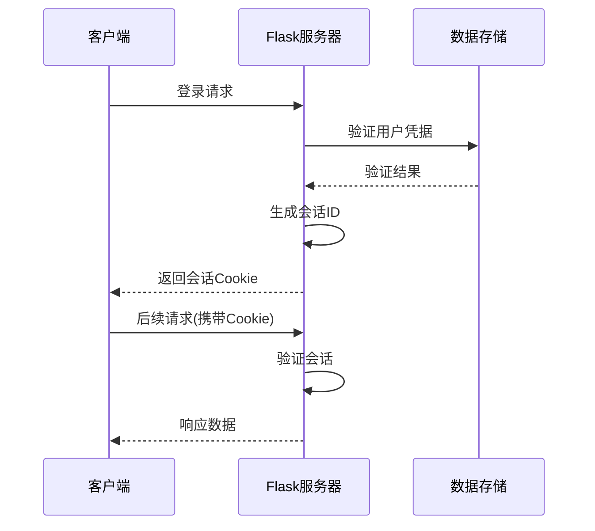
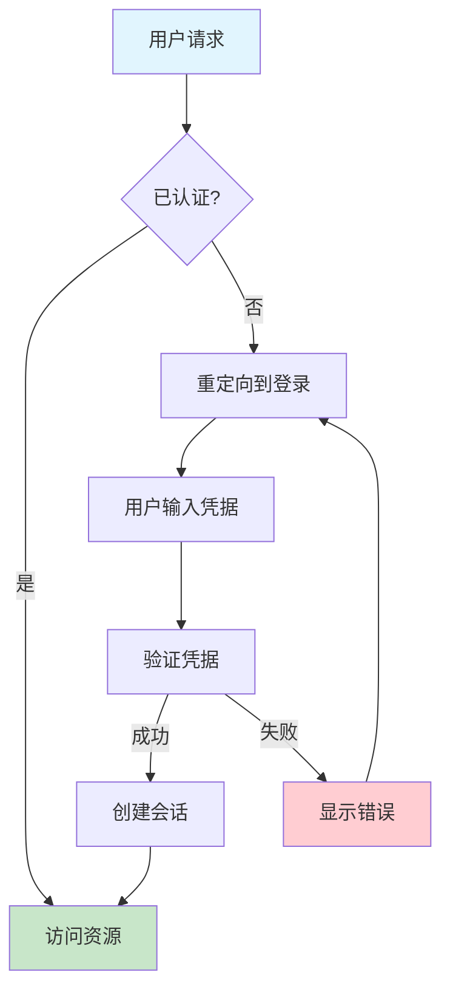
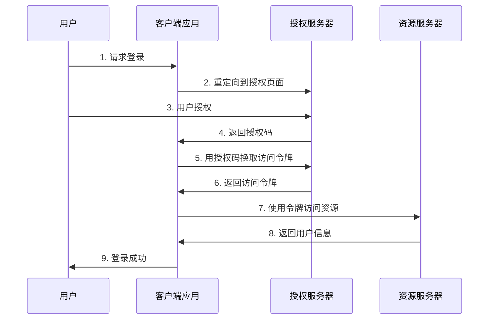
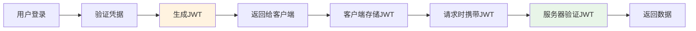
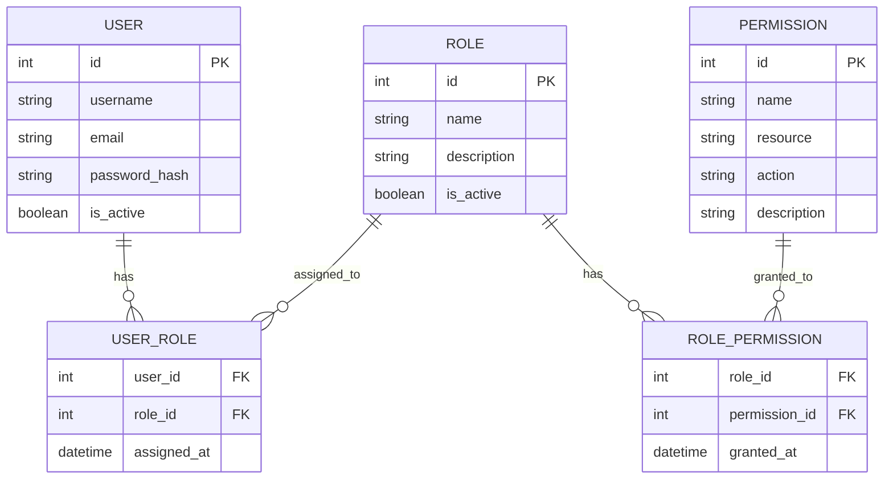
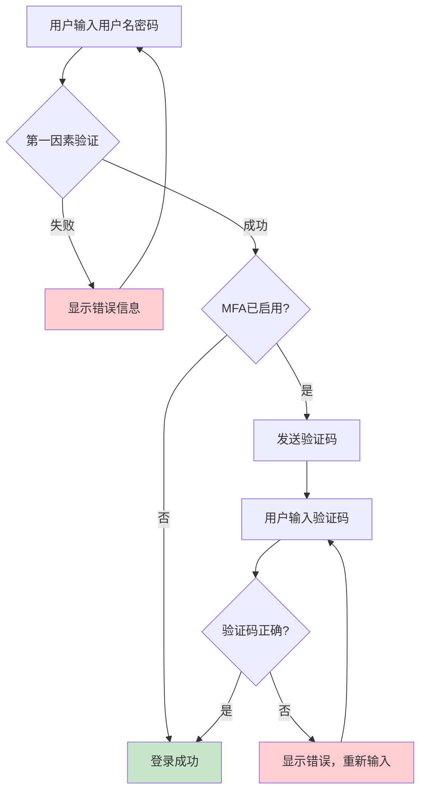

# 🔐 7. 用户认证与授权系统

用户认证与授权是Web应用安全的核心组成部分。认证（Authentication）解决"你是谁"的问题，而授权（Authorization）解决"你能做什么"的问题。本章将深入探讨Flask中构建安全、可扩展的用户认证与授权系统的各种方法和最佳实践。

## 🛡️ 7.1 会话管理与安全性

### 会话管理基础

会话管理是Web应用中维护用户状态的核心机制。Flask通过Session对象提供了安全的会话管理功能。



### Flask会话配置
app/config.py
```python
import os
from datetime import timedelta

class Config:
    # 会话安全配置
    SECRET_KEY = os.environ.get('SECRET_KEY') or 'dev-secret-key-change-in-production'
    
    # 会话Cookie配置
    SESSION_COOKIE_SECURE = True  # 仅HTTPS传输
    SESSION_COOKIE_HTTPONLY = True  # 防止XSS攻击
    SESSION_COOKIE_SAMESITE = 'Lax'  # CSRF防护
    PERMANENT_SESSION_LIFETIME = timedelta(hours=24)  # 会话过期时间
    
    # 会话存储配置
    SESSION_TYPE = 'filesystem'  # 或 'redis', 'memcached'
    SESSION_FILE_DIR = '/tmp/flask_session'
```

### 安全会话实现
app/auth/session.py
```python
from flask import session, request, current_app
from functools import wraps
import hashlib
import time

class SecureSession:
    @staticmethod
    def create_session(user_id, remember_me=False):
        """创建安全会话"""
        session.permanent = remember_me
        session['user_id'] = user_id
        session['csrf_token'] = SecureSession._generate_csrf_token()
        session['login_time'] = time.time()
        session['ip_address'] = request.remote_addr
    
    @staticmethod
    def _generate_csrf_token():
        """生成CSRF令牌"""
        return hashlib.sha256(
            f"{current_app.secret_key}{time.time()}".encode()
        ).hexdigest()[:32]
    
    @staticmethod
    def validate_session():
        """验证会话安全性"""
        if 'user_id' not in session:
            return False
            
        # IP地址验证（可选）
        if session.get('ip_address') != request.remote_addr:
            current_app.logger.warning(f"IP地址变更: {session.get('ip_address')} -> {request.remote_addr}")
            
        return True
    
    @staticmethod
    def destroy_session():
        """销毁会话"""
        session.clear()

def require_csrf_token(f):
    """CSRF保护装饰器"""
    @wraps(f)
    def decorated_function(*args, **kwargs):
        if request.method == 'POST':
            token = request.form.get('csrf_token') or request.headers.get('X-CSRF-Token')
            if not token or token != session.get('csrf_token'):
                return {'error': 'CSRF token validation failed'}, 403
        return f(*args, **kwargs)
    return decorated_function
```

## 👤 7.2 用户认证系统设计

### 认证系统架构



### 用户模型设计
app/models/user.py
```python
from flask_sqlalchemy import SQLAlchemy
from werkzeug.security import generate_password_hash, check_password_hash
from datetime import datetime
import re

db = SQLAlchemy()

class User(db.Model):
    __tablename__ = 'users'
    
    id = db.Column(db.Integer, primary_key=True)
    username = db.Column(db.String(80), unique=True, nullable=False, index=True)
    email = db.Column(db.String(120), unique=True, nullable=False, index=True)
    password_hash = db.Column(db.String(255), nullable=False)
    
    # 用户状态
    is_active = db.Column(db.Boolean, default=True)
    is_verified = db.Column(db.Boolean, default=False)
    
    # 时间戳
    created_at = db.Column(db.DateTime, default=datetime.utcnow)
    last_login = db.Column(db.DateTime)
    
    # 安全字段
    failed_login_attempts = db.Column(db.Integer, default=0)
    locked_until = db.Column(db.DateTime)
    
    def set_password(self, password):
        """设置密码哈希"""
        if not self._validate_password_strength(password):
            raise ValueError("密码强度不足")
        self.password_hash = generate_password_hash(password)
    
    def check_password(self, password):
        """验证密码"""
        return check_password_hash(self.password_hash, password)
    
    def _validate_password_strength(self, password):
        """密码强度验证"""
        if len(password) < 8:
            return False
        if not re.search(r'[A-Z]', password):  # 大写字母
            return False
        if not re.search(r'[a-z]', password):  # 小写字母
            return False
        if not re.search(r'\d', password):     # 数字
            return False
        return True
    
    def is_locked(self):
        """检查账户是否被锁定"""
        if self.locked_until and datetime.utcnow() < self.locked_until:
            return True
        return False
    
    def record_failed_login(self):
        """记录登录失败"""
        self.failed_login_attempts += 1
        if self.failed_login_attempts >= 5:
            self.locked_until = datetime.utcnow() + timedelta(minutes=30)
    
    def record_successful_login(self):
        """记录成功登录"""
        self.last_login = datetime.utcnow()
        self.failed_login_attempts = 0
        self.locked_until = None
```

### 认证服务实现
app/auth/service.py
```python
from flask import current_app
from app.models.user import User, db
from app.auth.session import SecureSession
import logging

class AuthService:
    @staticmethod
    def authenticate(username_or_email, password, remember_me=False):
        """用户认证"""
        try:
            # 查找用户
            user = User.query.filter(
                (User.username == username_or_email) | 
                (User.email == username_or_email)
            ).first()
            
            if not user:
                current_app.logger.warning(f"登录失败: 用户不存在 - {username_or_email}")
                return None, "用户名或密码错误"
            
            # 检查账户状态
            if not user.is_active:
                return None, "账户已被禁用"
            
            if user.is_locked():
                return None, "账户已被锁定，请稍后再试"
            
            # 验证密码
            if not user.check_password(password):
                user.record_failed_login()
                db.session.commit()
                current_app.logger.warning(f"登录失败: 密码错误 - {username_or_email}")
                return None, "用户名或密码错误"
            
            # 登录成功
            user.record_successful_login()
            db.session.commit()
            
            # 创建会话
            SecureSession.create_session(user.id, remember_me)
            
            current_app.logger.info(f"用户登录成功: {user.username}")
            return user, None
            
        except Exception as e:
            current_app.logger.error(f"认证过程出错: {str(e)}")
            return None, "系统错误，请稍后再试"
    
    @staticmethod
    def logout():
        """用户登出"""
        SecureSession.destroy_session()
        current_app.logger.info("用户已登出")
```

## 🔑 7.3 Flask-Login 深入应用

### Flask-Login 配置与集成
app/__init__.py
```python
from flask import Flask
from flask_login import LoginManager
from app.models.user import User

def create_app():
    app = Flask(__name__)
    
    # 初始化 Flask-Login
    login_manager = LoginManager()
    login_manager.init_app(app)
    login_manager.login_view = 'auth.login'
    login_manager.login_message = '请先登录以访问此页面'
    login_manager.login_message_category = 'info'
    
    @login_manager.user_loader
    def load_user(user_id):
        """用户加载回调"""
        return User.query.get(int(user_id))
    
    @login_manager.unauthorized_handler
    def unauthorized():
        """未授权访问处理"""
        return redirect(url_for('auth.login', next=request.url))
    
    return app
```

### 扩展用户模型
app/models/user.py
```python
from flask_login import UserMixin

class User(UserMixin, db.Model):
    # ... 之前的代码 ...
    
    def get_id(self):
        """返回用户唯一标识"""
        return str(self.id)
    
    @property
    def is_authenticated(self):
        """用户是否已认证"""
        return True
    
    @property
    def is_active(self):
        """用户是否激活"""
        return self.is_active
    
    @property
    def is_anonymous(self):
        """是否为匿名用户"""
        return False
```

### 认证视图实现
app/auth/views.py
```python
from flask import Blueprint, render_template, request, flash, redirect, url_for
from flask_login import login_user, logout_user, login_required, current_user
from app.auth.service import AuthService
from app.auth.forms import LoginForm, RegisterForm

auth_bp = Blueprint('auth', __name__, url_prefix='/auth')

@auth_bp.route('/login', methods=['GET', 'POST'])
def login():
    """用户登录"""
    if current_user.is_authenticated:
        return redirect(url_for('main.dashboard'))
    
    form = LoginForm()
    if form.validate_on_submit():
        user, error = AuthService.authenticate(
            form.username.data,
            form.password.data,
            form.remember_me.data
        )
        
        if user:
            login_user(user, remember=form.remember_me.data)
            next_page = request.args.get('next')
            return redirect(next_page) if next_page else redirect(url_for('main.dashboard'))
        else:
            flash(error, 'error')
    
    return render_template('auth/login.html', form=form)

@auth_bp.route('/logout')
@login_required
def logout():
    """用户登出"""
    logout_user()
    flash('您已成功登出', 'success')
    return redirect(url_for('main.index'))

@auth_bp.route('/profile')
@login_required
def profile():
    """用户资料页面"""
    return render_template('auth/profile.html', user=current_user)
```

## 🌐 7.4 OAuth 2.0 与第三方登录

### OAuth 2.0 流程图



### GitHub OAuth 集成示例
app/auth/oauth.py
```python
from flask import current_app, url_for, request, session
from authlib.integrations.flask_client import OAuth
import requests

class GitHubOAuth:
    def __init__(self, app=None):
        self.oauth = OAuth()
        if app:
            self.init_app(app)
    
    def init_app(self, app):
        """初始化OAuth配置"""
        self.oauth.init_app(app)
        
        # 注册GitHub OAuth
        self.github = self.oauth.register(
            name='github',
            client_id=app.config['GITHUB_CLIENT_ID'],
            client_secret=app.config['GITHUB_CLIENT_SECRET'],
            server_metadata_url='https://api.github.com/.well-known/oauth_authorization_server',
            client_kwargs={
                'scope': 'user:email'
            }
        )
    
    def get_authorization_url(self):
        """获取授权URL"""
        redirect_uri = url_for('auth.github_callback', _external=True)
        return self.github.authorize_redirect(redirect_uri)
    
    def get_user_info(self, token):
        """获取用户信息"""
        resp = self.github.parse_id_token(token)
        user_info = self.github.get('user', token=token).json()
        
        return {
            'id': user_info['id'],
            'username': user_info['login'],
            'email': user_info.get('email'),
            'name': user_info.get('name'),
            'avatar_url': user_info.get('avatar_url')
        }

# OAuth视图
@auth_bp.route('/github')
def github_login():
    """GitHub登录"""
    github_oauth = current_app.extensions['github_oauth']
    return github_oauth.get_authorization_url()

@auth_bp.route('/github/callback')
def github_callback():
    """GitHub回调处理"""
    github_oauth = current_app.extensions['github_oauth']
    token = github_oauth.github.authorize_access_token()
    
    if token:
        user_info = github_oauth.get_user_info(token)
        # 处理用户信息，创建或更新用户
        user = handle_oauth_user(user_info, 'github')
        login_user(user)
        return redirect(url_for('main.dashboard'))
    
    flash('GitHub登录失败', 'error')
    return redirect(url_for('auth.login'))
```

## 🎫 7.5 JWT 令牌认证

### JWT 工作原理



### JWT 服务实现
app/auth/jwt_service.py
```python
import jwt
from datetime import datetime, timedelta
from flask import current_app
from functools import wraps

class JWTService:
    @staticmethod
    def generate_token(user_id, expires_in=3600):
        """生成JWT令牌"""
        payload = {
            'user_id': user_id,
            'exp': datetime.utcnow() + timedelta(seconds=expires_in),
            'iat': datetime.utcnow(),
            'iss': 'flask-app'  # 发行者
        }
        
        return jwt.encode(
            payload,
            current_app.config['JWT_SECRET_KEY'],
            algorithm='HS256'
        )
    
    @staticmethod
    def verify_token(token):
        """验证JWT令牌"""
        try:
            payload = jwt.decode(
                token,
                current_app.config['JWT_SECRET_KEY'],
                algorithms=['HS256']
            )
            return payload['user_id']
        except jwt.ExpiredSignatureError:
            return None  # 令牌过期
        except jwt.InvalidTokenError:
            return None  # 无效令牌
    
    @staticmethod
    def refresh_token(token):
        """刷新令牌"""
        try:
            payload = jwt.decode(
                token,
                current_app.config['JWT_SECRET_KEY'],
                algorithms=['HS256'],
                options={'verify_exp': False}  # 忽略过期验证
            )
            
            # 检查令牌是否在刷新窗口内
            exp_time = datetime.fromtimestamp(payload['exp'])
            if datetime.utcnow() - exp_time > timedelta(days=7):
                return None  # 超出刷新窗口
            
            return JWTService.generate_token(payload['user_id'])
        except jwt.InvalidTokenError:
            return None

def jwt_required(f):
    """JWT认证装饰器"""
    @wraps(f)
    def decorated_function(*args, **kwargs):
        token = request.headers.get('Authorization')
        if not token:
            return {'error': '缺少认证令牌'}, 401
        
        try:
            # 移除 'Bearer ' 前缀
            token = token.split(' ')[1] if token.startswith('Bearer ') else token
            user_id = JWTService.verify_token(token)
            
            if not user_id:
                return {'error': '无效或过期的令牌'}, 401
            
            # 将用户ID添加到请求上下文
            request.current_user_id = user_id
            
        except Exception as e:
            return {'error': '令牌验证失败'}, 401
        
        return f(*args, **kwargs)
    return decorated_function
```

### API认证端点
app/api/auth.py
```python
from flask import Blueprint, request, jsonify
from app.auth.service import AuthService
from app.auth.jwt_service import JWTService, jwt_required

api_auth_bp = Blueprint('api_auth', __name__, url_prefix='/api/auth')

@api_auth_bp.route('/login', methods=['POST'])
def api_login():
    """API登录端点"""
    data = request.get_json()
    
    if not data or not data.get('username') or not data.get('password'):
        return jsonify({'error': '用户名和密码不能为空'}), 400
    
    user, error = AuthService.authenticate(
        data['username'],
        data['password']
    )
    
    if user:
        token = JWTService.generate_token(user.id)
        return jsonify({
            'access_token': token,
            'token_type': 'Bearer',
            'expires_in': 3600,
            'user': {
                'id': user.id,
                'username': user.username,
                'email': user.email
            }
        })
    else:
        return jsonify({'error': error}), 401

@api_auth_bp.route('/refresh', methods=['POST'])
def refresh_token():
    """刷新令牌"""
    data = request.get_json()
    old_token = data.get('refresh_token')
    
    if not old_token:
        return jsonify({'error': '缺少刷新令牌'}), 400
    
    new_token = JWTService.refresh_token(old_token)
    if new_token:
        return jsonify({
            'access_token': new_token,
            'token_type': 'Bearer',
            'expires_in': 3600
        })
    else:
        return jsonify({'error': '无效的刷新令牌'}), 401

@api_auth_bp.route('/profile', methods=['GET'])
@jwt_required
def get_profile():
    """获取用户资料"""
    user = User.query.get(request.current_user_id)
    if user:
        return jsonify({
            'id': user.id,
            'username': user.username,
            'email': user.email,
            'created_at': user.created_at.isoformat(),
            'last_login': user.last_login.isoformat() if user.last_login else None
        })
    return jsonify({'error': '用户不存在'}), 404
```

## 🎭 7.6 基于角色的访问控制（RBAC）

### RBAC 模型设计



### RBAC 模型实现
app/models/rbac.py
```python
from app.models.user import db
from datetime import datetime

# 关联表
user_roles = db.Table('user_roles',
    db.Column('user_id', db.Integer, db.ForeignKey('users.id'), primary_key=True),
    db.Column('role_id', db.Integer, db.ForeignKey('roles.id'), primary_key=True),
    db.Column('assigned_at', db.DateTime, default=datetime.utcnow)
)

role_permissions = db.Table('role_permissions',
    db.Column('role_id', db.Integer, db.ForeignKey('roles.id'), primary_key=True),
    db.Column('permission_id', db.Integer, db.ForeignKey('permissions.id'), primary_key=True),
    db.Column('granted_at', db.DateTime, default=datetime.utcnow)
)

class Role(db.Model):
    __tablename__ = 'roles'
    
    id = db.Column(db.Integer, primary_key=True)
    name = db.Column(db.String(80), unique=True, nullable=False)
    description = db.Column(db.Text)
    is_active = db.Column(db.Boolean, default=True)
    created_at = db.Column(db.DateTime, default=datetime.utcnow)
    
    # 关系
    permissions = db.relationship('Permission', secondary=role_permissions, backref='roles')
    
    def has_permission(self, permission_name):
        """检查角色是否有指定权限"""
        return any(p.name == permission_name for p in self.permissions)
    
    def __repr__(self):
        return f'<Role {self.name}>'

class Permission(db.Model):
    __tablename__ = 'permissions'
    
    id = db.Column(db.Integer, primary_key=True)
    name = db.Column(db.String(100), unique=True, nullable=False)
    resource = db.Column(db.String(50), nullable=False)  # 资源类型
    action = db.Column(db.String(50), nullable=False)    # 操作类型
    description = db.Column(db.Text)
    created_at = db.Column(db.DateTime, default=datetime.utcnow)
    
    def __repr__(self):
        return f'<Permission {self.name}>'

# 扩展User模型
class User(UserMixin, db.Model):
    # ... 之前的代码 ...
    
    # 添加角色关系
    roles = db.relationship('Role', secondary=user_roles, backref='users')
    
    def has_role(self, role_name):
        """检查用户是否有指定角色"""
        return any(role.name == role_name for role in self.roles)
    
    def has_permission(self, permission_name):
        """检查用户是否有指定权限"""
        for role in self.roles:
            if role.has_permission(permission_name):
                return True
        return False
    
    def add_role(self, role):
        """添加角色"""
        if not self.has_role(role.name):
            self.roles.append(role)
    
    def remove_role(self, role):
        """移除角色"""
        if self.has_role(role.name):
            self.roles.remove(role)
```

### 权限装饰器
app/auth/decorators.py
```python
from functools import wraps
from flask import abort, request, jsonify
from flask_login import current_user

def require_permission(permission_name):
    """权限检查装饰器"""
    def decorator(f):
        @wraps(f)
        def decorated_function(*args, **kwargs):
            if not current_user.is_authenticated:
                if request.is_json:
                    return jsonify({'error': '需要登录'}), 401
                abort(401)
            
            if not current_user.has_permission(permission_name):
                if request.is_json:
                    return jsonify({'error': '权限不足'}), 403
                abort(403)
            
            return f(*args, **kwargs)
        return decorated_function
    return decorator

def require_role(role_name):
    """角色检查装饰器"""
    def decorator(f):
        @wraps(f)
        def decorated_function(*args, **kwargs):
            if not current_user.is_authenticated:
                if request.is_json:
                    return jsonify({'error': '需要登录'}), 401
                abort(401)
            
            if not current_user.has_role(role_name):
                if request.is_json:
                    return jsonify({'error': f'需要{role_name}角色'}), 403
                abort(403)
            
            return f(*args, **kwargs)
        return decorated_function
    return decorator

def require_any_role(*role_names):
    """多角色检查装饰器（满足任一即可）"""
    def decorator(f):
        @wraps(f)
        def decorated_function(*args, **kwargs):
            if not current_user.is_authenticated:
                abort(401)
            
            if not any(current_user.has_role(role) for role in role_names):
                abort(403)
            
            return f(*args, **kwargs)
        return decorated_function
    return decorator
```

### 使用示例
app/admin/views.py
```python
from flask import Blueprint, render_template
from flask_login import login_required
from app.auth.decorators import require_permission, require_role

admin_bp = Blueprint('admin', __name__, url_prefix='/admin')

@admin_bp.route('/dashboard')
@login_required
@require_role('admin')
def dashboard():
    """管理员仪表板"""
    return render_template('admin/dashboard.html')

@admin_bp.route('/users')
@login_required
@require_permission('user.read')
def list_users():
    """用户列表"""
    users = User.query.all()
    return render_template('admin/users.html', users=users)

@admin_bp.route('/users/<int:user_id>/edit')
@login_required
@require_permission('user.update')
def edit_user(user_id):
    """编辑用户"""
    user = User.query.get_or_404(user_id)
    return render_template('admin/edit_user.html', user=user)
```

## 🔐 7.7 多因素认证（MFA）

### MFA 流程图



### TOTP（基于时间的一次性密码）实现
app/auth/mfa.py
```python
import pyotp
import qrcode
from io import BytesIO
import base64
from flask import current_app

class MFAService:
    @staticmethod
    def generate_secret():
        """生成MFA密钥"""
        return pyotp.random_base32()
    
    @staticmethod
    def generate_qr_code(user, secret):
        """生成二维码"""
        totp_uri = pyotp.totp.TOTP(secret).provisioning_uri(
            name=user.email,
            issuer_name=current_app.config.get('APP_NAME', 'Flask App')
        )
        
        qr = qrcode.QRCode(version=1, box_size=10, border=5)
        qr.add_data(totp_uri)
        qr.make(fit=True)
        
        img = qr.make_image(fill_color="black", back_color="white")
        
        # 转换为base64字符串
        buffer = BytesIO()
        img.save(buffer, format='PNG')
        buffer.seek(0)
        
        return base64.b64encode(buffer.getvalue()).decode()
    
    @staticmethod
    def verify_token(secret, token):
        """验证TOTP令牌"""
        totp = pyotp.TOTP(secret)
        return totp.verify(token, valid_window=1)  # 允许30秒误差
    
    @staticmethod
    def generate_backup_codes(count=10):
        """生成备用码"""
        import secrets
        import string
        
        codes = []
        for _ in range(count):
            code = ''.join(secrets.choice(string.ascii_uppercase + string.digits) 
                          for _ in range(8))
            codes.append(f"{code[:4]}-{code[4:]}")
        
        return codes

# 扩展User模型
class User(UserMixin, db.Model):
    # ... 之前的代码 ...
    
    # MFA相关字段
    mfa_secret = db.Column(db.String(32))  # TOTP密钥
    mfa_enabled = db.Column(db.Boolean, default=False)
    backup_codes = db.Column(db.Text)  # JSON格式存储备用码
    
    def enable_mfa(self):
        """启用MFA"""
        if not self.mfa_secret:
            self.mfa_secret = MFAService.generate_secret()
        
        # 生成备用码
        backup_codes = MFAService.generate_backup_codes()
        self.backup_codes = json.dumps(backup_codes)
        self.mfa_enabled = True
        
        return backup_codes
    
    def disable_mfa(self):
        """禁用MFA"""
        self.mfa_enabled = False
        self.mfa_secret = None
        self.backup_codes = None
    
    def verify_mfa_token(self, token):
        """验证MFA令牌"""
        if not self.mfa_enabled or not self.mfa_secret:
            return False
        
        # 首先尝试TOTP验证
        if MFAService.verify_token(self.mfa_secret, token):
            return True
        
        # 如果TOTP失败，尝试备用码
        return self._verify_backup_code(token)
    
    def _verify_backup_code(self, code):
        """验证备用码"""
        if not self.backup_codes:
            return False
        
        backup_codes = json.loads(self.backup_codes)
        if code in backup_codes:
            # 使用后移除备用码
            backup_codes.remove(code)
            self.backup_codes = json.dumps(backup_codes)
            db.session.commit()
            return True
        
        return False
```

### MFA 视图实现
app/auth/mfa_views.py
```python
from flask import Blueprint, render_template, request, flash, redirect, url_for, session
from flask_login import login_required, current_user
from app.auth.mfa import MFAService
from app.models.user import db

mfa_bp = Blueprint('mfa', __name__, url_prefix='/auth/mfa')

@mfa_bp.route('/setup', methods=['GET', 'POST'])
@login_required
def setup():
    """MFA设置页面"""
    if request.method == 'POST':
        token = request.form.get('token')
        
        if not current_user.mfa_secret:
            # 生成新的密钥
            current_user.mfa_secret = MFAService.generate_secret()
            db.session.commit()
        
        # 验证用户输入的令牌
        if MFAService.verify_token(current_user.mfa_secret, token):
            backup_codes = current_user.enable_mfa()
            db.session.commit()
            
            flash('MFA已成功启用！请保存以下备用码：', 'success')
            return render_template('auth/mfa_backup_codes.html', codes=backup_codes)
        else:
            flash('验证码错误，请重试', 'error')
    
    # 生成二维码
    if not current_user.mfa_secret:
        current_user.mfa_secret = MFAService.generate_secret()
        db.session.commit()
    
    qr_code = MFAService.generate_qr_code(current_user, current_user.mfa_secret)
    
    return render_template('auth/mfa_setup.html', 
                         qr_code=qr_code, 
                         secret=current_user.mfa_secret)

@mfa_bp.route('/verify', methods=['GET', 'POST'])
def verify():
    """MFA验证页面"""
    if 'mfa_user_id' not in session:
        return redirect(url_for('auth.login'))
    
    if request.method == 'POST':
        token = request.form.get('token')
        user_id = session.get('mfa_user_id')
        user = User.query.get(user_id)
        
        if user and user.verify_mfa_token(token):
            # MFA验证成功，完成登录
            session.pop('mfa_user_id', None)
            login_user(user, remember=session.get('remember_me', False))
            
            next_page = request.args.get('next')
            return redirect(next_page) if next_page else redirect(url_for('main.dashboard'))
        else:
            flash('验证码错误，请重试', 'error')
    
    return render_template('auth/mfa_verify.html')

@mfa_bp.route('/disable', methods=['POST'])
@login_required
def disable():
    """禁用MFA"""
    password = request.form.get('password')
    
    if current_user.check_password(password):
        current_user.disable_mfa()
        db.session.commit()
        flash('MFA已禁用', 'success')
    else:
        flash('密码错误', 'error')
    
    return redirect(url_for('auth.profile'))
```

### 修改登录流程支持MFA
app/auth/views.py
```python
# 修改登录视图
@auth_bp.route('/login', methods=['GET', 'POST'])
def login():
    """用户登录（支持MFA）"""
    if current_user.is_authenticated:
        return redirect(url_for('main.dashboard'))
    
    form = LoginForm()
    if form.validate_on_submit():
        user, error = AuthService.authenticate(
            form.username.data,
            form.password.data,
            form.remember_me.data
        )
        
        if user:
            # 检查是否启用了MFA
            if user.mfa_enabled:
                # 将用户ID存储在会话中，重定向到MFA验证页面
                session['mfa_user_id'] = user.id
                session['remember_me'] = form.remember_me.data
                return redirect(url_for('mfa.verify'))
            else:
                # 直接登录
                login_user(user, remember=form.remember_me.data)
                next_page = request.args.get('next')
                return redirect(next_page) if next_page else redirect(url_for('main.dashboard'))
        else:
            flash(error, 'error')
    
    return render_template('auth/login.html', form=form)
```

## 📝 小结

本章深入介绍了Flask中用户认证与授权系统的各个方面：

- **会话管理**：安全的会话配置和CSRF防护
- **认证系统**：用户模型设计和认证服务实现
- **Flask-Login**：简化的用户会话管理
- **OAuth 2.0**：第三方登录集成
- **JWT认证**：无状态的API认证方案
- **RBAC**：灵活的角色权限控制
- **MFA**：多因素认证增强安全性

这些技术组合使用，可以构建出安全、可扩展的用户认证与授权系统，满足不同应用场景的需求。在实际项目中，应根据具体需求选择合适的认证方案，并始终将安全性放在首位。
        