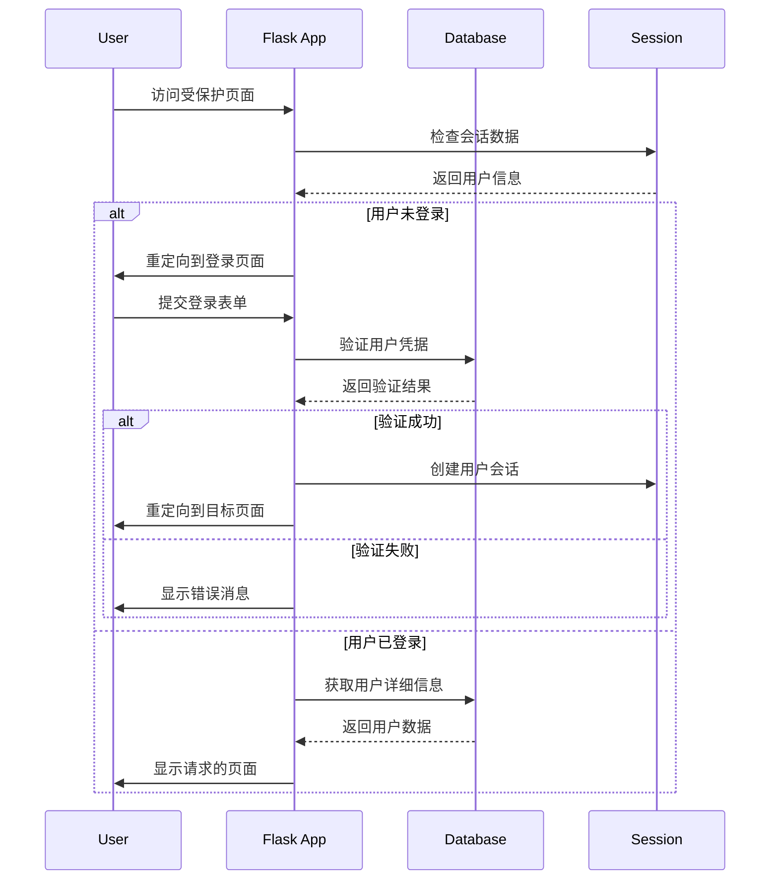

# 7. 用户认证和会话管理
## 7.1 会话（Session）基础
Flask 提供了基于客户端的会话管理机制，允许在多个请求间存储用户特定的数据。

**会话配置**：

```python
app.config['SECRET_KEY'] = 'your-secret-key-here'  # 必须设置，用于加密会话数据
app.config['SESSION_COOKIE_NAME'] = 'my_flask_session'
app.config['PERMANENT_SESSION_LIFETIME'] = timedelta(days=7)  # 持久会话有效期
```

**基本会话操作**：

```python
from flask import session

@app.route('/set-session')
def set_session():
    # 设置会话数据
    session['user_id'] = 123
    session['username'] = 'john_doe'
    session['logged_in'] = True
    session.permanent = True  # 设置持久会话
    return '会话数据已设置'

@app.route('/get-session')
def get_session():
    # 获取会话数据
    user_id = session.get('user_id')
    username = session.get('username')
    logged_in = session.get('logged_in', False)
    return f'用户ID: {user_id}, 用户名: {username}, 登录状态: {logged_in}'

@app.route('/clear-session')
def clear_session():
    # 清除会话数据
    session.clear()
    return '会话数据已清除'
```

**自定义会话接口**：

```python
from flask import Flask, session
from datetime import datetime

@app.before_request
def update_last_visit():
    # 每次请求前更新最后访问时间
    if 'last_visit' in session:
        session['last_visit'] = datetime.now().isoformat()

@app.route('/dashboard')
def dashboard():
    last_visit = session.get('last_visit')
    visit_count = session.get('visit_count', 0) + 1
    session['visit_count'] = visit_count
    
    return f'最后访问: {last_visit}, 访问次数: {visit_count}'
```

## 7.2 用户注册和登录实现
**密码安全处理**：

```python
from werkzeug.security import generate_password_hash, check_password_hash
import re

class User(db.Model):
    # ... 其他字段
    password_hash = db.Column(db.String(128))
    
    @property
    def password(self):
        raise AttributeError('password is not a readable attribute')
    
    @password.setter
    def password(self, password):
        if len(password) < 6:
            raise ValueError('密码必须至少6个字符')
        if not re.search(r'[A-Z]', password):
            raise ValueError('密码必须包含至少一个大写字母')
        if not re.search(r'[a-z]', password):
            raise ValueError('密码必须包含至少一个小写字母')
        if not re.search(r'[0-9]', password):
            raise ValueError('密码必须包含至少一个数字')
        
        self.password_hash = generate_password_hash(password)
    
    def verify_password(self, password):
        return check_password_hash(self.password_hash, password)
```

**用户注册视图**：

```python
@app.route('/register', methods=['GET', 'POST'])
def register():
    form = RegistrationForm()
    
    if form.validate_on_submit():
        # 检查用户名和邮箱是否已存在
        existing_user = User.query.filter(
            (User.username == form.username.data) | 
            (User.email == form.email.data)
        ).first()
        
        if existing_user:
            flash('用户名或邮箱已存在', 'danger')
            return render_template('register.html', form=form)
        
        try:
            user = User(
                username=form.username.data,
                email=form.email.data
            )
            user.password = form.password.data  # 这会触发密码哈希
            
            db.session.add(user)
            db.session.commit()
            
            # 发送欢迎邮件
            send_welcome_email(user.email, user.username)
            
            flash('注册成功！请登录。', 'success')
            return redirect(url_for('login'))
            
        except ValueError as e:
            flash(str(e), 'danger')
    
    return render_template('register.html', form=form)
```

**用户登录视图**：

```python
@app.route('/login', methods=['GET', 'POST'])
def login():
    # 如果用户已登录，重定向到首页
    if current_user.is_authenticated:
        return redirect(url_for('index'))
    
    form = LoginForm()
    
    if form.validate_on_submit():
        user = User.query.filter_by(username=form.username.data).first()
        
        if user and user.verify_password(form.password.data):
            # 密码正确，登录用户
            login_user(user, remember=form.remember_me.data)
            
            # 记录登录日志
            login_log = LoginLog(user_id=user.id, ip_address=request.remote_addr)
            db.session.add(login_log)
            db.session.commit()
            
            next_page = request.args.get('next')
            if not next_page or not next_page.startswith('/'):
                next_page = url_for('dashboard')
            
            flash('登录成功！', 'success')
            return redirect(next_page)
        else:
            flash('用户名或密码错误', 'danger')
    
    return render_template('login.html', form=form)
```

## 7.3 使用 Flask-Login 扩展
Flask-Login 提供了完整的用户会话管理功能。

**安装和配置**：

```bash
pip install flask-login
```

**初始化 Flask-Login**：

```python
from flask_login import LoginManager, UserMixin, current_user, login_required, logout_user

login_manager = LoginManager()
login_manager.init_app(app)
login_manager.login_view = 'login'  # 设置登录页面
login_manager.login_message = '请先登录'  # 设置提示消息
login_manager.login_message_category = 'info'

# 设置会话保护强度
login_manager.session_protection = 'strong'  # 可选：'basic', 'strong', None
```

**用户模型配置**：

```python
class User(db.Model, UserMixin):
    # ... 其他字段
    
    def get_id(self):
        return str(self.id)
    
    @property
    def is_active(self):
        return self.active  # 假设有一个active字段
    
    @property
    def is_authenticated(self):
        return True  # 根据实际需求实现
    
    @property
    def is_anonymous(self):
        return False

@login_manager.user_loader
def load_user(user_id):
    return User.query.get(int(user_id))
```

**保护路由**：

```python
@app.route('/dashboard')
@login_required
def dashboard():
    return render_template('dashboard.html', user=current_user)

@app.route('/profile')
@login_required
def profile():
    return render_template('profile.html', user=current_user)

@app.route('/admin')
@login_required
def admin_panel():
    if not current_user.is_admin:
        flash('无权访问此页面', 'danger')
        return redirect(url_for('index'))
    return render_template('admin.html')
```

**用户登出**：

```python
@app.route('/logout')
@login_required
def logout():
    # 记录登出日志
    logout_log = LogoutLog(user_id=current_user.id)
    db.session.add(logout_log)
    db.session.commit()
    
    logout_user()
    flash('您已成功登出', 'success')
    return redirect(url_for('index'))
```

## 7.4 密码哈希和安全性最佳实践
**增强密码安全性**：

```python
import secrets
from werkzeug.security import generate_password_hash, check_password_hash

def generate_salt():
    """生成随机盐值"""
    return secrets.token_hex(16)

def hash_password(password, salt=None):
    """使用盐值哈希密码"""
    if salt is None:
        salt = generate_salt()
    return generate_password_hash(f'{salt}{password}'), salt

def verify_password(password_hash, password, salt):
    """验证密码"""
    return check_password_hash(password_hash, f'{salt}{password}')
```

**密码策略配置**：

```python
class PasswordPolicy:
    MIN_LENGTH = 8
    REQUIRE_UPPERCASE = True
    REQUIRE_LOWERCASE = True
    REQUIRE_DIGIT = True
    REQUIRE_SPECIAL = True
    SPECIAL_CHARS = "!@#$%^&*()_+-=[]{}|;:,.<>?"
    
    @classmethod
    def validate(cls, password):
        errors = []
        
        if len(password) < cls.MIN_LENGTH:
            errors.append(f'密码必须至少{cls.MIN_LENGTH}个字符')
        
        if cls.REQUIRE_UPPERCASE and not any(c.isupper() for c in password):
            errors.append('密码必须包含至少一个大写字母')
        
        if cls.REQUIRE_LOWERCASE and not any(c.islower() for c in password):
            errors.append('密码必须包含至少一个小写字母')
        
        if cls.REQUIRE_DIGIT and not any(c.isdigit() for c in password):
            errors.append('密码必须包含至少一个数字')
        
        if cls.REQUIRE_SPECIAL and not any(c in cls.SPECIAL_CHARS for c in password):
            errors.append(f'密码必须包含至少一个特殊字符: {cls.SPECIAL_CHARS}')
        
        return errors
```

**密码重置功能**：

```python
from itsdangerous import URLSafeTimedSerializer

def generate_token(email):
    serializer = URLSafeTimedSerializer(app.config['SECRET_KEY'])
    return serializer.dumps(email, salt='password-reset-salt')

def verify_token(token, expiration=3600):
    serializer = URLSafeTimedSerializer(app.config['SECRET_KEY'])
    try:
        email = serializer.loads(
            token,
            salt='password-reset-salt',
            max_age=expiration
        )
    except:
        return False
    return email

@app.route('/reset-password-request', methods=['GET', 'POST'])
def reset_password_request():
    form = ResetPasswordRequestForm()
    
    if form.validate_on_submit():
        user = User.query.filter_by(email=form.email.data).first()
        if user:
            token = generate_token(user.email)
            send_password_reset_email(user.email, token)
        
        flash('如果邮箱存在，重置指令已发送', 'info')
        return redirect(url_for('login'))
    
    return render_template('reset_password_request.html', form=form)
```

## 7.5 角色和权限管理（基础）
**基础角色模型**：

```python
class Role(db.Model):
    __tablename__ = 'roles'
    
    id = db.Column(db.Integer, primary_key=True)
    name = db.Column(db.String(64), unique=True)
    permissions = db.Column(db.Integer)
    users = db.relationship('User', backref='role', lazy='dynamic')
    
    def __repr__(self):
        return f'<Role {self.name}>'

class Permission:
    FOLLOW = 1
    COMMENT = 2
    WRITE = 4
    MODERATE = 8
    ADMIN = 16

# 初始化角色
def create_roles():
    roles = {
        'User': [Permission.FOLLOW, Permission.COMMENT, Permission.WRITE],
        'Moderator': [Permission.FOLLOW, Permission.COMMENT, Permission.WRITE, Permission.MODERATE],
        'Administrator': [Permission.FOLLOW, Permission.COMMENT, Permission.WRITE, Permission.MODERATE, Permission.ADMIN]
    }
    
    for r in roles:
        role = Role.query.filter_by(name=r).first()
        if role is None:
            role = Role(name=r)
        role.reset_permissions()
        for perm in roles[r]:
            role.add_permission(perm)
        db.session.add(role)
    db.session.commit()
```

**权限检查装饰器**：

```python
from functools import wraps

def permission_required(permission):
    def decorator(f):
        @wraps(f)
        @login_required
        def decorated_function(*args, **kwargs):
            if not current_user.can(permission):
                flash('权限不足', 'danger')
                return redirect(url_for('index'))
            return f(*args, **kwargs)
        return decorated_function
    return decorator

def admin_required(f):
    return permission_required(Permission.ADMIN)(f)

# 在用户模型中添加权限检查方法
class User(UserMixin, db.Model):
    # ... 其他字段
    
    def can(self, permissions):
        return self.role is not None and \
            (self.role.permissions & permissions) == permissions
    
    def is_administrator(self):
        return self.can(Permission.ADMIN)
```

以下图表展示了用户认证的完整流程：



**用户状态管理流程图**：


本章详细介绍了 Flask 中的用户认证和会话管理系统，从基础的会话操作到完整的用户注册登录功能，再到权限管理和安全最佳实践。通过合理使用 Flask-Login 扩展和实现适当的安全措施，可以构建安全可靠的用户认证系统。

