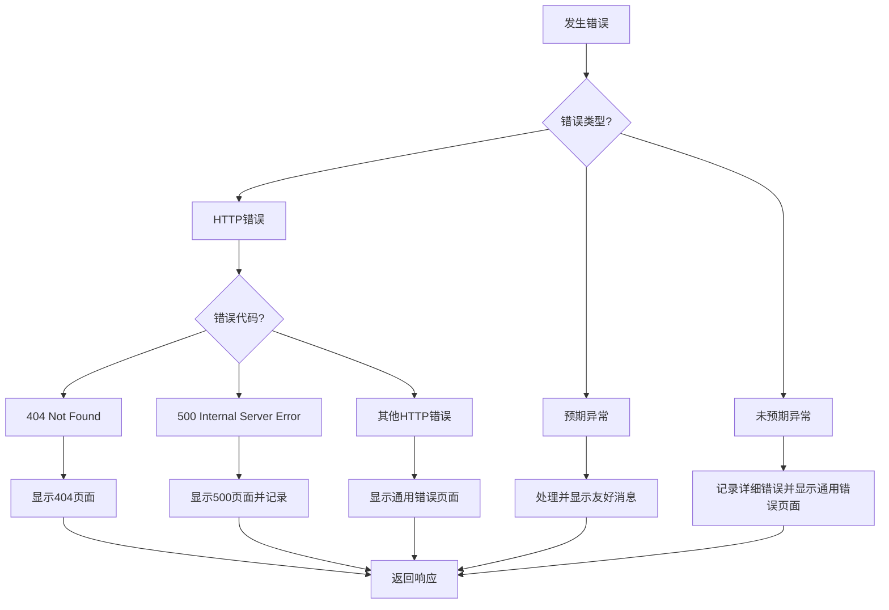
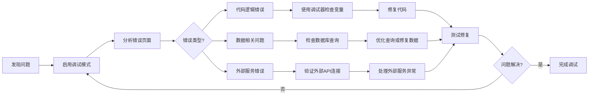

# 8. 错误处理和调试
## 8.1 Flask 调试模式
Flask 提供了一个强大的调试模式，可以在开发过程中帮助快速定位和解决问题。

**启用调试模式**：

```python
# 方式1：在应用配置中设置
app.config['DEBUG'] = True

# 方式2：通过环境变量设置
import os
os.environ['FLASK_DEBUG'] = '1'

# 方式3：运行应用时启用
if __name__ == '__main__':
    app.run(debug=True)
```

**调试模式特性**：

+ 自动重载：代码修改后自动重启服务器
+ 详细错误页面：显示完整的错误信息和堆栈跟踪
+ 调试器：提供交互式调试控制台（PIN 保护）
+ 请求分析：显示请求处理的详细时间线

**安全注意事项**：

```python
# 生产环境必须禁用调试模式
if os.environ.get('FLASK_ENV') == 'production':
    app.config['DEBUG'] = False
    app.config['TESTING'] = False
else:
    app.config['DEBUG'] = True

# 设置调试器PIN码（可选）
app.config['DEBUG_TB_INTERCEPT_REDIRECTS'] = False
```

## 8.2 自定义错误页面
Flask 允许为不同的 HTTP 错误代码创建自定义错误页面，提供更好的用户体验。

**基本错误处理**：

```python
from flask import render_template

@app.errorhandler(404)
def page_not_found(error):
    return render_template('errors/404.html'), 404

@app.errorhandler(500)
def internal_server_error(error):
    return render_template('errors/500.html'), 500

@app.errorhandler(403)
def forbidden(error):
    return render_template('errors/403.html'), 403

@app.errorhandler(401)
def unauthorized(error):
    return render_template('errors/401.html'), 401
```

**高级错误处理**：

```python
def create_error_handler(error_code):
    """工厂函数创建错误处理"""
    def error_handler(error):
        # 记录错误信息
        app.logger.error(f'{error_code} Error: {error.description}')
        
        # 根据请求类型返回不同响应
        if request.headers.get('X-Requested-With') == 'XMLHttpRequest':
            return jsonify({
                'error': error.description,
                'code': error_code
            }), error_code
        else:
            return render_template(
                f'errors/{error_code}.html',
                error=error
            ), error_code
    return error_handler

# 注册错误处理
for code in [400, 401, 403, 404, 405, 500]:
    app.errorhandler(code)(create_error_handler(code))
```

**错误页面模板示例**：

```html
<!-- templates/errors/404.html -->


页面未找到 - {{ super() }}


<div class="error-container">
    <h1>404</h1>
    <h2>页面未找到</h2>
    <p>您访问的页面不存在，请检查URL是否正确。</p>
    <a href="{{ url_for('index') }}" class="btn btn-primary">返回首页</a>
</div>

```

## 8.3 日志记录配置
合理的日志记录是应用程序可维护性的关键部分。

**基本日志配置**：

```python
import logging
from logging.handlers import RotatingFileHandler, SMTPHandler
import os

# 创建日志目录
if not os.path.exists('logs'):
    os.mkdir('logs')

# 文件日志处理器
file_handler = RotatingFileHandler(
    'logs/app.log', 
    maxBytes=10240, 
    backupCount=10
)
file_handler.setFormatter(logging.Formatter(
    '%(asctime)s %(levelname)s: %(message)s [in %(pathname)s:%(lineno)d]'
))
file_handler.setLevel(logging.INFO)

# 错误邮件通知
if not app.debug:
    mail_handler = SMTPHandler(
        mailhost=(app.config['MAIL_SERVER'], app.config['MAIL_PORT']),
        fromaddr=app.config['MAIL_USERNAME'],
        toaddrs=app.config['ADMINS'],
        subject='Application Error',
        credentials=(app.config['MAIL_USERNAME'], app.config['MAIL_PASSWORD']),
        secure=()
    )
    mail_handler.setLevel(logging.ERROR)
    mail_handler.setFormatter(logging.Formatter('''
    Message type:       %(levelname)s
    Location:           %(pathname)s:%(lineno)d
    Module:             %(module)s
    Function:           %(funcName)s
    Time:               %(asctime)s

    Message:

    %(message)s
    '''))
    app.logger.addHandler(mail_handler)

app.logger.addHandler(file_handler)
app.logger.setLevel(logging.INFO)
app.logger.info('Application startup')
```

**结构化日志记录**：

```python
import json
from pythonjsonlogger import jsonlogger

class StructuredLogger:
    def __init__(self, app=None):
        self.app = app
        if app is not None:
            self.init_app(app)
    
    def init_app(self, app):
        # 创建JSON格式的日志处理器
        json_handler = RotatingFileHandler(
            'logs/structured.log',
            maxBytes=10240,
            backupCount=10
        )
        
        formatter = jsonlogger.JsonFormatter(
            '%(asctime)s %(levelname)s %(name)s %(message)s'
        )
        json_handler.setFormatter(formatter)
        
        app.logger.addHandler(json_handler)
        
        # 添加请求上下文处理器
        @app.before_request
        def log_request():
            app.logger.info('Request received', extra={
                'method': request.method,
                'path': request.path,
                'ip': request.remote_addr,
                'user_agent': request.user_agent.string
            })
        
        @app.after_request
        def log_response(response):
            app.logger.info('Response sent', extra={
                'status': response.status_code,
                'method': request.method,
                'path': request.path,
                'ip': request.remote_addr
            })
            return response

# 初始化结构化日志
structured_logger = StructuredLogger(app)
```

## 8.4 常见错误和解决方案
**数据库连接错误**：

```python
@app.errorhandler(500)
def internal_server_error(error):
    # 检查是否是数据库连接错误
    if isinstance(error.original_exception, OperationalError):
        app.logger.critical('数据库连接失败')
        return render_template('errors/database.html'), 500
    return render_template('errors/500.html'), 500
```

**请求处理超时**：

```python
from flask import abort
import signal

class TimeoutException(Exception):
    pass

def timeout_handler(signum, frame):
    raise TimeoutException("请求处理超时")

@app.before_request
def set_timeout():
    # 设置超时时间为30秒
    signal.signal(signal.SIGALRM, timeout_handler)
    signal.alarm(30)

@app.after_request
def reset_timeout(response):
    signal.alarm(0)  # 取消警报
    return response

@app.errorhandler(TimeoutException)
def handle_timeout(error):
    app.logger.warning('请求处理超时')
    return render_template('errors/timeout.html'), 408
```

**内存溢出处理**：

```python
import resource

def set_memory_limit(limit_mb):
    # 设置内存使用限制
    soft, hard = resource.getrlimit(resource.RLIMIT_AS)
    resource.setrlimit(resource.RLIMIT_AS, (limit_mb * 1024 * 1024, hard))

@app.before_first_request
def set_limits():
    # 设置内存限制为512MB
    set_memory_limit(512)
```

**全局异常捕获**：

```python
@app.errorhandler(Exception)
def handle_unexpected_error(error):
    # 记录未捕获的异常
    app.logger.error(f'未处理的异常: {error}', exc_info=True)
    
    # 发送错误通知
    if not app.debug and app.config.get('ADMIN_EMAIL'):
        send_error_notification(error, request)
    
    return render_template('errors/unexpected.html'), 500
```

**请求数据验证错误**：

```python
from werkzeug.exceptions import BadRequest

@app.errorhandler(BadRequest)
def handle_bad_request(error):
    app.logger.warning(f'错误的请求: {error.description}')
    
    if request.headers.get('X-Requested-With') == 'XMLHttpRequest':
        return jsonify({
            'error': '无效的请求数据',
            'details': str(error.description)
        }), 400
    else:
        return render_template('errors/400.html', error=error), 400
```

以下图表展示了 Flask 应用的错误处理流程：


**错误处理决策树**：



**调试工作流程**：



本章详细介绍了 Flask 中的错误处理和调试技术，从基本的调试模式使用到高级的错误处理策略。通过合理配置错误处理机制和日志系统，可以大大提高应用程序的稳定性和可维护性。同时，良好的错误处理也能为用户提供更好的体验，即使在出现问题时也能保持应用的友好性。

