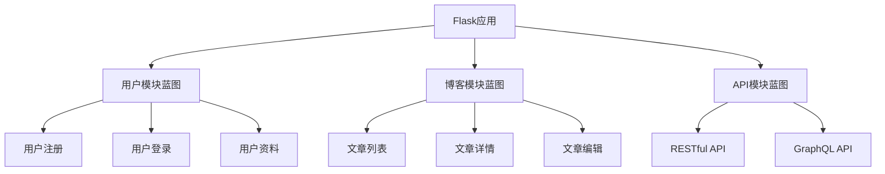
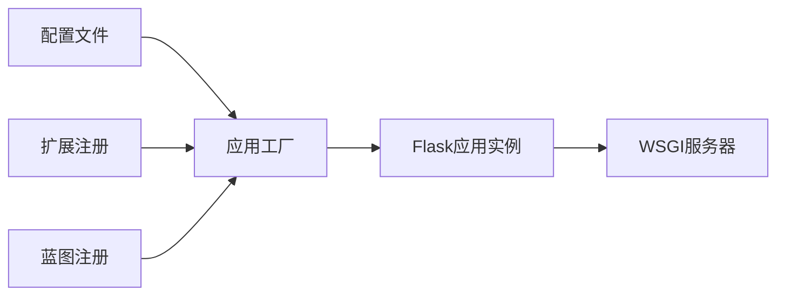
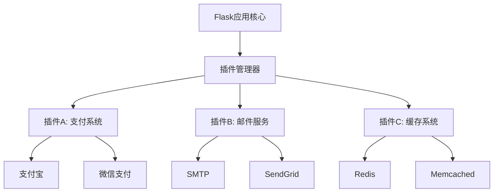
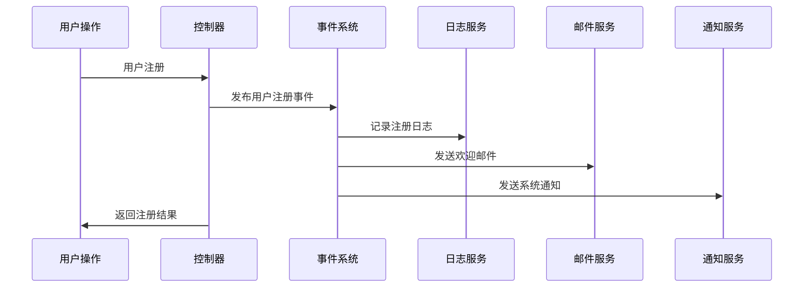
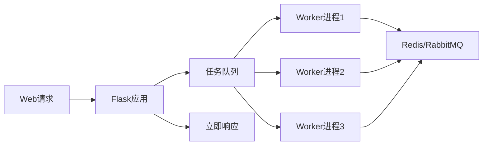
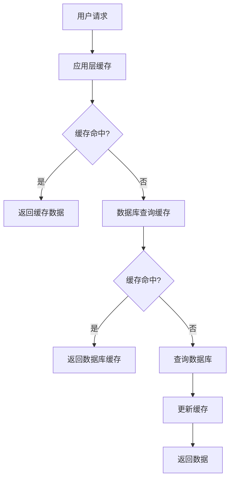
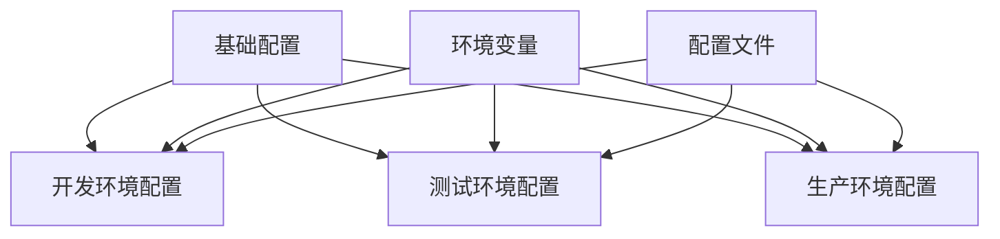

# 9. 🏗️ 应用架构与模块化

在Flask应用的发展过程中，随着功能的增加和团队的扩大，良好的架构设计变得至关重要。本章将深入探讨如何构建可维护、可扩展的Flask应用架构。

## 📋 9.1 蓝图（Blueprints）高级用法

### 🎯 核心概念

蓝图是Flask提供的应用模块化机制，允许我们将大型应用拆分为更小、更易管理的组件。



### 💡 基础蓝图实现
app/blueprints/auth.py
```python
from flask import Blueprint, render_template, request, flash, redirect, url_for
from werkzeug.security import check_password_hash

# 创建认证蓝图
auth_bp = Blueprint('auth', __name__, url_prefix='/auth')

@auth_bp.route('/login', methods=['GET', 'POST'])
def login():
    if request.method == 'POST':
        username = request.form['username']
        password = request.form['password']
        # 验证逻辑
        if validate_user(username, password):
            return redirect(url_for('main.dashboard'))
        flash('Invalid credentials')
    return render_template('auth/login.html')

@auth_bp.route('/register', methods=['GET', 'POST'])
def register():
    # 注册逻辑
    pass
```

### 🔧 高级蓝图特性

#### 1. 嵌套蓝图结构
app/blueprints/__init__.py
```python
from flask import Blueprint

# 主API蓝图
api_bp = Blueprint('api', __name__, url_prefix='/api')

# 版本化API蓝图
api_v1_bp = Blueprint('api_v1', __name__, url_prefix='/v1')
api_v2_bp = Blueprint('api_v2', __name__, url_prefix='/v2')

# 注册子蓝图到主蓝图
api_bp.register_blueprint(api_v1_bp)
api_bp.register_blueprint(api_v2_bp)
```

#### 2. 蓝图工厂模式
app/blueprints/blog.py
```python
def create_blog_blueprint(config=None):
    """蓝图工厂函数"""
    blog_bp = Blueprint('blog', __name__, url_prefix='/blog')
    
    # 根据配置动态添加路由
    if config and config.get('ENABLE_COMMENTS'):
        @blog_bp.route('/post/<int:id>/comments')
        def post_comments(id):
            # 评论功能
            pass
    
    return blog_bp
```

## 🏭 9.2 应用工厂与依赖注入

### 🎯 应用工厂模式

应用工厂模式是创建Flask应用的最佳实践，它提供了更好的测试性和配置灵活性。



### 💡 完整应用工厂实现
app/__init__.py
```python
from flask import Flask
from flask_sqlalchemy import SQLAlchemy
from flask_login import LoginManager
from flask_mail import Mail

# 扩展实例
db = SQLAlchemy()
login_manager = LoginManager()
mail = Mail()

def create_app(config_name='development'):
    """应用工厂函数"""
    app = Flask(__name__)
    
    # 加载配置
    app.config.from_object(f'config.{config_name.title()}Config')
    
    # 初始化扩展
    init_extensions(app)
    
    # 注册蓝图
    register_blueprints(app)
    
    # 注册错误处理器
    register_error_handlers(app)
    
    return app

def init_extensions(app):
    """初始化Flask扩展"""
    db.init_app(app)
    login_manager.init_app(app)
    mail.init_app(app)
    
    # 配置登录管理器
    login_manager.login_view = 'auth.login'
    login_manager.login_message = '请先登录访问此页面'

def register_blueprints(app):
    """注册蓝图"""
    from app.blueprints.auth import auth_bp
    from app.blueprints.blog import blog_bp
    from app.blueprints.api import api_bp
    
    app.register_blueprint(auth_bp)
    app.register_blueprint(blog_bp)
    app.register_blueprint(api_bp)
```

### 🔧 依赖注入实现
app/services/__init__.py
```python
class ServiceContainer:
    """简单的依赖注入容器"""
    
    def __init__(self):
        self._services = {}
        self._singletons = {}
    
    def register(self, name, factory, singleton=False):
        """注册服务"""
        self._services[name] = {
            'factory': factory,
            'singleton': singleton
        }
    
    def get(self, name):
        """获取服务实例"""
        if name not in self._services:
            raise ValueError(f"Service '{name}' not registered")
        
        service_config = self._services[name]
        
        if service_config['singleton']:
            if name not in self._singletons:
                self._singletons[name] = service_config['factory']()
            return self._singletons[name]
        
        return service_config['factory']()

# 全局容器实例
container = ServiceContainer()
```

## 🔌 9.3 插件系统设计

### 🎯 插件架构概念

插件系统允许应用在运行时动态加载和卸载功能模块，提供了极大的扩展性。



### 💡 插件基类设计
app/plugins/base.py
```python
from abc import ABC, abstractmethod
from flask import current_app

class BasePlugin(ABC):
    """插件基类"""
    
    def __init__(self, app=None):
        self.app = app
        if app is not None:
            self.init_app(app)
    
    @abstractmethod
    def init_app(self, app):
        """初始化插件"""
        pass
    
    @abstractmethod
    def get_name(self):
        """获取插件名称"""
        pass
    
    @abstractmethod
    def get_version(self):
        """获取插件版本"""
        pass
    
    def before_request(self):
        """请求前钩子"""
        pass
    
    def after_request(self, response):
        """请求后钩子"""
        return response
```

### 🔧 插件管理器实现
app/plugins/manager.py
```python
import importlib
import os
from flask import current_app

class PluginManager:
    """插件管理器"""
    
    def __init__(self, app=None):
        self.plugins = {}
        if app is not None:
            self.init_app(app)
    
    def init_app(self, app):
        """初始化插件管理器"""
        app.plugin_manager = self
        
        # 注册钩子
        app.before_request(self._before_request)
        app.after_request(self._after_request)
    
    def load_plugin(self, plugin_name):
        """加载插件"""
        try:
            module = importlib.import_module(f'app.plugins.{plugin_name}')
            plugin_class = getattr(module, f'{plugin_name.title()}Plugin')
            plugin = plugin_class(current_app)
            
            self.plugins[plugin_name] = plugin
            current_app.logger.info(f'Plugin {plugin_name} loaded successfully')
            
        except Exception as e:
            current_app.logger.error(f'Failed to load plugin {plugin_name}: {e}')
    
    def unload_plugin(self, plugin_name):
        """卸载插件"""
        if plugin_name in self.plugins:
            del self.plugins[plugin_name]
            current_app.logger.info(f'Plugin {plugin_name} unloaded')
    
    def _before_request(self):
        """执行所有插件的before_request钩子"""
        for plugin in self.plugins.values():
            plugin.before_request()
    
    def _after_request(self, response):
        """执行所有插件的after_request钩子"""
        for plugin in self.plugins.values():
            response = plugin.after_request(response)
        return response
```

## 📡 9.4 事件驱动架构

### 🎯 事件系统概念

事件驱动架构通过事件的发布和订阅实现组件间的松耦合通信。



### 💡 事件系统实现
app/events/__init__.py
```python
from typing import Dict, List, Callable
from functools import wraps

class EventManager:
    """事件管理器"""
    
    def __init__(self):
        self._listeners: Dict[str, List[Callable]] = {}
    
    def listen(self, event_name: str, listener: Callable):
        """注册事件监听器"""
        if event_name not in self._listeners:
            self._listeners[event_name] = []
        self._listeners[event_name].append(listener)
    
    def emit(self, event_name: str, **kwargs):
        """触发事件"""
        if event_name in self._listeners:
            for listener in self._listeners[event_name]:
                try:
                    listener(**kwargs)
                except Exception as e:
                    # 记录错误但不中断其他监听器
                    print(f"Error in event listener: {e}")
    
    def decorator(self, event_name: str):
        """事件监听器装饰器"""
        def wrapper(func):
            self.listen(event_name, func)
            return func
        return wrapper

# 全局事件管理器
events = EventManager()
```

### 🔧 事件使用示例
app/services/user_service.py
```python
from app.events import events
from app.models import User

class UserService:
    """用户服务"""
    
    def register_user(self, username, email, password):
        """用户注册"""
        user = User(username=username, email=email)
        user.set_password(password)
        user.save()
        
        # 触发用户注册事件
        events.emit('user.registered', user=user)
        
        return user

# 事件监听器
@events.decorator('user.registered')
def send_welcome_email(user):
    """发送欢迎邮件"""
    from app.services.mail_service import send_email
    send_email(
        to=user.email,
        subject='欢迎注册！',
        template='emails/welcome.html',
        user=user
    )

@events.decorator('user.registered')
def log_user_registration(user):
    """记录用户注册日志"""
    from flask import current_app
    current_app.logger.info(f'New user registered: {user.username}')
```

## 📬 9.5 消息队列集成（Celery、RQ）

### 🎯 异步任务架构

消息队列允许我们将耗时任务异步处理，提高应用响应性能。



### 💡 Celery集成
app/tasks/__init__.py
```python
from celery import Celery
from flask import current_app

def make_celery(app):
    """创建Celery实例"""
    celery = Celery(
        app.import_name,
        backend=app.config['CELERY_RESULT_BACKEND'],
        broker=app.config['CELERY_BROKER_URL']
    )
    
    class ContextTask(celery.Task):
        """保持Flask应用上下文的任务基类"""
        def __call__(self, *args, **kwargs):
            with app.app_context():
                return self.run(*args, **kwargs)
    
    celery.Task = ContextTask
    return celery

# 任务定义
@celery.task
def send_async_email(to, subject, template, **kwargs):
    """异步发送邮件"""
    from app.services.mail_service import send_email
    send_email(to, subject, template, **kwargs)

@celery.task
def process_image(image_path):
    """异步处理图片"""
    from PIL import Image
    
    # 生成缩略图
    with Image.open(image_path) as img:
        img.thumbnail((200, 200))
        thumbnail_path = image_path.replace('.jpg', '_thumb.jpg')
        img.save(thumbnail_path)
    
    return thumbnail_path
```

### 🔧 RQ集成（轻量级选择）
app/tasks/rq_tasks.py
```python
from rq import Queue
from redis import Redis
from flask import current_app

# Redis连接
redis_conn = Redis.from_url(current_app.config['REDIS_URL'])
queue = Queue(connection=redis_conn)

def enqueue_task(func, *args, **kwargs):
    """将任务加入队列"""
    job = queue.enqueue(func, *args, **kwargs)
    return job.id

# 任务函数
def send_notification(user_id, message):
    """发送通知任务"""
    from app.models import User
    user = User.query.get(user_id)
    # 发送通知逻辑
    pass
```

## 🚀 9.6 缓存策略与实现

### 🎯 多层缓存架构



### 💡 Flask-Caching集成
app/cache/__init__.py
```python
from flask_caching import Cache
from functools import wraps
import hashlib
import json

cache = Cache()

def cache_key(*args, **kwargs):
    """生成缓存键"""
    key_data = {'args': args, 'kwargs': kwargs}
    key_string = json.dumps(key_data, sort_keys=True)
    return hashlib.md5(key_string.encode()).hexdigest()

def cached_result(timeout=300, key_prefix=''):
    """结果缓存装饰器"""
    def decorator(func):
        @wraps(func)
        def wrapper(*args, **kwargs):
            # 生成缓存键
            key = f"{key_prefix}:{func.__name__}:{cache_key(*args, **kwargs)}"
            
            # 尝试从缓存获取
            result = cache.get(key)
            if result is not None:
                return result
            
            # 执行函数并缓存结果
            result = func(*args, **kwargs)
            cache.set(key, result, timeout=timeout)
            return result
        return wrapper
    return decorator
```

### 🔧 缓存使用示例
app/services/blog_service.py
```python
from app.cache import cache, cached_result
from app.models import Post

class BlogService:
    """博客服务"""
    
    @cached_result(timeout=600, key_prefix='blog')
    def get_popular_posts(self, limit=10):
        """获取热门文章（缓存10分钟）"""
        return Post.query.filter_by(published=True)\
                        .order_by(Post.view_count.desc())\
                        .limit(limit).all()
    
    @cache.memoize(timeout=300)
    def get_post_by_slug(self, slug):
        """根据slug获取文章（缓存5分钟）"""
        return Post.query.filter_by(slug=slug).first()
    
    def invalidate_post_cache(self, post_id):
        """使文章相关缓存失效"""
        post = Post.query.get(post_id)
        if post:
            cache.delete_memoized(self.get_post_by_slug, post.slug)
            # 清除相关的列表缓存
            cache.delete_many('blog:get_popular_posts:*')
```

## ⚙️ 9.7 配置管理与环境隔离

### 🎯 配置层次结构



### 💡 配置类设计
config.py
```python
import os
from datetime import timedelta

class Config:
    """基础配置类"""
    
    # 基础配置
    SECRET_KEY = os.environ.get('SECRET_KEY') or 'dev-secret-key'
    
    # 数据库配置
    SQLALCHEMY_TRACK_MODIFICATIONS = False
    SQLALCHEMY_RECORD_QUERIES = True
    
    # 缓存配置
    CACHE_TYPE = 'redis'
    CACHE_REDIS_URL = os.environ.get('REDIS_URL') or 'redis://localhost:6379/0'
    
    # 邮件配置
    MAIL_SERVER = os.environ.get('MAIL_SERVER')
    MAIL_PORT = int(os.environ.get('MAIL_PORT') or 587)
    MAIL_USE_TLS = os.environ.get('MAIL_USE_TLS', 'true').lower() in ['true', 'on', '1']
    
    # Celery配置
    CELERY_BROKER_URL = os.environ.get('CELERY_BROKER_URL') or 'redis://localhost:6379/1'
    CELERY_RESULT_BACKEND = os.environ.get('CELERY_RESULT_BACKEND') or 'redis://localhost:6379/1'
    
    @staticmethod
    def init_app(app):
        """初始化应用配置"""
        pass

class DevelopmentConfig(Config):
    """开发环境配置"""
    DEBUG = True
    SQLALCHEMY_DATABASE_URI = os.environ.get('DEV_DATABASE_URL') or \
        'sqlite:///dev.db'
    
    # 开发环境特定配置
    WTF_CSRF_ENABLED = False  # 开发时禁用CSRF
    SEND_FILE_MAX_AGE_DEFAULT = 0  # 禁用静态文件缓存

class TestingConfig(Config):
    """测试环境配置"""
    TESTING = True
    SQLALCHEMY_DATABASE_URI = 'sqlite:///:memory:'
    WTF_CSRF_ENABLED = False
    
class ProductionConfig(Config):
    """生产环境配置"""
    SQLALCHEMY_DATABASE_URI = os.environ.get('DATABASE_URL')
    
    # 生产环境安全配置
    SESSION_COOKIE_SECURE = True
    SESSION_COOKIE_HTTPONLY = True
    SESSION_COOKIE_SAMESITE = 'Lax'
    PERMANENT_SESSION_LIFETIME = timedelta(hours=1)
    
    @classmethod
    def init_app(cls, app):
        Config.init_app(app)
        
        # 生产环境日志配置
        import logging
        from logging.handlers import RotatingFileHandler
        
        if not app.debug:
            file_handler = RotatingFileHandler(
                'logs/app.log', maxBytes=10240, backupCount=10
            )
            file_handler.setFormatter(logging.Formatter(
                '%(asctime)s %(levelname)s: %(message)s [in %(pathname)s:%(lineno)d]'
            ))
            file_handler.setLevel(logging.INFO)
            app.logger.addHandler(file_handler)

# 配置映射
config = {
    'development': DevelopmentConfig,
    'testing': TestingConfig,
    'production': ProductionConfig,
    'default': DevelopmentConfig
}
```

### 🔧 环境配置管理
app/config/manager.py
```python
import os
from typing import Any, Dict

class ConfigManager:
    """配置管理器"""
    
    def __init__(self, app=None):
        self.app = app
        self._config_cache = {}
        
        if app is not None:
            self.init_app(app)
    
    def init_app(self, app):
        """初始化配置管理器"""
        app.config_manager = self
        
        # 加载环境特定配置
        self.load_env_config(app)
    
    def load_env_config(self, app):
        """加载环境配置"""
        env = os.environ.get('FLASK_ENV', 'development')
        
        # 加载.env文件
        env_file = f'.env.{env}'
        if os.path.exists(env_file):
            self.load_dotenv(env_file)
    
    def load_dotenv(self, filepath):
        """加载.env文件"""
        with open(filepath, 'r') as f:
            for line in f:
                if line.strip() and not line.startswith('#'):
                    key, value = line.strip().split('=', 1)
                    os.environ.setdefault(key, value)
    
    def get(self, key: str, default: Any = None) -> Any:
        """获取配置值"""
        if key in self._config_cache:
            return self._config_cache[key]
        
        value = self.app.config.get(key, default)
        self._config_cache[key] = value
        return value
    
    def set(self, key: str, value: Any):
        """设置配置值"""
        self.app.config[key] = value
        self._config_cache[key] = value
```

## 📚 本章小结

通过本章的学习，我们掌握了Flask应用架构设计的核心技术：

- **🔵 蓝图系统**：实现应用模块化，支持大型项目开发
- **🔵 应用工厂**：提供灵活的应用创建和配置机制
- **🔵 插件系统**：支持功能的动态扩展和管理
- **🔵 事件驱动**：实现组件间松耦合通信
- **🔵 消息队列**：处理异步任务，提升应用性能
- **🔵 缓存策略**：多层缓存提升响应速度
- **🔵 配置管理**：环境隔离和配置的统一管理

这些架构模式和技术的合理运用，将帮助你构建出可维护、可扩展、高性能的Flask应用。在下一章中，我们将学习错误处理与监控，确保应用的稳定性和可观测性。
        