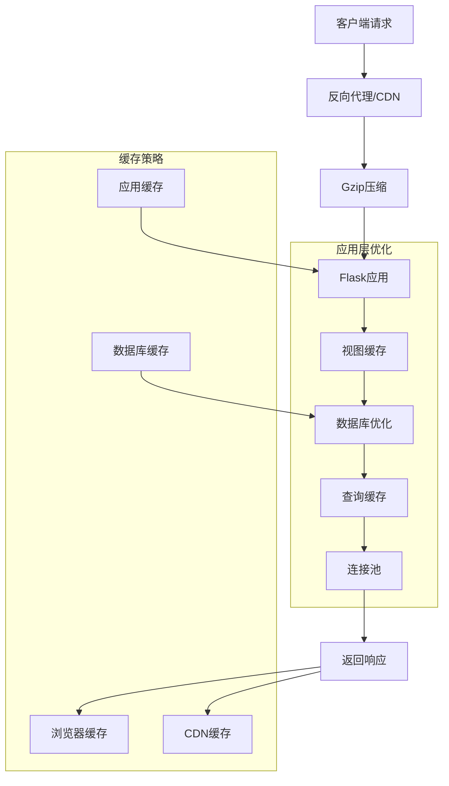
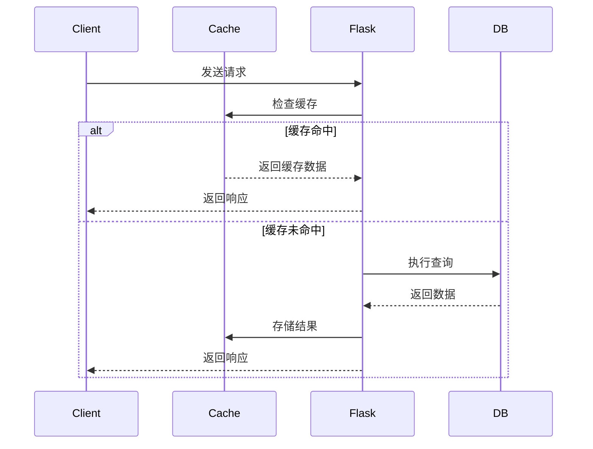

# 9. 进阶主题
## 9.1 RESTful API 开发
RESTful API 是现代 Web 应用的核心组件，Flask 提供了灵活的工具来构建符合 REST 原则的 API。

### 9.1.1 设计原则
**RESTful 设计原则**：

+ 资源导向：API 围绕资源而非操作设计
+ 统一接口：使用标准 HTTP 方法（GET、POST、PUT、DELETE）
+ 无状态：每个请求包含所有必要信息
+ 可缓存：响应应明确指示是否可缓存
+ 分层系统：客户端无需了解直接连接的服务端

**API 版本控制**：

```python
# 通过URL路径版本控制
@app.route('/api/v1/users')
def get_users_v1():
    return jsonify({'version': 'v1', 'users': []})

@app.route('/api/v2/users')
def get_users_v2():
    return jsonify({'version': 'v2', 'users': [], 'metadata': {}})

# 通过请求头版本控制
@app.route('/api/users')
def get_users():
    version = request.headers.get('API-Version', 'v1')
    if version == 'v2':
        return jsonify({'version': 'v2', 'users': [], 'metadata': {}})
    else:
        return jsonify({'version': 'v1', 'users': []})
```

### 9.1.2 使用 Flask-RESTful 扩展
**安装和配置**：

```bash
pip install flask-restful
```

**基本 API 结构**：

```python
from flask_restful import Api, Resource, reqparse, abort, fields, marshal_with

api = Api(app)

# 请求参数解析
user_parser = reqparse.RequestParser()
user_parser.add_argument('username', type=str, required=True, help='用户名不能为空')
user_parser.add_argument('email', type=str, required=True, help='邮箱不能为空')
user_parser.add_argument('password', type=str, required=True, help='密码不能为空')

# 响应字段定义
user_fields = {
    'id': fields.Integer,
    'username': fields.String,
    'email': fields.String,
    'created_at': fields.DateTime(dt_format='iso8601'),
    'links': fields.Nested({
        'self': fields.Url('user', absolute=True),
        'collection': fields.Url('users', absolute=True)
    })
}

class UserAPI(Resource):
    @marshal_with(user_fields)
    def get(self, user_id):
        user = User.query.get_or_404(user_id)
        return user
    
    @marshal_with(user_fields)
    def put(self, user_id):
        user = User.query.get_or_404(user_id)
        args = user_parser.parse_args()
        
        # 更新用户信息
        user.username = args['username']
        user.email = args['email']
        if args['password']:
            user.password = args['password']
        
        db.session.commit()
        return user
    
    def delete(self, user_id):
        user = User.query.get_or_404(user_id)
        db.session.delete(user)
        db.session.commit()
        return {'message': '用户已删除'}

class UserListAPI(Resource):
    @marshal_with(user_fields)
    def get(self):
        users = User.query.all()
        return users
    
    @marshal_with(user_fields)
    def post(self):
        args = user_parser.parse_args()
        
        # 检查用户是否已存在
        if User.query.filter_by(username=args['username']).first():
            abort(409, message='用户名已存在')
        if User.query.filter_by(email=args['email']).first():
            abort(409, message='邮箱已存在')
        
        # 创建新用户
        user = User(
            username=args['username'],
            email=args['email']
        )
        user.password = args['password']
        
        db.session.add(user)
        db.session.commit()
        
        return user, 201

# 注册API路由
api.add_resource(UserListAPI, '/api/users', endpoint='users')
api.add_resource(UserAPI, '/api/users/<int:user_id>', endpoint='user')
```

**API 认证和授权**：

```python
from flask_httpauth import HTTPTokenAuth

auth = HTTPTokenAuth(scheme='Bearer')

tokens = {
    "secret-token-1": "user1",
    "secret-token-2": "user2"
}

@auth.verify_token
def verify_token(token):
    if token in tokens:
        return tokens[token]
    return None

@auth.error_handler
def auth_error():
    return {'error': '认证失败'}, 401

class ProtectedResource(Resource):
    @auth.login_required
    def get(self):
        return {'message': f'你好, {auth.current_user()}!'}
```

## 9.2 蓝图（Blueprints）用于模块化应用
蓝图允许将应用分解为模块化组件，每个组件可以有自己的路由、模板和静态文件。

**创建和注册蓝图**：

```python
# auth/__init__.py
from flask import Blueprint

auth_bp = Blueprint('auth', __name__, 
                   template_folder='templates',
                   static_folder='static',
                   url_prefix='/auth')

from . import routes

# 在主应用中注册蓝图
from auth import auth_bp
app.register_blueprint(auth_bp)
```

**认证蓝图示例**：

```python
# auth/routes.py
from flask import render_template, redirect, url_for, flash
from . import auth_bp
from .forms import LoginForm, RegistrationForm
from ..models import User
from .. import db

@auth_bp.route('/login', methods=['GET', 'POST'])
def login():
    form = LoginForm()
    if form.validate_on_submit():
        # 处理登录逻辑
        pass
    return render_template('auth/login.html', form=form)

@auth_bp.route('/register', methods=['GET', 'POST'])
def register():
    form = RegistrationForm()
    if form.validate_on_submit():
        # 处理注册逻辑
        pass
    return render_template('auth/register.html', form=form)
```

**API 蓝图示例**：

```python
# api/__init__.py
from flask import Blueprint
from flask_restful import Api

api_bp = Blueprint('api', __name__, url_prefix='/api')
api = Api(api_bp)

from . import resources

# api/resources.py
from flask_restful import Resource
from . import api

class UserResource(Resource):
    def get(self, user_id):
        return {'user_id': user_id}

api.add_resource(UserResource, '/users/<int:user_id>')
```

## 9.3 静态文件和资产管理
**静态文件配置**：

```python
# 配置静态文件URL和路径
app.config['STATIC_FOLDER'] = 'static'
app.config['STATIC_URL_PATH'] = '/static'

# 多个静态文件目录
from flask import Blueprint

admin_static = Blueprint('admin_static', __name__, static_folder='static/admin')
app.register_blueprint(admin_static, url_prefix='/admin/static')
```

**资源压缩和版本控制**：

```python
from flask_assets import Environment, Bundle

# 初始化资源环境
assets = Environment(app)

# 定义资源包
css_bundle = Bundle(
    'css/bootstrap.css',
    'css/main.css',
    filters='cssmin',
    output='gen/packed.css'
)

js_bundle = Bundle(
    'js/jquery.js',
    'js/app.js',
    filters='jsmin',
    output='gen/packed.js'
)

# 注册资源包
assets.register('css_all', css_bundle)
assets.register('js_all', js_bundle)
```

**在模板中使用资源**：

```html

    <link rel="stylesheet" href="{{ ASSET_URL }}">



    <script src="{{ ASSET_URL }}"></script>

```

## 9.4 测试 Flask 应用
**测试配置**：

```python
import unittest
from app import create_app, db
from app.models import User

class TestConfig(Config):
    TESTING = True
    SQLALCHEMY_DATABASE_URI = 'sqlite:///:memory:'
    WTF_CSRF_ENABLED = False

class TestCase(unittest.TestCase):
    def setUp(self):
        self.app = create_app(TestConfig)
        self.app_context = self.app.app_context()
        self.app_context.push()
        db.create_all()
        self.client = self.app.test_client()
    
    def tearDown(self):
        db.session.remove()
        db.drop_all()
        self.app_context.pop()
```

**单元测试示例**：

```python
class UserModelTestCase(TestCase):
    def test_password_hashing(self):
        u = User(username='test')
        u.set_password('cat')
        self.assertFalse(u.check_password('dog'))
        self.assertTrue(u.check_password('cat'))
    
    def test_user_creation(self):
        u = User(username='test', email='test@example.com')
        db.session.add(u)
        db.session.commit()
        self.assertEqual(User.query.count(), 1)
        self.assertEqual(User.query.first().username, 'test')
```

**API 测试示例**：

```python
class APITestCase(TestCase):
    def test_get_user(self):
        # 创建测试用户
        u = User(username='test', email='test@example.com')
        db.session.add(u)
        db.session.commit()
        
        # 测试API端点
        response = self.client.get(f'/api/users/{u.id}')
        self.assertEqual(response.status_code, 200)
        self.assertIn('test', response.get_data(as_text=True))
    
    def test_protected_resource(self):
        response = self.client.get('/api/protected')
        self.assertEqual(response.status_code, 401)
        
        # 使用认证令牌测试
        response = self.client.get('/api/protected', 
                                 headers={'Authorization': 'Bearer secret-token-1'})
        self.assertEqual(response.status_code, 200)
```

**功能测试示例**：

```python
class FlaskClientTestCase(TestCase):
    def test_home_page(self):
        response = self.client.get('/')
        self.assertEqual(response.status_code, 200)
        self.assertIn(b'Welcome', response.data)
    
    def test_login(self):
        response = self.client.post('/auth/login', data={
            'username': 'test',
            'password': 'test'
        }, follow_redirects=True)
        self.assertEqual(response.status_code, 200)
        self.assertIn(b'Dashboard', response.data)
```

## 9.5 性能优化和缓存
**数据库查询优化**：

```python
# 使用急切加载避免N+1查询问题
from sqlalchemy.orm import joinedload

# 不好的方式：会产生N+1查询
users = User.query.all()
for user in users:
    print(user.posts.count())

# 好的方式：使用joinedload
users = User.query.options(joinedload(User.posts)).all()
for user in users:
    print(len(user.posts))

# 使用selectinload处理大型数据集
from sqlalchemy.orm import selectinload
users = User.query.options(selectinload(User.posts)).all()
```

**缓存策略**：

```python
from flask_caching import Cache

# 缓存配置
config = {
    'CACHE_TYPE': 'redis',
    'CACHE_REDIS_URL': 'redis://localhost:6379/0',
    'CACHE_DEFAULT_TIMEOUT': 300
}
cache = Cache(app, config=config)

# 视图缓存
@app.route('/expensive-operation')
@cache.cached(timeout=50)
def expensive_operation():
    # 耗时的操作
    result = do_expensive_calculation()
    return jsonify(result)

# 方法缓存
@cache.memoize(timeout=50)
def get_user_data(user_id):
    return User.query.get(user_id).to_dict()

# 模板片段缓存

    <div>昂贵的内容渲染</div>

```

**性能监控**：

```python
from flask import request
import time

@app.before_request
def start_timer():
    request.start_time = time.time()

@app.after_request
def log_request(response):
    # 计算请求处理时间
    if hasattr(request, 'start_time'):
        duration = (time.time() - request.start_time) * 1000  # 毫秒
        app.logger.info(f'{request.method} {request.path} - {response.status_code} - {duration:.2f}ms')
    
    return response
```

**数据库连接池优化**：

```python
# SQLAlchemy连接池配置
app.config['SQLALCHEMY_ENGINE_OPTIONS'] = {
    'pool_size': 10,
    'max_overflow': 20,
    'pool_timeout': 30,
    'pool_recycle': 1800,  # 30分钟
    'pool_pre_ping': True  # 连接前检查连接是否有效
}
```

**Gzip压缩**：

```python
from flask_compress import Compress

compress = Compress()
compress.init_app(app)

# 配置压缩选项
app.config['COMPRESS_MIMETYPES'] = [
    'text/html', 'text/css', 'text/xml',
    'application/json', 'application/javascript'
]
app.config['COMPRESS_LEVEL'] = 6
app.config['COMPRESS_MIN_SIZE'] = 500
```

以下图表展示了 Flask 应用的性能优化策略：



**请求处理优化流程**：



本章详细介绍了 Flask 的进阶主题，包括 RESTful API 开发、蓝图模块化、静态文件管理、应用测试和性能优化。这些高级技术可以帮助开发者构建更加强大、可维护和高性能的 Flask 应用。通过合理应用这些技术，可以显著提升应用的质量和用户体验。

