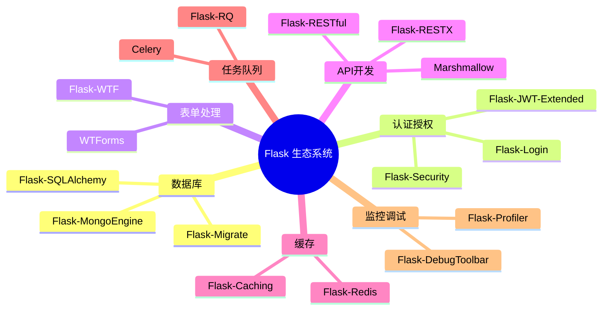
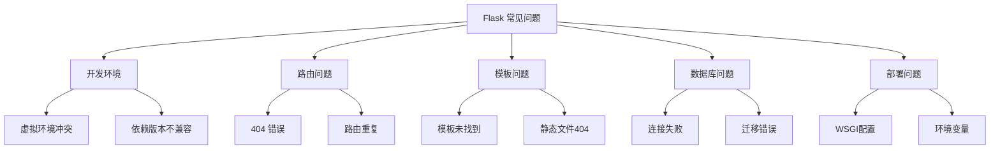
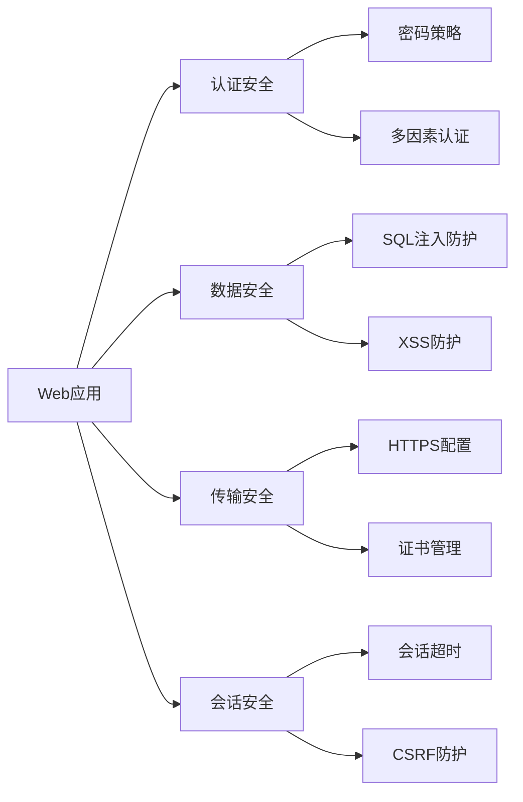
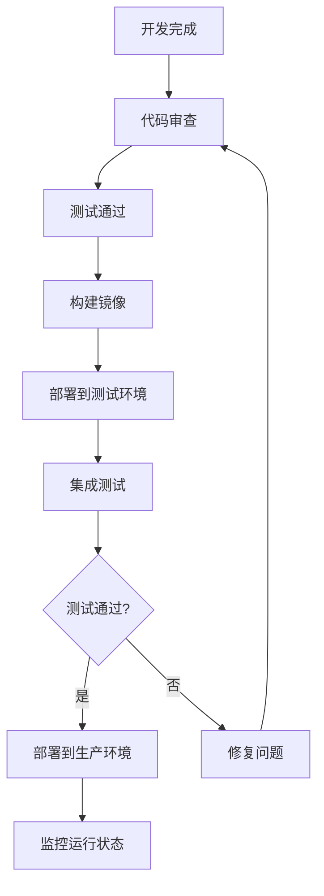
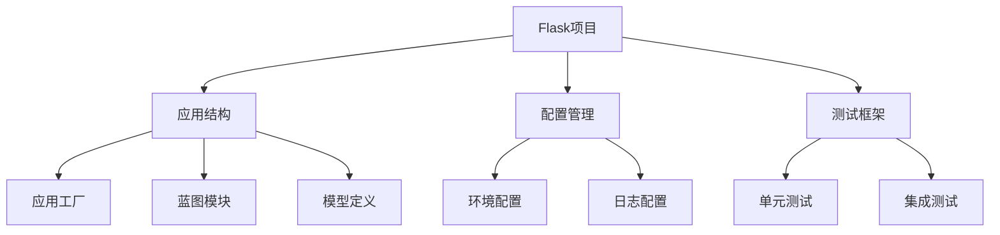
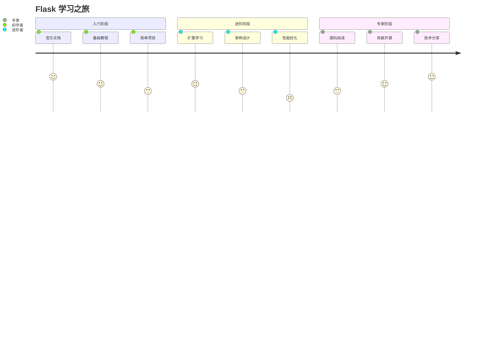
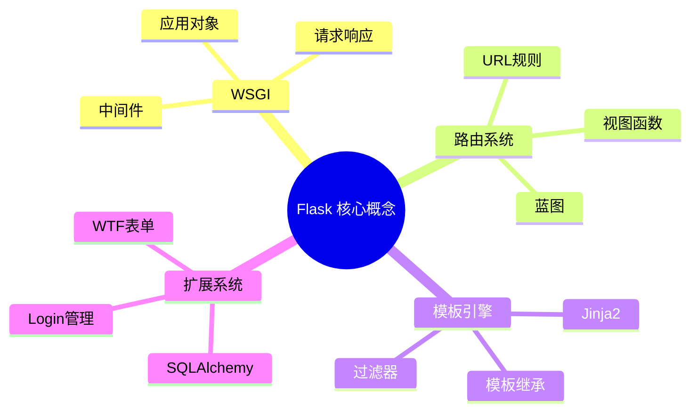

# 🧾 附录详细内容

## 📚 A. Flask 生态系统扩展库

### 🔧 核心扩展库分类



### 🌟 推荐扩展库清单

| 分类 | 扩展库 | 用途 | 推荐指数 |
|------|--------|------|----------|
| 🗄️ 数据库 | Flask-SQLAlchemy | ORM 数据库操作 | ⭐⭐⭐⭐⭐ |
| 🔐 认证 | Flask-Login | 用户会话管理 | ⭐⭐⭐⭐⭐ |
| 📝 表单 | Flask-WTF | 表单处理与验证 | ⭐⭐⭐⭐⭐ |
| 🚀 API | Flask-RESTX | REST API 开发 | ⭐⭐⭐⭐ |
| ⚡ 缓存 | Flask-Caching | 应用缓存 | ⭐⭐⭐⭐ |
| 📧 邮件 | Flask-Mail | 邮件发送 | ⭐⭐⭐ |

### 💡 扩展库使用示例

```python
# Flask-SQLAlchemy 基础用法
from flask_sqlalchemy import SQLAlchemy

app.config['SQLALCHEMY_DATABASE_URI'] = 'sqlite:///app.db'
db = SQLAlchemy(app)

class User(db.Model):
    id = db.Column(db.Integer, primary_key=True)
    username = db.Column(db.String(80), unique=True, nullable=False)
```

---

## ❓ B. 常见问题与解决方案

### 🔍 问题分类图



### 🛠️ 常见问题解决方案

#### 1. 🚫 ImportError: No module named 'flask'
**原因**: 虚拟环境未激活或Flask未安装
```bash
# 解决方案
source venv/bin/activate  # Linux/Mac
venv\Scripts\activate     # Windows
pip install flask
```

#### 2. 🔄 TemplateNotFound 错误
**原因**: 模板路径配置错误
```python
# 正确配置
app = Flask(__name__, template_folder='templates')
# 确保目录结构正确
# project/
#   ├── app.py
#   └── templates/
#       └── index.html
```

#### 3. 🗄️ 数据库连接失败
**原因**: 数据库URI配置错误
```python
# 检查配置
app.config['SQLALCHEMY_DATABASE_URI'] = 'sqlite:///app.db'
app.config['SQLALCHEMY_TRACK_MODIFICATIONS'] = False
```

---

## ⚡ C. 性能优化检查清单

### 📊 性能优化金字塔

```mermaid
pyramid
    title 性能优化层次
    
    "应用架构" : 5
    "数据库优化" : 4  
    "缓存策略" : 3
    "代码优化" : 2
    "基础设施" : 1
```

### ✅ 性能检查清单

#### 🏗️ 应用层面
- [ ] 使用应用工厂模式
- [ ] 实现蓝图模块化
- [ ] 配置生产环境设置
- [ ] 启用 Gzip 压缩

#### 🗄️ 数据库层面
- [ ] 添加适当的数据库索引
- [ ] 使用连接池
- [ ] 实现查询优化
- [ ] 配置数据库缓存

```python
# 数据库连接池配置示例
app.config['SQLALCHEMY_ENGINE_OPTIONS'] = {
    'pool_size': 10,
    'pool_recycle': 120,
    'pool_pre_ping': True
}
```

#### 💾 缓存层面
- [ ] 实现 Redis 缓存
- [ ] 配置页面缓存
- [ ] 使用 CDN 加速静态资源
- [ ] 实现数据库查询缓存

```python
# Flask-Caching 配置
from flask_caching import Cache

cache = Cache(app, config={'CACHE_TYPE': 'redis'})

@cache.cached(timeout=300)
def expensive_function():
    return "cached result"
```

---

## 🔒 D. 安全检查清单

### 🛡️ 安全威胁模型



### 🔐 安全配置检查清单

#### 基础安全配置
- [ ] 设置强密钥 `SECRET_KEY`
- [ ] 启用 CSRF 保护
- [ ] 配置安全头
- [ ] 实现输入验证

```python
# 安全配置示例
from flask_talisman import Talisman

# 安全头配置
Talisman(app, force_https=True)

# CSRF 保护
from flask_wtf.csrf import CSRFProtect
csrf = CSRFProtect(app)
```

#### 认证与授权
- [ ] 实现强密码策略
- [ ] 配置会话超时
- [ ] 实现角色权限控制
- [ ] 记录安全日志

```python
# 密码哈希示例
from werkzeug.security import generate_password_hash, check_password_hash

class User(db.Model):
    password_hash = db.Column(db.String(128))
    
    def set_password(self, password):
        self.password_hash = generate_password_hash(password)
    
    def check_password(self, password):
        return check_password_hash(self.password_hash, password)
```

---

## 🚀 E. 部署检查清单

### 📋 部署流程图



### ✅ 部署前检查清单

#### 🔧 环境配置
- [ ] 生产环境配置文件
- [ ] 环境变量设置
- [ ] 数据库连接配置
- [ ] 日志配置

```python
# 生产环境配置示例
class ProductionConfig:
    DEBUG = False
    TESTING = False
    SQLALCHEMY_DATABASE_URI = os.environ.get('DATABASE_URL')
    SECRET_KEY = os.environ.get('SECRET_KEY')
```

#### 🐳 容器化部署
- [ ] Dockerfile 优化
- [ ] 多阶段构建
- [ ] 健康检查配置
- [ ] 资源限制设置

```dockerfile
# Dockerfile 示例
FROM python:3.9-slim
WORKDIR /app
COPY requirements.txt .
RUN pip install -r requirements.txt
COPY . .
EXPOSE 5000
HEALTHCHECK --interval=30s --timeout=3s \
  CMD curl -f http://localhost:5000/health || exit 1
CMD ["gunicorn", "--bind", "0.0.0.0:5000", "app:app"]
```

---

## 📝 F. 代码模板与脚手架

### 🏗️ 项目结构模板



### 📁 标准项目结构

```
flask-app/
├── app/
│   ├── __init__.py          # 应用工厂
│   ├── models/              # 数据模型
│   ├── views/               # 视图蓝图
│   ├── templates/           # 模板文件
│   └── static/              # 静态资源
├── tests/                   # 测试文件
├── migrations/              # 数据库迁移
├── config.py                # 配置文件
├── requirements.txt         # 依赖列表
└── run.py                   # 启动文件
```

### 🔧 应用工厂模板

```python
# app/__init__.py
from flask import Flask
from flask_sqlalchemy import SQLAlchemy
from flask_migrate import Migrate

db = SQLAlchemy()
migrate = Migrate()

def create_app(config_name='development'):
    app = Flask(__name__)
    app.config.from_object(f'config.{config_name.title()}Config')
    
    # 初始化扩展
    db.init_app(app)
    migrate.init_app(app, db)
    
    # 注册蓝图
    from app.views.main import main_bp
    app.register_blueprint(main_bp)
    
    return app
```

---

## 📚 G. 学习资源与参考文献

### 🎯 学习路径图



### 📖 推荐学习资源

#### 📚 官方文档
- [Flask 官方文档](https://flask.palletsprojects.com/)
- [Jinja2 模板文档](https://jinja.palletsprojects.com/)
- [Werkzeug 工具库](https://werkzeug.palletsprojects.com/)

#### 📺 视频教程
- Corey Schafer - Flask Tutorial Series
- Miguel Grinberg - Flask Mega-Tutorial
- Real Python - Flask 课程

#### 📖 推荐书籍
- 《Flask Web Development》- Miguel Grinberg
- 《Building Web APIs with Flask》- Kunal Relan
- 《Flask Framework Cookbook》- Shalabh Aggarwal

---

## 📖 H. 术语表与概念索引

### 🔤 核心概念图谱



### 📝 术语表

| 术语 | 英文 | 定义 | 示例 |
|------|------|------|------|
| 🌐 WSGI | Web Server Gateway Interface | Python Web应用与服务器间的标准接口 | Gunicorn, uWSGI |
| 🛣️ 路由 | Route | URL到视图函数的映射关系 | `@app.route('/users')` |
| 📘 蓝图 | Blueprint | 应用模块化的组织方式 | `Blueprint('auth', __name__)` |
| 🎨 模板 | Template | 动态生成HTML的文件 | `render_template('index.html')` |
| 🔧 扩展 | Extension | 为Flask添加功能的第三方库 | Flask-SQLAlchemy |
| 📦 上下文 | Context | Flask中的请求和应用环境 | `request`, `g`, `session` |
| 🔒 会话 | Session | 跨请求存储用户数据的机制 | `session['user_id']` |
| 🎣 钩子 | Hook | 在特定时机执行的函数 | `@app.before_request` |

### 🔍 概念索引

#### A-F
- **Application Factory** (应用工厂): 创建Flask应用实例的设计模式
- **Blueprint** (蓝图): 组织路由和视图的模块化方式
- **Context** (上下文): Flask的请求处理环境
- **Decorator** (装饰器): 修改函数行为的Python特性
- **Extension** (扩展): 增强Flask功能的第三方库
- **Filter** (过滤器): Jinja2模板中处理变量的函数

#### G-M
- **Gunicorn**: Python WSGI HTTP服务器
- **Hook** (钩子): 在特定事件触发的回调函数
- **Jinja2**: Flask默认的模板引擎
- **Middleware** (中间件): 处理请求响应的组件

#### N-Z
- **ORM**: 对象关系映射，如SQLAlchemy
- **Route** (路由): URL到视图函数的映射
- **Session** (会话): 跨请求的用户数据存储
- **Template** (模板): 动态生成HTML的文件
- **View Function** (视图函数): 处理HTTP请求的函数
- **WSGI**: Web服务器网关接口标准

---

> 💡 **学习提示**: 这些附录内容是Flask开发的重要参考资料，建议在实际项目中经常查阅，特别是安全和性能优化的检查清单。随着经验的积累，你会发现这些资源的价值越来越大。
        